**[목차]** 
- [개발 환경 구성](#개발-환경-구성)
  - [전체 시스템 구성](#전체-시스템-구성)
  - [VM 생성](#vm-생성)
    - [Workspace VM 생성](#workspace-vm-생성)
    - [탄력적 IP 주소 할당](#탄력적-ip-주소-할당)
    - [인스턴스에 탄력적 IP 주소 연결](#인스턴스에-탄력적-ip-주소-연결)
  - [인스턴스에 연결](#인스턴스에-연결)
    - [SSH 클라이언트를 사용하여 Linux 인스턴스에 연결 (macOS)](#ssh-클라이언트를-사용하여-linux-인스턴스에-연결-macos)
    - [SSH 클라이언트를 사용하여 Linux 인스턴스에 연결 (Windows)](#ssh-클라이언트를-사용하여-linux-인스턴스에-연결-windows)
    - [SSH 클라이언트를 사용하여 Linux 인스턴스에 연결 (AWS Console 이용)](#ssh-클라이언트를-사용하여-linux-인스턴스에-연결-aws-console-이용)
  - [Workspace Desktop 연결](#workspace-desktop-연결)
    - [Desktop 접속](#desktop-접속)
    - [Microsoft 원격 데스크톱 연결을 통한 Remote 연결 (For Windows 사용자)](#microsoft-원격-데스크톱-연결을-통한-remote-연결-for-windows-사용자)
    - [Tools VM 생성](#tools-vm-생성)
    - [추가 환경 설정](#추가-환경-설정)
  - [참고](#참고)

# 개발 환경 구성
## 전체 시스템 구성

< 전체 아키텍처 >
| 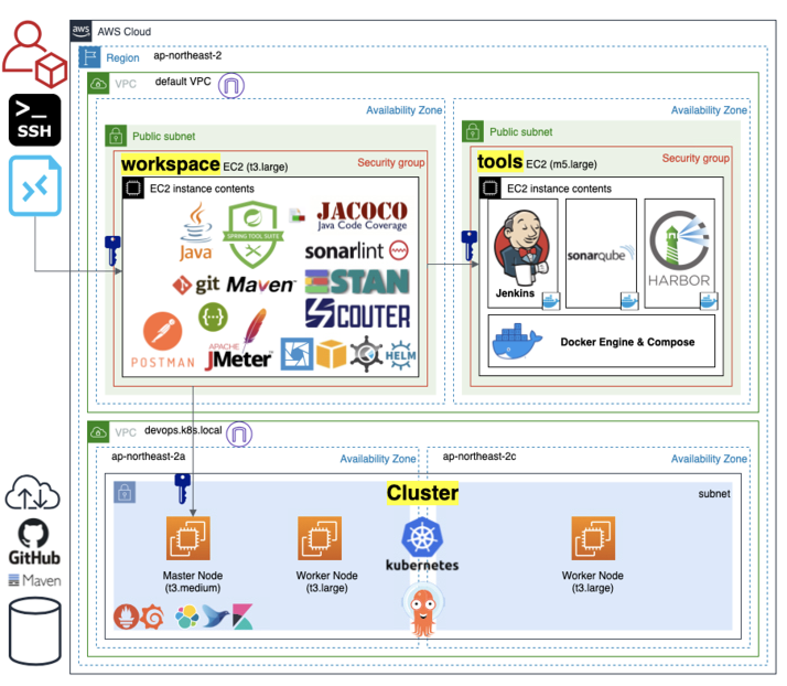 |
| ------------------------------------------------------------ |

## VM 생성

### Workspace VM 생성

< Workspace VM image >
| 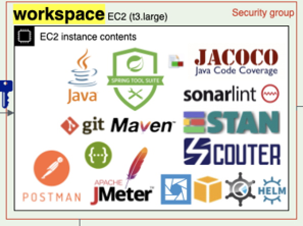 |
| ------------------------------------------------------ |


[AWS Console](https://aws.amazon.com/)에 로그인하여 다음 단계를 실행합니다.

1. 서비스 [EC2 콘솔](https://console.aws.amazon.com/ec2/) 좌측 탐색 창 > 이미지 > AMI > `프라이빗 이미지` 선택합니다.
2. AMI 이름 `skcc-aws-workspace-##` 이미지를 선택합니다.

    | 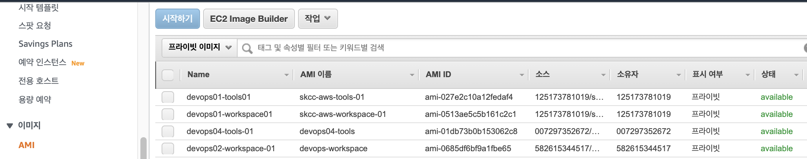 |
    | ---------------------------------------------------------- |

3. 이미지 `시작하기`를 클릭합니다.

    | 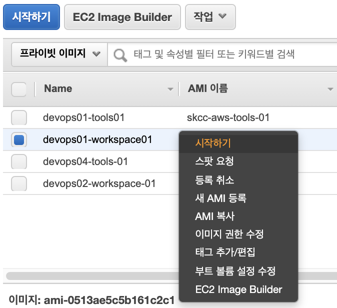 |
    | ----------------------------------------------------------- |

4. 인스턴스 유형 `t3.large`를 선택합니다.

    | 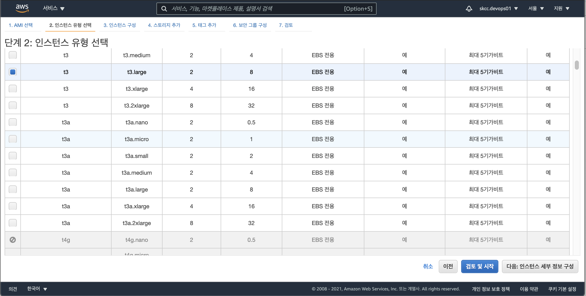 |
    | ----------------------------------------------------------- |

5. `다음:인스턴스 세부 정보구성` > `다음:스토리지 추가` > `다음:태그 추가` 까지 진행한 후 다음과 같이 입력합니다.
    * 키 : `Name`
    * 값 : `workspace`

    | 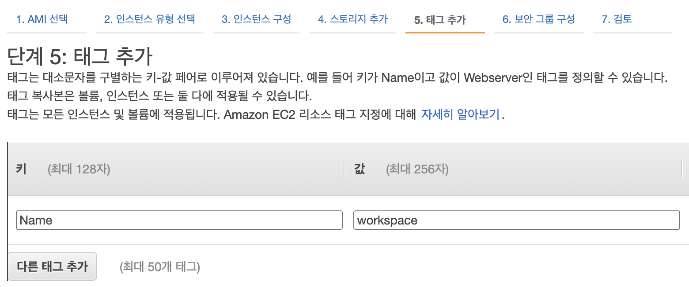 |
    | ----------------------------------------------------------- |

6. `다음:보안 그룹 구성`에서 `규칙 추가`를 누른 후 다음과 같이 추가합니다.
    * 유형 : `RDP`
    * 포트 범위 : `3389`
    * 소스 : `사용자 지정`, `0.0.0.0/0`

    | 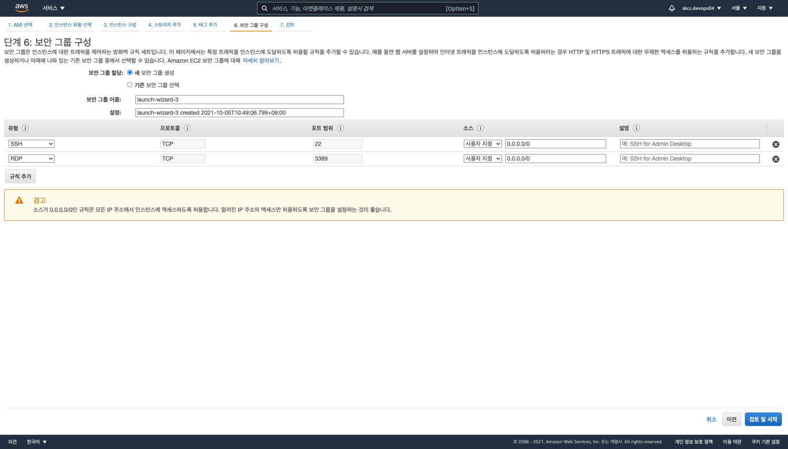 |
    | ---------------------------------------------------------------- |

7. `검토 및 시작` 누른 후 검토합니다.

    | 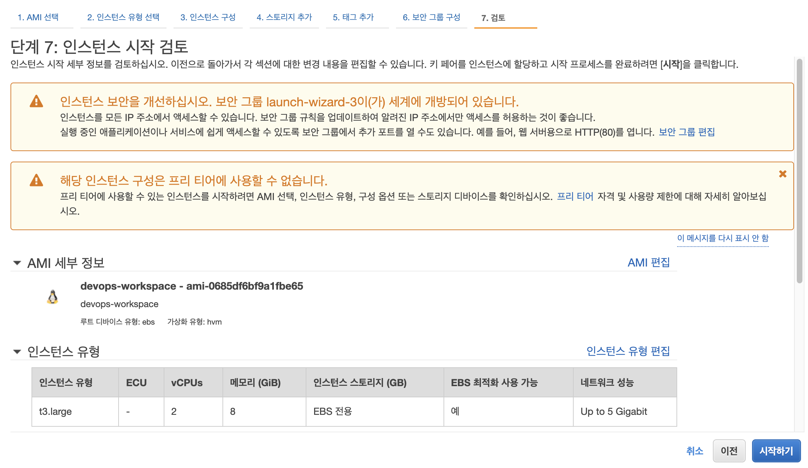 |
    | ----------------------------------------------------------- |

8. `시작하기`를 누른 후 `기존 키 페어 선택 또는 새 키 페어 생성` 하기를 합니다.
    * `새 키 페어 생성`, `RSA`을 선택
    * 키 페어 이름 : `key-worksapce`
    * `키 페어 다운로드`를 눌러 로컬PC에 저장해 둡니다. 
    > `key-workspace.pem` 파일명으로 생성됨.

    | 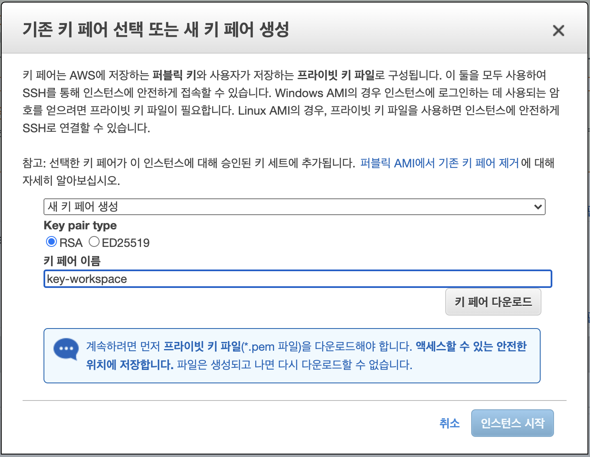 |
    | ----------------------------------------------------------- |

9. `인스턴스 시작`을 통해 VM 생성을 확인합니다.
    * 좌측 탐색 창 > 인스턴스 > 인스턴스에서 `workspace` VM을 확인할 수 있습니다.

    | 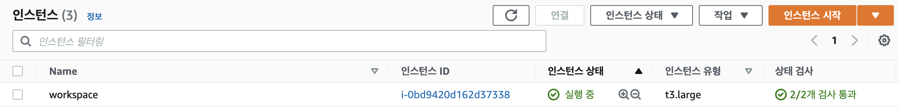 |
    | ----------------------------------------------------------- |


### 탄력적 IP 주소 할당

**탄력적 IP 주소를 할당하려면 아래와 같이 진행합니다.**

1. [EC2 콘솔](https://console.aws.amazon.com/ec2/)의 좌측 탐색 창에서 **네트워크 및 보안 > 탄력적 IP**을 선택합니다.
2. **탄력적 IP 주소 할당** 버튼을 클릭합니다.
3. **네트워크 경계 그룹**에 `ap-northeast-2`으로 설정되어 있는지 확인합니다.
4. **퍼블릭 IPv4 주소 풀**에 `Amazon의 IP 주소 풀`을 선택합니다.
    * Amazon의 IP 주소 풀 — IPv4 주소를 Amazon의 IP 주소 풀에서 할당하려는 경우
    * 내 퍼블릭 IPv4 주소 풀 — AWS 계정으로 가져온 IP 주소 풀에서 IPv4 주소를 할당하려는 경우. IP 주소 풀이 없는 경우에는 이 옵션을 사용할 수 없습니다.
    * IPv4 주소의 고객 소유 풀 — AWS Outpost에서 사용하기 위해 온프레미스 네트워크에서 만든 풀에서 IPv4 주소를 할당하려는 경우. AWS Outpost가 없는 경우 이 옵션이 비활성화됩니다.
5. **할당** 버튼을 클릭합니다.


    | 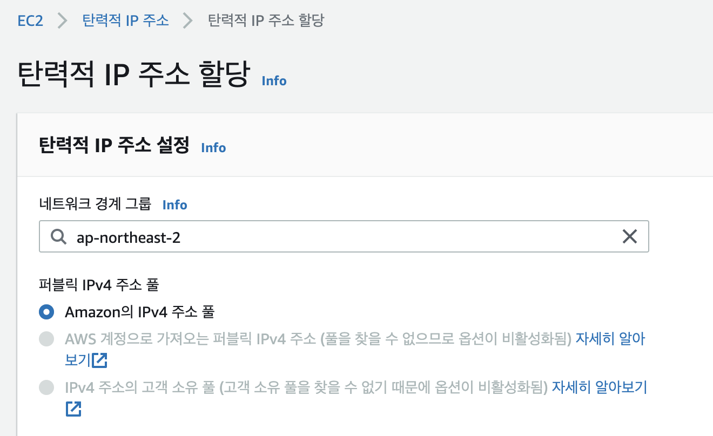 |
    | ---------------------------------------------- |


> AWS 계정은 리전 당 5개의 탄력적 IP 주소로 제한되어 있습니다.

### 인스턴스에 탄력적 IP 주소 연결

**인스턴스와 탄력적 IP 주소를 연결하려면 다음을 수행합니다.**

1. [EC2 콘솔](https://console.aws.amazon.com/ec2/)의 **탄력적 IP 주소** 페이지에서 연결할 탄력적 IP 주소를 선택하고 **작업** 버튼을 클릭한 후, **탄력적 IP 주소 연결**을 선택합니다.
2. **리소스 유형**에서 `인스턴스`를 선택합니다.
3. **인스턴스**에 앞 단계에서 생성한 인스턴스를 선택합니다. 탄력적 IP 주소를 연결할 인스턴스를 선택합니다. 텍스트를 입력하여 특정 인스턴스를 검색할 수도 있습니다.
4. (선택 사항) 프라이빗 IP 주소에 탄력적 IP 주소를 연결할 프라이빗 IP 주소를 지정합니다.
5. **연결** 버튼을 클릭합니다.

    | 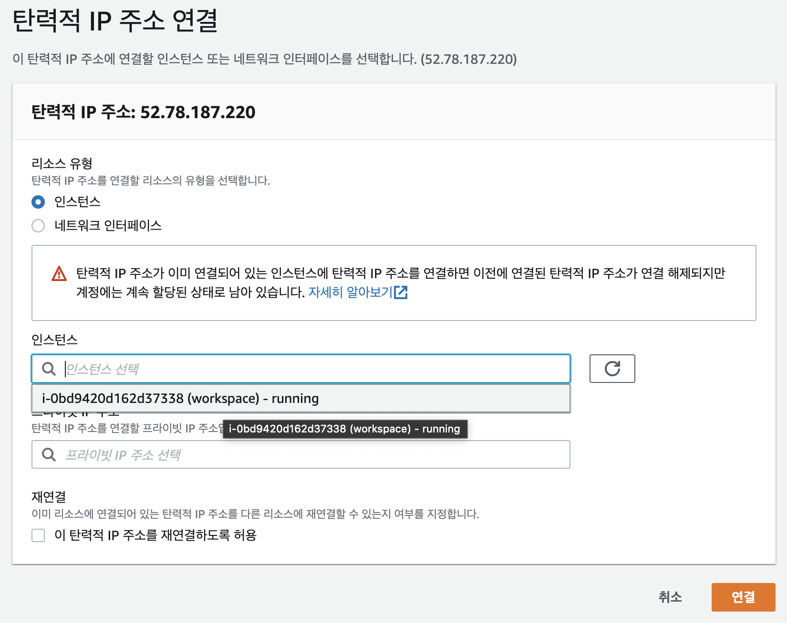 |
    | ---------------------------------------------- |

## 인스턴스에 연결

### SSH 클라이언트를 사용하여 Linux 인스턴스에 연결 (macOS)

SSH(Secure Shell) 프로토콜
공개키 비밀키 방식을 사용. 공개키는 자물쇠이고, 비밀키는 열쇠이다.
내 컴퓨터에 열쇠(비밀키)를 저장하고 서버에 자물쇠(공개키)를 업로드하면 열쇠와 자물쇠의 쌍을 이용해 사용자 인증을 한다.
비밀키는 타인 또는 다른 서비스 등에 절대 노출되면 안된다.
만약 노출되었을 경우, 공개키를 제거하고,
새 공개키,비밀키를 만들어서 등록해야 한다.
(집 열쇠를 잃어버리면 현관 자물쇠를 바꾸는 것과 같은 이치)

**SSH를 사용하여 인스턴스에 연결하려면 다음을 수행합니다.**

1. **SSH 클라이언트**(터미널)를 엽니다.
2. 저장했던 **프라이빗 키 파일**을 찾습니다.
3. 프라이빗 키 파일의 권한이 설정되지 않았다면 아래 명령을 실행하여 권한을 설정합니다.

    ```bash
    chmod 400 key-workspace.pem
    ```

4. 프라이빗 키 파일과 퍼블릭 IPv4 주소를 사용하여 아래 명령을 실행합니다.

    ```bash
    $ ssh -i /path/key-workspace.pem ubuntu@my-instance-IPv4-address
    The authenticity of host 'xx.xx.xx.xxx (xx.xx.xx.xxx)' can't be established.
    ECDSA key fingerprint is SHA256:mgYD462tx89tdlsicstqNoe3hMSUlUwm7+g8CbDcLU.
    Are you sure you want to continue connecting (yes/no/[fingerprint])?

    Warning: Permanently added 'xx.xx.xx.xxx' (ECDSA) to the list of known hosts.
    Welcome to Ubuntu 20.04.2 LTS (GNU/Linux 5.4.0-1048-aws x86_64)

    * Documentation:  https://help.ubuntu.com
    * Management:     https://landscape.canonical.com
    * Support:        https://ubuntu.com/advantage

    System information as of Wed Aug 25 15:11:33 KST 2021

    System load:  0.6                Processes:             214
    Usage of /:   31.2% of 29.02GB   Users logged in:       0
    Memory usage: 7%                 IPv4 address for ens5: 172.31.53.191
    Swap usage:   0%

     Super-optimized for small spaces - read how we shrank the memory
     footprint of MicroK8s to make it the smallest full K8s around.

     https://ubuntu.com/blog/microk8s-memory-optimisation

    The list of available updates is more than a week old.
    To check for new updates run: sudo apt update
    
    Last login: Thu Jun  3 10:01:05 2021 from 211.45.60.5
    ```

    > 참고 : ubuntu의 인스턴스 접속 계정은 `ubuntu`입니다.

### SSH 클라이언트를 사용하여 Linux 인스턴스에 연결 (Windows)

**SSH를 사용하여 인스턴스에 연결하려면 다음을 수행합니다.**

Windows 사용자는 SSH로 원격 접속을 위해 PuTTY 및 PuTTYgen을 설치합니다.

1. [PuTTY 다운로드 페이지](https://www.chiark.greenend.org.uk/~sgtatham/putty/latest.html)에 접속합니다.
2. 설치 방식에는 두 가지 옵션이 있습니다. 원하는 방식과 Windows 운영 체제 버전(64-bit x86 or 32-bit x86)에 따라 다운로드 후 설치합니다.
    * Package files : PuTTY를 포함한 모든 유틸리티를 한번에 설치
    * (추천) Alternative binary files : PuTTY, PSCP, PSFTP, PuTTYtel, Pagent, PuTTYgen 등 유틸리티를 따로 설치
      (클라우드 접속 pem인증서를 위해 putty.exe, pageant.exe, puttygen.exe는 다운로드 필수)

    

3. [PuTTY를 사용하여 Windows에서 Linux 인스턴스에 연결](https://docs.aws.amazon.com/ko_kr/AWSEC2/latest/UserGuide/putty.html)을 참고합니다.
즉, PuTTY는 SSH키의 프라이빗 키 형식을 기본적으로 지원하지 않으므로 puttygen.exe을 이용해 이전에 다운로드해 두었던 프라이빗 키(.pem 파일)을 .ppk 파일로 변환해야 합니다.
(puttygen.exe 실행 -> Load 버튼 클릭 -> pem 파일 선택 -> Save private key 버튼 클릭 후 ppk 파일 형태로 저장)
    | 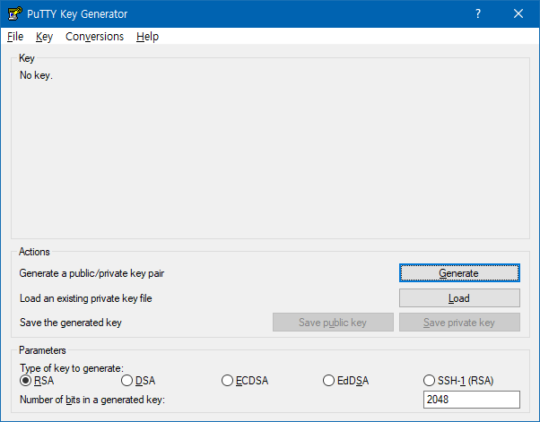 |
    | ------------------------------------------------------------ |
4. pageant.exe 실행 후 아이콘 우클릭 -> Add Key -> ppk 파일 선택
5. pageant.exe 아이콘 우클릭 후 New Session을 클릭하여 Host Name 정보(이전에 설정한 탄력적IP주소)를 입력 후 Open 버튼을 클릭합니다. (접속)
    | 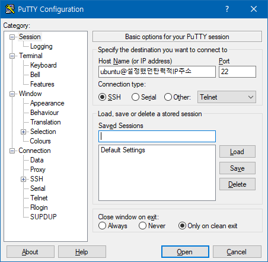 |
    | ------------------------------------------------------- |
6. GUI Desktop 연결을 위해 ubuntu 패스워드를 설정합니다.

* 터미널에 다음과 같이 실행하여 패스워드 설정합니다.
    ```
    $ sudo passwd ubuntu
    ```

### SSH 클라이언트를 사용하여 Linux 인스턴스에 연결 (AWS Console 이용)

**AWS > EC2(인스턴스) > `연결`을 사용하여 인스턴스에 연결하려면 다음을 수행합니다.**

1. **workspace VM**을 선택한 후 연결 버튼을 누릅니다.
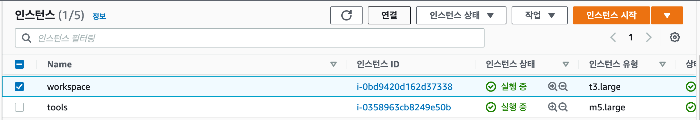 

2. `EC2 인스턴스 연결` 탭에서 **사용자 이름** `ubuntu`로 바꾸고 `연결`하면 별도 터미널 브라우저창이 생성됩니다. 
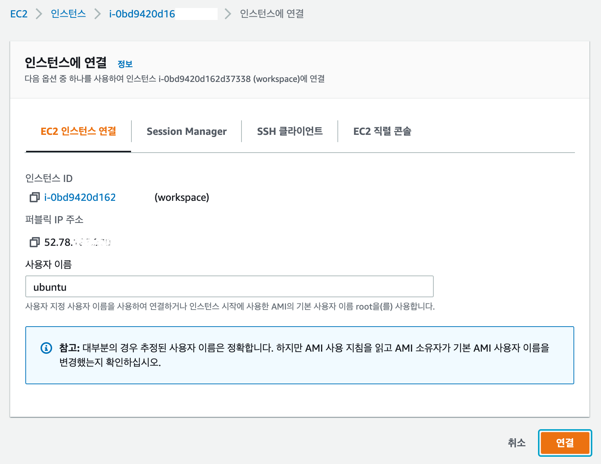 

**GUI Desktop 연결을 위해 ubuntu 패스워드를 설정합니다.**

* 터미널에 다음과 같이 실행하여 패스워드 설정합니다.
    ```
    $ sudo passwd ubuntu
    ```


## Workspace Desktop 연결

macOS 사용자는 **`App Store`**에서 `Microsoft remote desktop`을 검색하여 설치합니다.

* 생성 화면
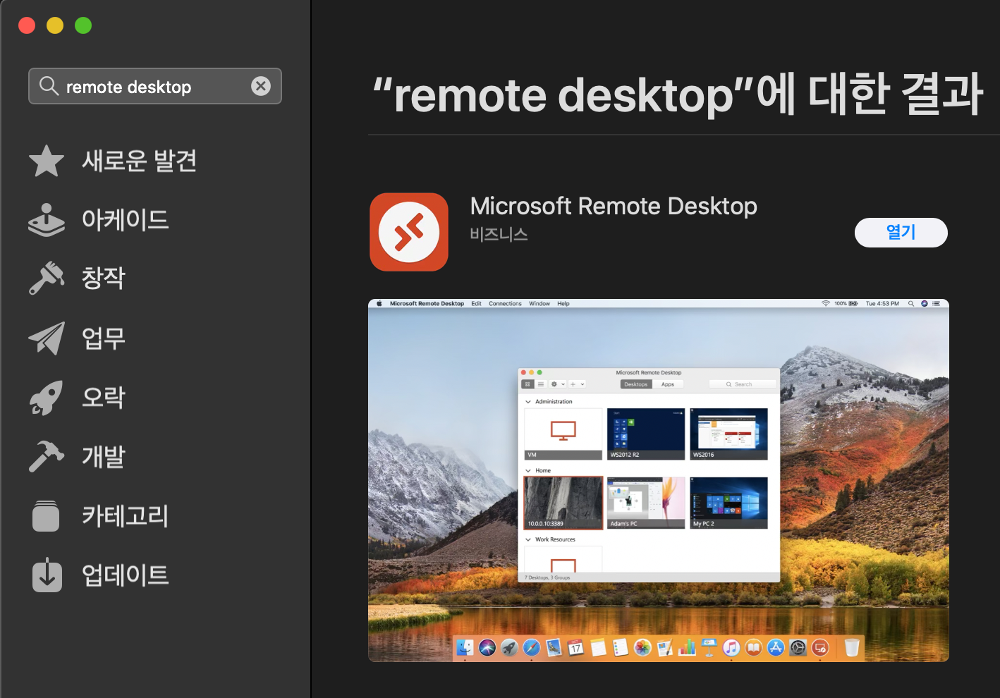 

### Desktop 접속

* desktop을 실행하여 신규 등록을 합니다.
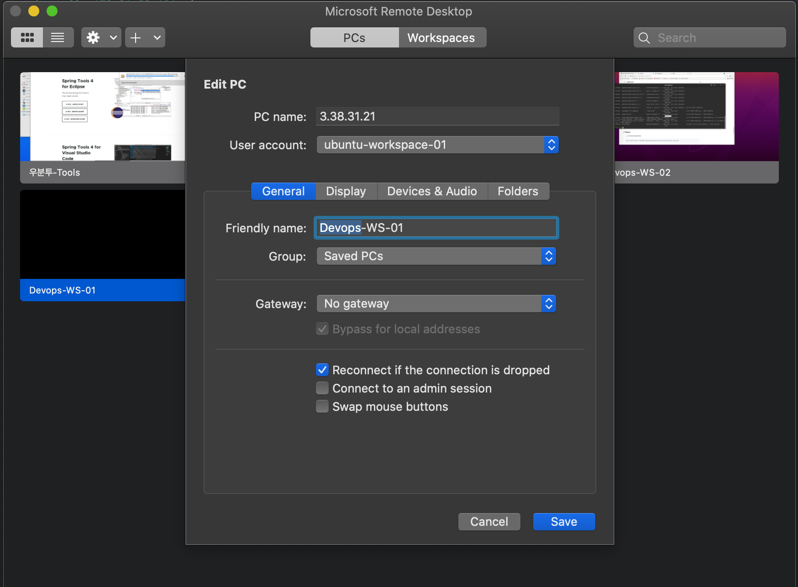 

* Desktop 화면
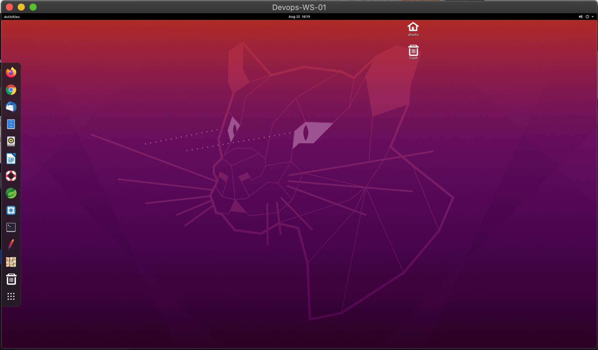 

### Microsoft 원격 데스크톱 연결을 통한 Remote 연결 (For Windows 사용자) 

Windows 사용자는 RDP로 원격 접속을 위해 원격 테스크톱 연결을 사용합니다. (원격 데스크톱은 윈도우 프로 이상 버전에서만 사용할 수 있습니다. 기본 원격 데스크톱 포트는 TCP 3389)

1. 원격 데스크톱 활성화

   Windows 설정(제어판) > 시스템 > 원격 데스크톱 활성화

   

   

   

   

2. 시작 > Windows 보조프로그램 > **원격 데스크톱 연결**을 클릭하여 필요한 접속 정보를 입력 후 원격 접속합니다.

   


### Tools VM 생성

< Tools VM image >
| 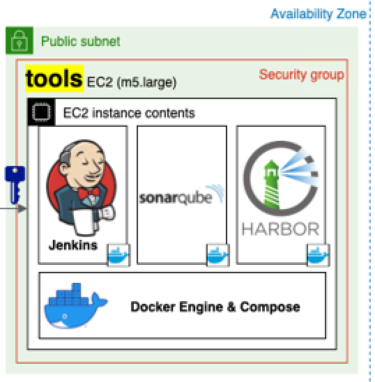 |
| -------------------------------------------------- |

Workspace Remote Desktop(원격 데스크톱) 연결 후,
[AWS Console](https://aws.amazon.com/)에 로그인하여 다음 단계를 실행합니다.

1. 서비스 [EC2 콘솔](https://console.aws.amazon.com/ec2/) 좌측 탐색 창 > 이미지 > AMI > `프라이빗 이미지` 선택합니다.
2. AMI 이름 `skcc-aws-tools-##` 이미지를 선택합니다.
3. 이하 workspace VM 생성 절차대로 진행합니다.
4. 인스턴스 유형 **`m5.large`** 를 선택합니다.

    | 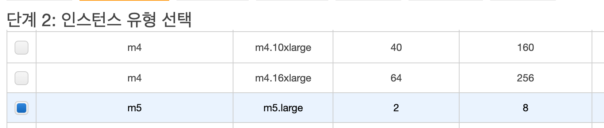 |
    | ------------------------------------------------------- |

5. `다음:인스턴스 세부 정보구성` > `다음:스토리지 추가` > `다음:태그 추가` 까지 진행한 후 다음과 같이 입력합니다.
    * 키 : `Name`
    * 값 : `tools`


6. `다음:보안 그룹 구성`에서 `규칙 추가`를 누른 후 다음과 같이 추가합니다.
    * 유형 : **`사용자 지정 TCP`**
    * 포트 범위 : `8080`, `8000`, `9000`, `50000` , `6100`(설명: scouter)
    * 소스 : `사용자 지정`, `0.0.0.0/0`

    | 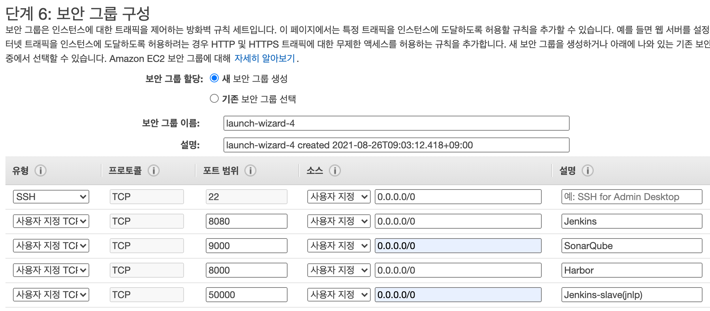 |
    | ------------------------------------------------------- |

    **[추가]**
    * 유형 : **`사용자 지정 UDP`**
    * 포트 범위 : `6100`(설명: scouter)
    * 소스 : `사용자 지정`, `0.0.0.0/0`
<br>

7. `검토 및 시작` 누른 후 검토합니다.


8. `시작하기`를 누른 후 `기존 키 페어 선택 또는 새 키 페어 생성` 하기를 합니다.
    * `새 키 페어 생성`, `RSA`을 선택
    * 키 페어 이름 : `key-tools`
    * `키 페어 다운로드`를 눌러 로컬PC에 저장해 둡니다. 
    > `key-tools.pem` 파일명으로 생성됨

    | 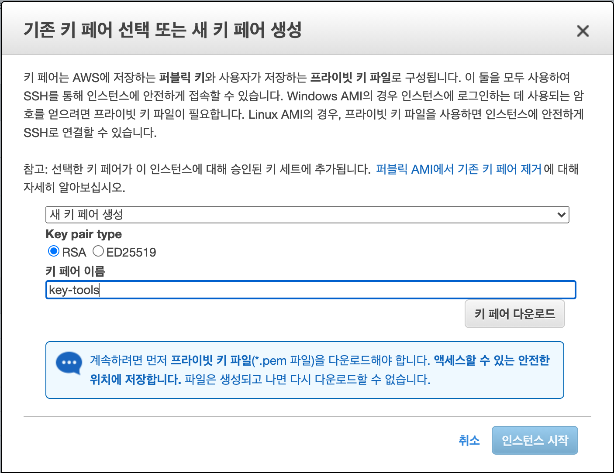 |
    | ------------------------------------------------------- |

9. `인스턴스 시작`을 통해 VM 생성을 확인합니다.
    * 좌측 탐색 창 > 인스턴스 > 인스턴스에서 `tools` VM을 확인할 수 있습니다.

10. workspace VM을 참고하여 탄력적 IP 생성 및 연결을 진행합니다.

### 추가 환경 설정

1. 01.7-Setup-Harbor.md > **Harbor YML 파일 구성** 참고하여 Harbor를 재시작합니다.
2. AWS IAM 처리 : 06.1-Setup-AWS-CLI.md > **IAM 사용자에 대한 Access Key 생성** 참고하여 추가합니다. (실습 이미지로 진행하는 경우, AWS CLI가 이미 설치되어 있고, IAM 설정은 해야 함)

비고.
hostname 변경 및 적용 (ex. workspace, tools 등)
```bash
#변경
$ sudo vi /etc/hostname
    
#적용
$ sudo hostname -F /etc/hostname
```

## 참고

[Homebrew Installation](https://docs.brew.sh/Installation)  
[JDK-8146115 : Improve docker container detection and resource configuration usage](https://bugs.java.com/bugdatabase/view_bug.do?bug_id=JDK-8146115)  
[https://bugs.openjdk.java.net/browse/JDK-8146115](https://bugs.openjdk.java.net/browse/JDK-8146115)  
[Java LTS Version Roadmap and Guide](https://www.petefreitag.com/item/911.cfm)  
[Java version history](https://en.wikipedia.org/wiki/Java_version_history)  
[무료 자바 8 업데이트가 끝났을 때의 대안 5가지](https://www.ciokorea.com/news/114909)  
[Uninstalling the JDK on macOS](https://docs.oracle.com/javase/10/install/installation-jdk-and-jre-macos.htm#JSJIG-GUID-577CEA7C-E51C-416D-B9C6-B1469F45AC78)  
[AdoptOpenJDK - HomeBrew TAP](https://github.com/AdoptOpenJDK/homebrew-openjdk)  
[Homebrew Cask](https://github.com/Homebrew/homebrew-cask)  
[Homebrew Formulae - maven](https://formulae.brew.sh/formula/maven)  
[Installing and updating](https://learning.postman.com/docs/getting-started/installation-and-updates/)  
