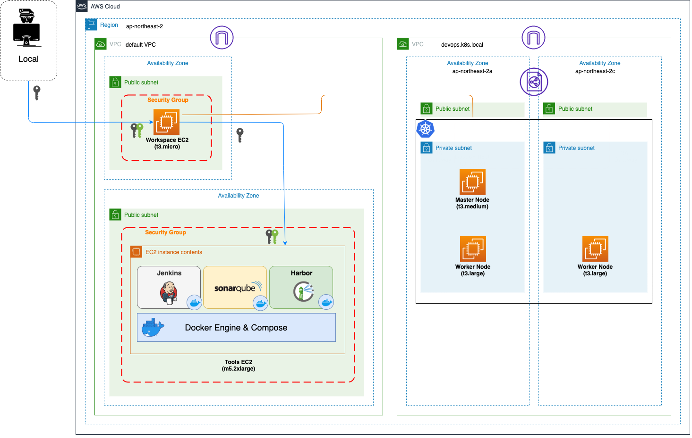

# 실습 작업공간을 위한 EC2 인스턴스 구성

[kops](https://kops.sigs.k8s.io/) 및 [kubectl](https://kubernetes.io/ko/docs/reference/kubectl/overview/)를 사용하여 Kubernetes 설치 및 관리할 Amazon EC2 Linux 인스턴스를 구성합니다.

Amazon EC2 Linux 인스턴스에는 AWS CLI가 포함되어 있어 별도 설치할 필요가 없습니다.

## 전체 Workshop 환경 요약



## 키 페어 생성

AWS에서는 공개키(Public Key) 암호화를 사용하여 인스턴스에 대한 로그인 정보를 보호합니다. Linux 인스턴스에는 암호가 없으므로 인스턴스에 안전하게 로그인하기 위해 키 페어를 사용합니다. 인스턴스를 시작할 때 키 페어의 이름을 지정한 다음, SSH를 사용하여 로그인할 때 개인키(Private Key)를 제공합니다.

키 페어를 아직 생성하지 않은 경우 Amazon EC2 콘솔을 사용하여 생성할 수 있습니다.

**키 페어를 만들려면 아래와 같이 진행합니다.**

1. AWS Management 콘솔에 로그인한 다음, [EC2 콘솔](https://console.aws.amazon.com/ec2/)을 엽니다.
2. 우측 상단에서 EC2 인스턴스를 생성할 리전으로 `아시아 태평양 (서울) ap-northeast-2`를 선택합니다.
3. 좌측 탐색 창에서 **네트워크 및 보안**에서 **키 페어**를 선택합니다.
4. **키 페어 생성(Create key pair)** 버튼을 클릭합니다.
5. **이름**에 설명이 포함된 키 페어 이름을 입력합니다. Amazon EC2는 키 이름으로 지정한 이름과 퍼블릭 키를 연결합니다. 키 이름에는 최대 255자의 ASCII 문자를 포함할 수 있습니다. 선행 또는 후행 공백을 포함할 수 없습니다.
6. **파일 형식**에서 프라이빗 키를 저장할 형식을 선택합니다. OpenSSH에서 사용할 수 있는 형식으로 프라이빗 키를 저장하려면 **pem**을 선택합니다. PuTTY(Windows 시스템)에서 사용할 수 있는 형식으로 프라이빗 키를 저장하려면 **ppk**를 선택합니다.
7. **키 페어 생성(Create key pair)** 버튼을 클릭합니다.
8. 브라우저에서 프라이빗 키 파일이 자동으로 다운로드됩니다. 기본 파일 이름은 키 페어의 이름으로 지정한 이름이며, 파일 이름 확장명은 선택한 파일 형식에 따라 결정됩니다. 안전한 장소에 프라이빗 키 파일을 저장합니다.
    > 중요!  
    > 이때가 사용자가 프라이빗 키 파일을 저장할 수 있는 유일한 기회입니다.
9. macOS 또는 Linux 컴퓨터에서 SSH 클라이언트를 사용하여 Linux 인스턴스에 연결하려면 사용자만 프라이빗 키 파일을 읽을 수 있도록 다음 명령으로 해당 파일의 권한을 설정합니다.

    ```bash
    chmod 400 my-key-pair.pem
    ```

    이러한 권한을 설정하지 않으면 이 키 페어를 사용하여 인스턴스에 연결할 수 없습니다. 자세한 내용은 [오류: 보호되지 않는 프라이빗 키 파일](https://docs.aws.amazon.com/ko_kr/AWSEC2/latest/UserGuide/TroubleshootingInstancesConnecting.html#troubleshoot-unprotected-key) 문서를 참조하십시오.

## 보안 그룹 생성

보안 그룹은 연결된 인스턴스에 대한 방화벽 역할을 하여 인스턴스 수준에서 인바운드 트래픽과 아웃바운드 트래픽을 모두 제어합니다. SSH를 사용하여 IP 주소에서 인스턴스에 연결할 수 있게 하는 규칙을 보안 그룹에 추가해야 합니다. 어디서나 인바운드 및 아웃바운드 HTTP/HTTPS 액세스를 허용하는 규칙을 추가할 수도 있습니다.

**최소 권한으로 보안 그룹을 생성하려면 아래와 같이 진행합니다.**

1. [EC2 콘솔](https://console.aws.amazon.com/ec2/)의 좌측 탐색 창에서 **네트워크 및 보안 > 보안 그룹**을 선택합니다.
2. **보안 그룹 생성** 버튼을 클릭합니다.
3. **기본 세부 정보** 섹션에서 다음을 수행합니다.
    * 새 보안 그룹의 이름과 설명을 입력합니다. 기억하기 쉬운 이름을 사용합니다(예: 사용자 이름, 뒤에 _SG_ 및 리전 이름). 예를 들어, me_SG_uswest2로 지정할 수 있습니다.
    * VPC 목록에서 리전의 기본(default) VPC를 선택합니다.
4. 인바운드 규칙 섹션에서 다음 규칙을 생성합니다(각 새 규칙에 대해 규칙 추가 선택).
    * ~~**규칙 추가** 버튼을 클릭한 후, **Type(유형)** 목록에서 **HTTP**를 선택하고 **소스**가 **위치 무관** (0.0.0.0/0)으로 설정되어 있는지 확인합니다.~~
    * ~~**규칙 추가** 버튼을 클릭한 후, **유형** 목록에서 **HTTPS**를 선택하고 **소스**가 **위치 무관** (0.0.0.0/0)으로 설정되어 있는지 확인합니다.~~
    * **규칙 추가** 버튼을 클릭한 후, **유형** 목록에서 **SSH**를 선택합니다. **소스**를 로컬 컴퓨터의 퍼블릭 IPv4 주소로 자동으로 채우려면 소스 상자에서 `내 IP`를 선택하면 됩니다. 또는 사용자 지정을 선택하고 컴퓨터 또는 네트워크의 퍼블릭 IPv4 주소를 CIDR 표기법으로 지정해도 됩니다. 개별 IP 주소를 CIDR 표기법으로 지정하려면 라우팅 접미사 /32를 추가합니다(예: 203.0.113.25/32). 회사에서 주소를 범위로 할당하는 경우 전체 범위(예: 203.0.113.0/24)를 지정합니다.
        > 주의!  
        > 보안상 테스트를 위해 짧은 시간 동안만 허용하는 경우를 제외하고 모든 IPv4 주소(0.0.0.0/0)에서의 인스턴스에 대한 SSH 액세스를 허용하지 않는 것이 좋습니다.
5. **보안 그룹 생성** 버튼을 클릭합니다.

## 인스턴스 생성

### 인스턴스 시작

**인스턴스를 시작하려면 다음을 수행합니다.**

1. [EC2 콘솔](https://console.aws.amazon.com/ec2/)의 좌측 탐색 창에서 **인스턴스**를 선택합니다.
2. **인스턴스 시작** 버튼을 클릭합니다.
3. **Amazon Machine Image(AMI) 선택** 페이지에 인스턴스에 대한 템플릿 역할을 하는 Amazon Machine Image(AMI)라는 기본 구성 목록이 표시됩니다. `Amazon Linux 2 AMI (HVM), SSD Volume Type`을 선택합니다. 해당하는 AMI는 "프리 티어 사용 가능"으로 표시됩니다.
4. **인스턴스 유형 선택** 페이지에서 인스턴스의 하드웨어 구성을 선택할 수 있습니다. `t3.micro` 인스턴스 유형을 선택합니다.
5. **검토 및 시작(Review and Launch)** 버튼을 클릭하여 마법사가 다른 구성 설정을 완료하게 합니다.
6. **인스턴스 시작 검토** 페이지의 **보안 그룹** 섹션에서 아래와 같이 수행하여 이전 단계에서 만든 보안 그룹을 선택합니다.
    * **보안 그룹 편집**을 클릭합니다.
    * **보안 그룹 구성** 페이지에서 **기존 보안 그룹 선택**을 선택합니다.
    * 기존 보안 그룹 목록에서 해당 보안 그룹을 선택한 다음, **검토 후 시작(Review and Launch)** 버튼을 클릭합니다.
7. **인스턴스 시작 검토** 페이지에서 **시작하기** 버튼을 클릭합니다.
8. **기존 키 페어 선택 또는 새 키 페어 생성** 모달(Modal) 창이 나타나면 **기존 키 페어 선택**을 선택한 다음 앞 단계에서 생성한 키 페어를 선택합니다.
    > 주의!  
    > 키 페어 없이 계속을 선택하지 마십시오. 키 페어 없이 인스턴스를 시작하면 인스턴스에 연결할 수 없습니다.

    준비되면 승인 체크박스를 선택한 다음 **인스턴스 시작** 버튼을 클릭합니다.
9. **시작 상태** 페이지에서 인스턴스가 시작 중인지 확인할 수 있습니다. **인스턴스 보기** 버튼을 클릭하여 시작 상태 페이지를 닫고 콘솔로 돌아갑니다.
10. **인스턴스** 화면에서 시작 상태를 볼 수 있습니다. 인스턴스를 시작하는 데 약간 시간이 걸립니다. 인스턴스를 시작할 때 초기 상태는 `대기 중(pending)`입니다. 인스턴스가 시작된 후에는 상태가 `실행 중(running)`으로 바뀌고 퍼블릭 DNS 이름을 받습니다. **(퍼블릭 DNS(IPv4)** 열이 숨겨져 있는 경우 페이지 오른쪽 상단 모서리에 있는 **열 표시/숨기기**(기어 모양 아이콘)를 선택한 다음 **퍼블릭 DNS(IPv4)**를 선택합니다.)
11. 연결할 수 있도록 인스턴스가 준비될 때까지 몇 분 정도 걸릴 수 있습니다. 인스턴스가 상태 검사를 통과했는지 확인하십시오. **상태 검사** 열에서 이 정보를 볼 수 있습니다.

### 인스턴스 태그 지정

**인스턴스에 태그를 지정하려면 다음을 수행합니다.**

1. [EC2 콘솔](https://console.aws.amazon.com/ec2/)의 **인스턴스** 페이지에서 태그를 지정할 인스턴스를 선택하고 **작업** 버튼을 클릭한 후, **세부 정보 보기**를 선택합니다.
2. **태그** 탭에서 **태그 관리** 버튼을 클릭합니다.
3. **태그 추가** 버튼을 클릭한 후, **키**에 `Name`을 입력하고 **값**에 인스턴스 이름을 입력합니다(예: DevOps Training).
4. **저장** 버튼을 클릭합니다.

## 탄력적 IP 주소

### 탄력적 IP 주소 할당

**탄력적 IP 주소를 할당하려면 아래와 같이 진행합니다.**

1. [EC2 콘솔](https://console.aws.amazon.com/ec2/)의 좌측 탐색 창에서 **네트워크 및 보안 > 탄력적 IP**을 선택합니다.
2. **탄력적 IP 주소 할당** 버튼을 클릭합니다.
3. **네트워크 경계 그룹**에 `ap-northeast-2`으로 설정되어 있는지 확인합니다.
4. **퍼블릭 IPv4 주소 풀**에 `Amazon의 IP 주소 풀`을 선택합니다.
    * Amazon의 IP 주소 풀 — IPv4 주소를 Amazon의 IP 주소 풀에서 할당하려는 경우
    * 내 퍼블릭 IPv4 주소 풀 — AWS 계정으로 가져온 IP 주소 풀에서 IPv4 주소를 할당하려는 경우. IP 주소 풀이 없는 경우에는 이 옵션을 사용할 수 없습니다.
    * IPv4 주소의 고객 소유 풀 — AWS Outpost에서 사용하기 위해 온프레미스 네트워크에서 만든 풀에서 IPv4 주소를 할당하려는 경우. AWS Outpost가 없는 경우 이 옵션이 비활성화됩니다.
5. **할당** 버튼을 클릭합니다.

> AWS 계정은 리전 당 5개의 탄력적 IP 주소로 제한되어 있습니다.

### 인스턴스에 탄력적 IP 주소 연결

**인스턴스와 탄력적 IP 주소를 연결하려면 다음을 수행합니다.**

1. [EC2 콘솔](https://console.aws.amazon.com/ec2/)의 **탄력적 IP 주소** 페이지에서 연결할 탄력적 IP 주소를 선택하고 **작업** 버튼을 클릭한 후, **탄력적 IP 주소 연결**을 선택합니다.
2. **리소스 유형**에서 `인스턴스`를 선택합니다.
3. **인스턴스**에 앞 단계에서 생성한 인스턴스를 선택합니다. 탄력적 IP 주소를 연결할 인스턴스를 선택합니다. 텍스트를 입력하여 특정 인스턴스를 검색할 수도 있습니다.
4. (선택 사항) 프라이빗 IP 주소에 탄력적 IP 주소를 연결할 프라이빗 IP 주소를 지정합니다.
5. **연결** 버튼을 클릭합니다.

## 인스턴스에 연결

### SSH 클라이언트를 사용하여 Linux 인스턴스에 연결 (macOS)

**SSH를 사용하여 인스턴스에 연결하려면 다음을 수행합니다.**

1. **SSH 클라이언트**(터미널)를 엽니다.
2. 저장했던 **프라이빗 키 파일**을 찾습니다.
3. 프라이빗 키 파일의 권한이 설정되지 않았다면 아래 명령을 실행하여 권한을 설정합니다.

    ```bash
    chmod 400 my-key-pair.pem
    ```

4. 프라이빗 키 파일과 퍼블릭 IPv4 주소를 사용하여 아래 명령을 실행합니다.

    ```bash
    $ ssh -i /path/my-key-pair.pem ec2-user@my-instance-IPv4-address
    The authenticity of host 'xx.xx.xx.xxx (xx.xx.xx.xxx)' can't be established.
    ECDSA key fingerprint is SHA256:l4UB/neBad9tvkgJf1QZWxheQmR59WgrgzEimCG6kZY.
    Are you sure you want to continue connecting (yes/no/[fingerprint])? yes
    Warning: Permanently added 'xx.xx.xx.xxx' (ECDSA) to the list of known hosts.
    Last login: Sun Feb  7 13:53:10 2021 from xxx.xxx.xxx.xx

           __|  __|_  )
           _|  (     /   Amazon Linux 2 AMI
          ___|\___|___|

    https://aws.amazon.com/amazon-linux-2/
    ```

    > 참고 : Ama Linux의 인스턴스 접속 계정은 `ec2-user`입니다.

### PuTTY를 사용하여 Linux 인스턴스에 연결 (Windows)

**PuTTY를 사용하여 인스턴스에 연결하려면 다음을 수행합니다.**

1. PuTTY를 시작합니다. 즉, **시작 메뉴 > PuTTY (64-bit) > PuTTY**를 선택합니다.
2. **Category** 창에서 **Session**을 선택하고 다음 필드를 작성합니다.
    * **Host Name (or IP address)** 필드에 IPv4 주소를 사용하여 `ec2-user@my-instance-IPv4-address`를 입력합니다.
    * **Port** 값이 22인지 확인합니다.
    * **Connection type** 아래에서 SSH를 선택합니다.
3. (선택 사항) 세션의 활성 상태를 유지하기 위해 일정 간격으로 'keepalive' 데이터를 자동 전송하도록 PuTTY를 구성할 수 있습니다. 이는 세션 비활성으로 인한 인스턴스 연결 해제를 방지하는 데 유용한 기능입니다. **Category** 창에서 **Connection**을 선택한 다음, **Seconds between keepalives** 필드에 필요한 간격을 입력합니다. 예를 들어 비활성 상태가 되고 10분 후에 세션 연결이 해제되는 경우, 180을 입력하여 3분마다 keepalive 데이터를 전송하도록 PuTTY를 구성합니다.
4. **Category** 창에서 **Connection > SSH**를 확장한 다음, Auth를 선택합니다. 다음 작업을 완료합니다.
    * **Browse...** 버튼을 클릭합니다.
    * 생성한 키 페어 .ppk 파일을 선택한 다음, **Open** 버튼을 클릭합니다.
    * (선택 사항) 이 세션을 나중에 다시 시작하려는 경우, 세션 정보를 나중에 사용할 수 있게 저장할 수 있습니다. **Category**에서 **Session**을 선택하고 **Saved Sessions**에 세션 이름을 입력한 다음, **Save** 버튼을 클릭합니다.
    * **Open** 버튼을 클릭합니다.
5. 이 인스턴스에 처음 연결한 경우 PuTTY에서 연결하려는 호스트를 신뢰할 수 있는지 묻는 보안 알림 대화 상자가 표시됩니다.
    * **Yes** 버튼을 클릭합니다. 창이 열리고 인스턴스에 연결됩니다.

### AWS CLI 설치 확인

아래 명령을 실행하면 Amazon Linux 2 AMI로 생성한 Linux 인스턴스에는 AWS CLI가 이미 설치되어 있는 것을 확인할 수 있습니다.

```bash
$ which aws
/usr/bin/aws
$ aws --version
aws-cli/1.18.147 Python/2.7.18 Linux/4.14.214-160.339.amzn2.x86_64 botocore/1.18.6
```

## 참고

[EC2 키 페어 및 Linux 인스턴스](https://docs.aws.amazon.com/ko_kr/AWSEC2/latest/UserGuide/ec2-key-pairs.html)  
[Amazon EC2 설정](https://docs.aws.amazon.com/ko_kr/AWSEC2/latest/UserGuide/get-set-up-for-amazon-ec2.html)  
[Amazon EC2 Linux 인스턴스 시작하기](https://docs.aws.amazon.com/ko_kr/AWSEC2/latest/UserGuide/EC2_GetStarted.html)  
[탄력적인 IP 주소](https://docs.aws.amazon.com/ko_kr/AWSEC2/latest/UserGuide/elastic-ip-addresses-eip.html)  
[SSH를 사용하여 Linux 인스턴스에 연결](https://docs.aws.amazon.com/ko_kr/AWSEC2/latest/UserGuide/AccessingInstancesLinux.html)  
[PuTTY를 사용하여 Windows에서 Linux 인스턴스에 연결](https://docs.aws.amazon.com/ko_kr/AWSEC2/latest/UserGuide/putty.html)  
