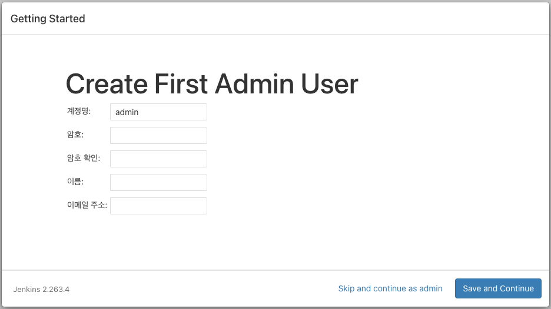

**[목차]**
- [Jenkins 설치 및 구성](#jenkins-설치-및-구성)
  - [Docker Compose를 사용하여 Jenkins 설치](#docker-compose를-사용하여-jenkins-설치)
    - [Docker bridge network 생성](#docker-bridge-network-생성)
    - [디렉토리 생성](#디렉토리-생성)
    - [docker-compose.yml 파일 준비](#docker-composeyml-파일-준비)
    - [Jenkins 구동](#jenkins-구동)
    - [초기 화면](#초기-화면)
    - [필수 Plugin 설치](#필수-plugin-설치)
    - [Admin 계정 생성](#admin-계정-생성)
  - [참고](#참고)
# Jenkins 설치 및 구성

**젠킨스**(Jenkins)는 소프트웨어 개발 시 지속적 통합(continuous integration) 서비스를 제공하는 툴입니다. 다수의 개발자들이 하나의 프로그램을 개발할 때 버전 충돌을 방지하기 위해 각자 작업한 내용을 공유 영역에 있는 Git 등의 저장소에 빈번히 업로드함으로써 지속적 통합이 가능하도록 해줍니다. MIT 라이선스를 따릅니다.

## Docker Compose를 사용하여 Jenkins 설치

### Docker bridge network 생성

`docker network create` 명령을 사용하여 Jenkins 컨테이너가 사용할 사용자 정의 브릿지 네트워크를 생성합니다.  
(`--driver bridge`은 기본값이므로 생략할 수 있습니다.)

```bash
docker network create --driver bridge jenkins-net
```

아래 명령을 실행하여 Docker 네트워크를 나열합니다.

```bash
$ docker network ls
NETWORK ID     NAME          DRIVER    SCOPE
c03afca8f518   bridge        bridge    local
d0da05445ff0   host          host      local
4b9d3631755e   jenkins-net   bridge    local
fc3416e25d63   none          null      local
```

jenkins-net 네트워크를 검사하면, IP 주소와 이 네트워크에 연결된 컨테이너가 없다는 것을 알 수 있습니다.

```bash
$ docker network inspect jenkins-net
[
    {
        "Name": "jenkins-net",
        "Id": "4b9d3631755e583ac810a02fffa26e5d052fa650dfafcbb49f308b0853839331",
        "Created": "2021-02-17T06:08:38.993132472Z",
        "Scope": "local",
        "Driver": "bridge",
        "EnableIPv6": false,
        "IPAM": {
            "Driver": "default",
            "Options": {},
            "Config": [
                {
                    "Subnet": "172.18.0.0/16",
                    "Gateway": "172.18.0.1"
                }
            ]
        },
        "Internal": false,
        "Attachable": false,
        "Ingress": false,
        "ConfigFrom": {
            "Network": ""
        },
        "ConfigOnly": false,
        "Containers": {},
        "Options": {},
        "Labels": {}
    }
]
```

### 디렉토리 생성

Jenkins 작업 디렉토리 (Working directory)를 생성합니다.

```bash
cd /data
sudo mkdir jenkins
cd jenkins
```

Jenkins 데이터를 영속적(Persistent)으로 저장하기 위한 바인드 마운트(Bind mount)용 디렉토리를 생성합니다.

```bash
sudo mkdir jenkins_home
sudo mkdir jenkins_docker_certs
```

`jenkins` 디렉토리의 소유권을 $USER로 변경하고 권한을 변경합니다.

```bash
sudo chown -R $USER:$USER /data/jenkins/
sudo chmod -R 755 /data/jenkins/
```

### docker-compose.yml 파일 준비

Java 11에서 Jenkins를 실행하려면 Docker 커뮤니티에서 유지 관리하는 공식 [openjdk:11-jdk](https://hub.docker.com/_/openjdk) 이미지 기반의 Jenkins 이미지를 사용하면 됩니다.  
Java 11 기반 이미지의 최신 버전 릴리즈를 사용하려면 `jdk11` 태그를 사용합니다. 다른 릴리스의 경우, 버전에 `-jdk11` 태그를 추가합니다. (예 : 2.164-jdk11)

현재 LTS(Long-Term Support) 버전인 2.263.4의 Java 11 기반 이미지를 사용합니다.

docker-compose.yml 파일을 생성합니다.

```bash
vim docker-compose.yml
```

아래 내용을 추가하고 저장합니다.

```bash
version: '3.8'

networks:
  default:
    external:
      name: jenkins-net

services:

  dind:
    image: docker:dind
    container_name: dind
    restart: always
    privileged: true
    networks:
      default:
        aliases:
          - docker
    ports:
      - '2376:2376'
    volumes:
      - './jenkins_home:/var/jenkins_home'
      - './jenkins_docker_certs:/certs/client'
    environment:
      DOCKER_TLS_CERTDIR: '/certs'

  jenkins:
    image: 'jenkins/jenkins:2.263.4-lts-jdk11'
    container_name: jenkins
    restart: always
    depends_on:
      - dind
    ports:
      - '8080:8080'
      - '50000:50000'
    volumes:
      - './jenkins_home:/var/jenkins_home'
      - './jenkins_docker_certs:/certs/client:ro'
      - '/usr/bin/docker:/usr/bin/docker'
    environment:
      DOCKER_HOST: 'tcp://docker:2376'
      DOCKER_CERT_PATH: '/certs/client'
      DOCKER_TLS_VERIFY: 1
      JAVA_OPTS: '-Xmx1024m -Djava.awt.headless=true'
      TZ: 'Asia/Seoul'
```

### Jenkins 구동

`docker-compose up` 명령을 실행하여 Jenkins를 구동합니다.

```bash
docker-compose up -d
```

jenkins-net 네트워크를 검사하면, 네트워크에 두 개의 컨테이너가 연결된 것을 알 수 있습니다.

```bash
$ docker network inspect jenkins-net
[
    {
        "Name": "jenkins-net",
        "Id": "4b9d3631755e583ac810a02fffa26e5d052fa650dfafcbb49f308b0853839331",
        "Created": "2021-02-17T06:08:38.993132472Z",
        "Scope": "local",
        "Driver": "bridge",
        "EnableIPv6": false,
        "IPAM": {
            "Driver": "default",
            "Options": {},
            "Config": [
                {
                    "Subnet": "172.18.0.0/16",
                    "Gateway": "172.18.0.1"
                }
            ]
        },
        "Internal": false,
        "Attachable": false,
        "Ingress": false,
        "ConfigFrom": {
            "Network": ""
        },
        "ConfigOnly": false,
        "Containers": {
            "521cb08b9209c779d837dca417b49a7c9637019217372de9c604aed7cf8f6ad8": {
                "Name": "dind",
                "EndpointID": "e277d3bfaa1ada7ef9c0251cfb728b2a25e154ca69a66b54656d0c20155d0cc8",
                "MacAddress": "02:42:ac:12:00:02",
                "IPv4Address": "172.18.0.2/16",
                "IPv6Address": ""
            },
            "664dce189c2cd8ba6c1b1fcb238bacec98dc21a1878bb4716cf746b61e1d5b6e": {
                "Name": "jenkins",
                "EndpointID": "2256e39a41a8422364065963a8115773243ef2a7d29632f2d28d601257f63475",
                "MacAddress": "02:42:ac:12:00:03",
                "IPv4Address": "172.18.0.3/16",
                "IPv6Address": ""
            }
        },
        "Options": {},
        "Labels": {}
    }
]
```

아래 명령을 실행하면 Jenkins 구동 로그를 확인할 수 있습니다.

```bash
docker-compose logs -f
```

아래 명령을 실행하여 container 목록을 확인할 수 있습니다.

```bash
$ docker-compose ps -a
 Name                Command               State                        Ports
---------------------------------------------------------------------------------------------------
dind      dockerd-entrypoint.sh            Up      2375/tcp, 0.0.0.0:2376->2376/tcp
jenkins   /sbin/tini -- /usr/local/b ...   Up      0.0.0.0:50000->50000/tcp, 0.0.0.0:8080->8080/tcp
```

아래 명령을 실행하여 Jenkins 초기 Admin 비밀번호를 확인하고 기록합니다.

```bash
docker exec jenkins cat /var/jenkins_home/secrets/initialAdminPassword
```

### 초기 화면


앞 단계에서 기록했던 초기 Admin 비밀번호를 복사하여 붙여넣고 **Continue** 버튼을 클릭합니다.

### 필수 Plugin 설치


**Install suggested plugins**를 클릭하여 필수 Plugin을 설치합니다.


### Admin 계정 생성



* Admin 계정 정보를 입력하고 **Save and Continue** 버튼을 클릭합니다.
* **Instance Configuration** 화면에서 **Save and Finish** 버튼을 클릭합니다.
* **Jenkins is ready!** 메시지가 보이면 **Start using Jenkins** 버튼을 클릭합니다.

## 참고

[Installing Jenkins using Docker](https://www.jenkins.io/doc/book/installing/docker/)  
[Running Jenkins on Java 11](https://www.jenkins.io/doc/administration/requirements/jenkins-on-java-11/)  
[docker network create](https://docs.docker.com/engine/reference/commandline/network_create/)  
[Use user-defined bridge networks](https://docs.docker.com/network/network-tutorial-standalone/#use-user-defined-bridge-networks)  
[Compose file version 3 reference](https://docs.docker.com/compose/compose-file/compose-file-v3/)  
[Docker Official Images](https://hub.docker.com/_/docker)  
[Jenkins Official Images](https://hub.docker.com/r/jenkins/jenkins)  
