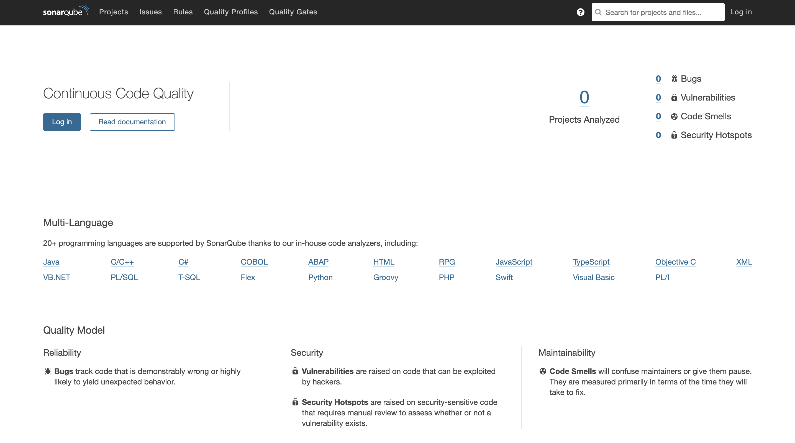
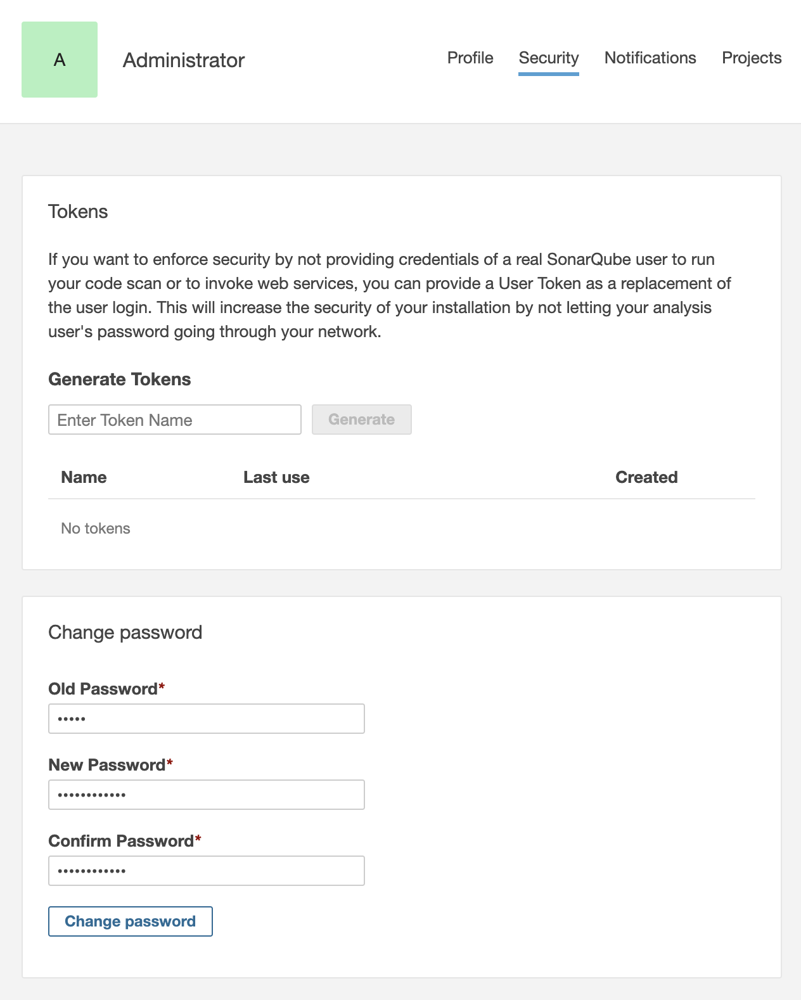
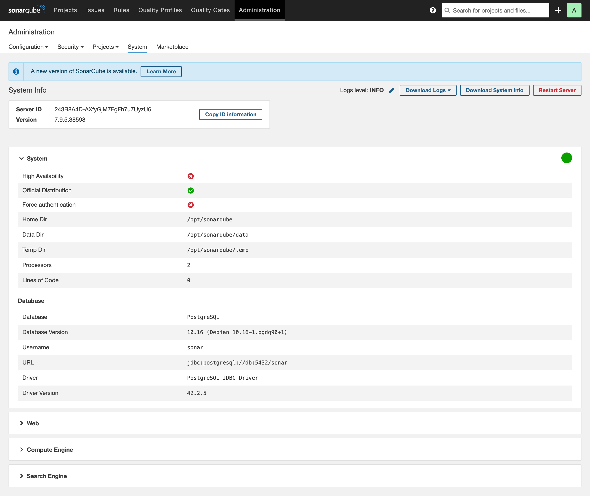

**[목차]**
[TOC]
# SonarQube 설치 및 구성

**소나큐브**(SonarQube, 이전 이름: 소나/Sonar)는 20개 이상의 프로그래밍 언어에서 버그, 코드 스멜, 보안 취약점을 발견할 목적으로 **정적 코드 분석으로 자동 리뷰를 수행하기 위한 지속적인 코드 품질 검사용** 소나소스(SonarSource)가 개발한 **오픈 소스 플랫폼**입니다.  
소나큐브는 중복 코드, 코딩 표준, 유닛 테스트, 코드 커버리지, 코드 복잡도, 주석, 버그 및 보안 취약점의 보고서를 제공합니다.

소나큐브는 **매트릭스 히스토리를 기록하고 점진 그래프를 제공**합니다.  
소나큐브는 완전 자동화된 분석과 Maven, Apache Ant, Graddle, MS빌드, 지속적 통합(CI) 도구(젠킨스, 허드슨 등)와의 연동을 제공합니다.

현재 LTS(Long Term Support) 버전인 SonarQube 7.9를 설치합니다.

## Linux Kernel 파라미터 및 ulimit 설정

SonarQube 내부에 검색 서버로 [Elasticsearch](https://www.elastic.co/kr/elasticsearch/)를 사용합니다.  
SonarQube를 Linux에서 구동하는 경우 다음 설정이 필요합니다.

* vm.max_map_count : 262144 이상
* fs.file-max : 65536 이상
* SonarQube를 실행하는 User가 최소 65536 개의 파일 디스크립터(File descriptors)을 열 수 있어야 함
* SonarQube를 실행하는 User가 최소 4096 개의 스레드(Thread)를 열 수 있어야 함

아래 명령을 실행하여 확인 할 수 있습니다.

```bash
sysctl vm.max_map_count
sysctl fs.file-max
ulimit -n
ulimit -u
```

다음 명령을 실행하여 현재 세션에 대해 동적으로 설정할 수 있습니다.

```bash
sudo sysctl -w vm.max_map_count=262144
sudo sysctl -w fs.file-max=65536
ulimit -n 65536
ulimit -u 4096
```

시스템이 재부팅 되더라도 적용될 수 있게 영구적으로 설정하려면 아래와 같이 수행합니다.

System config 파일을 엽니다.

```bash
sudo vi /etc/sysctl.conf
```

다음 내용을 붙여 넣고 저장합니다.

```bash
vm.max_map_count=262144
fs.file-max=65536
```

`/etc/security/limits.d/99-sonarqube.conf` 파일을 생성한 다음, 아래 내용을 붙여 넣고 저장합니다.

```bash
sudo vi /etc/security/limits.d/99-sonarqube.conf

ubuntu    -    nofile    65536
ubuntu    -    nproc    4096
```

## Docker Compose를 사용하여 SonarQube 설치

### Docker bridge network 생성

`docker network create` 명령을 사용하여 SonarQube 및 PostgreSQL 컨테이너가 사용할 사용자 정의 브릿지 네트워크를 생성합니다.  
(`--driver bridge`은 기본값이므로 생략할 수 있습니다.)

```bash
docker network create --driver bridge sonarqube-net
```

아래 명령을 실행하여 Docker 네트워크를 나열합니다.

```bash
$ docker network ls
NETWORK ID     NAME            DRIVER    SCOPE
d4091bdc904b   bridge          bridge    local
d0da05445ff0   host            host      local
4b9d3631755e   jenkins-net     bridge    local
fc3416e25d63   none            null      local
99accf6d6d52   sonarqube-net   bridge    local
```

sonarqube-net 네트워크를 검사하면, IP 주소와 이 네트워크에 연결된 컨테이너가 없다는 것을 알 수 있습니다.

```bash
docker network inspect sonarqube-net
```

### 디렉토리 생성

SonarQube 작업 디렉토리 (Working directory)를 생성합니다.

```bash
cd /data
sudo mkdir sonarqube
cd sonarqube
```

`sonarqube` 디렉토리의 소유권을 $USER로 변경하고 권한을 변경합니다.

```bash
sudo chown -R $USER:$USER /data/sonarqube/
sudo chmod -R 755 /data/sonarqube/
```

### docker-compose.yml 파일 준비

현재 LTS(Long-Term Support) 버전인 7.9.5 community 이미지를 사용합니다.

docker-compose.yml 파일을 생성합니다.

```bash
vim docker-compose.yml
```

아래 내용을 추가하고 저장합니다.

```bash
version: '3.8'

services:

  sonarqube:
    image: sonarqube:7.9.5-community
    container_name: sonarqube
    restart: always
    depends_on:
      - db
    ports:
      - '9000:9000'
    environment:
      SONARQUBE_HOME: '/opt/sonarqube'
      SONARQUBE_JDBC_URL: 'jdbc:postgresql://db:5432/sonar'
      SONARQUBE_JDBC_USERNAME: sonar
      SONARQUBE_JDBC_PASSWORD: sonar
      TZ: 'Asia/Seoul'
    volumes:
      - 'sonarqube_conf:/opt/sonarqube/conf'
      - 'sonarqube_data:/opt/sonarqube/data'
      - 'sonarqube_logs:/opt/sonarqube/logs'
      - 'sonarqube_extensions:/opt/sonarqube/extensions'

  db:
    image: postgres:10.16
    container_name: postgresql
    restart: always
    environment:
      POSTGRES_USER: sonar
      POSTGRES_PASSWORD: sonar
    volumes:
      - 'postgresql:/var/lib/postgresql'
      - 'postgresql_data:/var/lib/postgresql/data'

networks:
  default:
    external:
      name: sonarqube-net

volumes:
  sonarqube_conf:
  sonarqube_data:
  sonarqube_logs:
  sonarqube_extensions:
  postgresql:
  postgresql_data:
```

> 주의: [Bind mounts](https://docs.docker.com/storage/bind-mounts/)가 아닌 위의 명령으로 생성한 [Volumes](https://docs.docker.com/storage/volumes/)을 사용해야 합니다. 바인드 마운트를 사용하면 플러그인이 올바르게 채워지지 않습니다.

### SonarQube 구동

`docker-compose up` 명령을 실행하여 SonarQube를 구동합니다.

```bash
docker-compose up -d
```

sonarqube-net 네트워크를 검사하면, 네트워크에 두 개의 컨테이너가 연결된 것을 알 수 있습니다.

```bash
docker network inspect sonarqube-net
```

아래 명령을 실행하면 SonarQube 구동 로그를 확인할 수 있습니다.

```bash
docker-compose logs -f
```

아래 명령을 실행하여 container 목록을 확인할 수 있습니다.

```bash
$ docker-compose ps -a
   Name                 Command              State           Ports
---------------------------------------------------------------------------
postgresql   docker-entrypoint.sh postgres   Up      5432/tcp
sonarqube    ./bin/run.sh                    Up      0.0.0.0:9000->9000/tcp
```

### SonarQube 접속

웹 브라우저를 열고 http://[your_ip]:9000에 접속합니다.



#### Admin 비밀번호 변경

**Log in** 버튼을 클릭하고 `admin/admin`으로 로그인 합니다.

아래와 같이 수행하여 기본 비밀번호를 변경합니다.

* 우측 상단의 프로필 **A**를 클릭한 후 **My Account**를 선택합니다.
* **Security** 탭을 클릭한 다음, **Change password** 섹션에서 비밀번호를 변경합니다.

  

#### System Info

상단 네비게이션에서 **Administration** 메뉴을 클릭한 다음, **System** 탭을 클릭하여 시스템 정보를 확인합니다.



## 참고

[SonarQube Long Term Support version](https://www.sonarqube.org/downloads/lts/)  
[The Definitive Guide to SonarQube 7.9 LTS](https://www.sonarqube.org/sonarqube-7-9-lts/)  
[SonarQube Prerequisites and Overview](https://docs.sonarqube.org/7.9/requirements/requirements/)  
[Linux Kernel Documentation for /proc/sys/vm/*](https://www.kernel.org/doc/Documentation/sysctl/vm.txt)  
[Linux Kernel Documentation for /proc/sys/fs/*](https://www.kernel.org/doc/Documentation/sysctl/fs.txt)  
[Installing SonarQube from the Docker Image](https://docs.sonarqube.org/latest/setup/install-server/)  
[Manage data in Docker](https://docs.docker.com/storage/)  
[SonarQube Architecture and Integration](https://docs.sonarqube.org/latest/architecture/architecture-integration/)  
[SonarQube Architecture 및 Integration](https://sonarqubekr.atlassian.net/wiki/spaces/SON/pages/8093714/Architecture+Integration)  
[SonarQube Docker Official Images](https://hub.docker.com/_/sonarqube/)  
[PostgreSQL Docker Official Images](https://hub.docker.com/_/postgres)  
