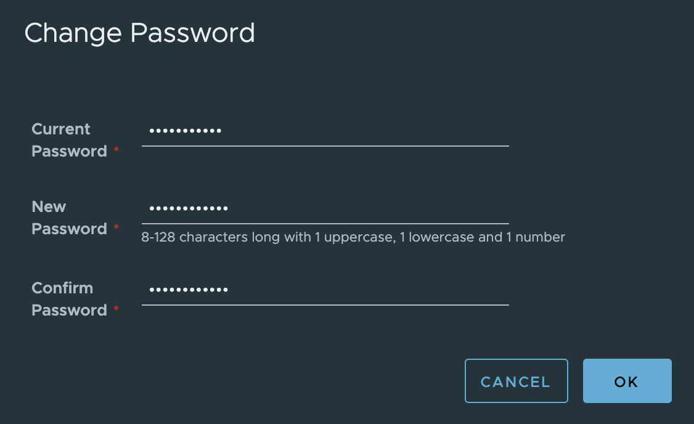

# Harbor 설치 및 구성

**하버**(Harbor)는 콘텐츠를 저장, 서명 및 검색하는 신뢰할 수 있는 클라우드 네이티브 레지스트리 오픈 소스 프로젝트입니다. **하버는 보안, 신원 및 관리 등 사용자에게 일반적으로 필요한 기능을 추가하여 오픈 소스 도커 배포를 확장**합니다. 레지스트리가 빌드 및 실행 환경에 더 가까우면 이미지 전송 효율성을 향상시킬 수 있습니다. 하버는 레지스트리 간 이미지 복제를 지원하며 사용자 관리, 액세스 제어 및 작업 감사와 같은 고급 보안 기능도 제공합니다.

## Harbor 설치

### Harbor Installer 다운로드

[공식 릴리즈](https://github.com/goharbor/harbor/releases) 페이지에서 Harbor Installer를 다운로드 합니다.  
Online installer 또는 Offline installer를 다운로드 합니다.

* Online installer : 온라인 설치 프로그램은 Docker hub에서 Harbor 이미지를 다운로드합니다. 이러한 이유로 설치 프로그램의 크기가 매우 작습니다.
* Offline installer : Harbor를 배포하는 호스트가 인터넷에 연결되어 있지 않은 경우, 오프라인 설치 프로그램을 사용합니다. 오프라인 설치 프로그램에는 사전 빌드된 이미지가 포함되어 있으므로 온라인 설치 프로그램보다 큽니다.

현재 최신 버전인 2.2.0 버전을 다운로드 받은 후 압축을 풉니다.

```bash
cd /data
sudo wget https://github.com/goharbor/harbor/releases/download/v2.2.0/harbor-online-installer-v2.2.0.tgz
sudo tar xvf harbor-online-installer-v2.2.0.tgz
```

### Harbor YML 파일 구성

프로덕션 환경에서 사용하려면 [Harbor에 대한 HTTPS 액세스 구성](https://goharbor.io/docs/2.2.0/install-config/configure-https/)이 필요하지만, 테스트/개발 환경이므로 HTTP를 사용합니다.

`harbor.yml.tmpl` 파일을 복사한 `harbor.yml` 파일을 열고 다음 항목을 수정합니다.

* **hostname** : 서버 IP 주소
* **http > port** : 원하는 HTTP 포트
* **https** : HTTPS를 사용하지 않으므로 주석처리하여 Disable
* **data_volume** : Harbor 데이터 저장 경로 지정
* **harbor_admin_password** : Harbor 시스템 관리자 초기 비밀번호, Harbor가 처음 시작할 때만 사용됩니다. (기본 username/password는 admin/Harbor12345)

```bash
cd harbor
sudo cp harbor.yml.tmpl harbor.yml
sudo vi harbor.yml
```

```bash
# Configuration file of Harbor

# The IP address or hostname to access admin UI and registry service.
# DO NOT use localhost or 127.0.0.1, because Harbor needs to be accessed by external clients.
hostname: [Your_Server_IP]

# http related config
http:
  # port for http, default is 80. If https enabled, this port will redirect to https port
  port: 8000

# https related config
#https:
  # https port for harbor, default is 443
  #port: 443
  # The path of cert and key files for nginx
  #certificate: /your/certificate/path
  #private_key: /your/private/key/path

(생략)

# The default data volume
data_volume: /data/harbor/data
```

### Installer Script 실행

아래 명령을 실행하여 Harbor를 설치합니다.

```bash
sudo ./install.sh
```

구성을 변경하고 반영하려면 아래와 같이 수행합니다.

```bash
sudo docker-compose down -v
sudo vi harbor.yml
sudo ./prepare
sudo docker-compose up -d
```

아래 명령을 실행하여 container 목록을 확인할 수 있습니다.

```bash
$ sudo docker-compose ps -a
      Name                     Command                       State                     Ports
------------------------------------------------------------------------------------------------------
harbor-core         /harbor/entrypoint.sh            Up (health: starting)
harbor-db           /docker-entrypoint.sh            Up (health: starting)
harbor-jobservice   /harbor/entrypoint.sh            Up (health: starting)
harbor-log          /bin/sh -c /usr/local/bin/ ...   Up (health: starting)   127.0.0.1:1514->10514/tcp
harbor-portal       nginx -g daemon off;             Up (health: starting)
nginx               nginx -g daemon off;             Up (health: starting)   0.0.0.0:8000->8080/tcp
redis               redis-server /etc/redis.conf     Up (health: starting)
registry            /home/harbor/entrypoint.sh       Up (health: starting)
registryctl         /home/harbor/start.sh            Up (health: starting)
```

## Harbor 구성

### Harbor 접속

웹 브라우저를 열고 http://[hostname]:[port]로 접속하면 아래와 같이 로그인 화면이 나타납니다.


로그인하면 아래와 같이 **Projects** 페이지로 이동됩니다.


우측 상단의 **admin** 프로필을 클릭하고 **Change Password**를 클릭하여 비밀번호를 수정합니다.



### 프로젝트 생성

Harbor의 프로젝트에는 애플리케이션의 모든 저장소가 포함됩니다. 프로젝트가 생성되기 전에는 이미지를 Harbor로 Push 할 수 없습니다. RBAC (Role-Based Access Control, 역할 기반 액세스 제어)가 프로젝트에 적용되므로 적절한 역할을 가진 사용자만 특정 작업을 수행 할 수 있습니다.

Harbor에는 두 가지 유형의 프로젝트가 있습니다.

* Public : 모든 사용자가 프로젝트에서 이미지를 Pull 할 수 있습니다. 이것은 다른 사람과 저장소를 공유할 수 있는 편리한 방법입니다.
* Private : 프로젝트에 참여한 사용자만 이미지를 Pull 할 수 있습니다.

다음을 수행하여 프로젝트를 생성합니다.

* **Projects** 페이지에서 **NEW PROJECT** 버튼을 클릭합니다.
* **Project Name** 필드에 원하는 프로젝트 이름을 입력합니다.
* (선택사항) 프로젝트를 공개로 설정하려면 **Access Level**의 **Public** 체크박스를 체크합니다.
* **OK** 버튼을 클릭합니다.


<!--
### 프로젝트 Robot 계정 생성

Harbor에서는 프로젝트 로봇 계정을 사용하여 다음을 포함한 프로젝트 실행 작업을 자동화 할 수 있습니다.

* 아티팩트(artifacts) Push
* 아티팩트 Pull
* 아티팩트 삭제
* Helm 차트 읽기
* Helm 차트 버전 생성
* Helm 차트 버전 삭제
* 태그 생성
* 태그 삭제
* 이슈 레이블 생성
* 스캔 생성

프로젝트 로봇 계정은 시크릿(secret)을 사용하여 Harbor 인스턴스에 대한 인증을 사용하므로 OCI(Open Container Initiative) 클라이언트 또는 Harbor API를 통해 Harbor 인스턴스에 연결하여 작업을 자동화 할 수 있습니다. 로봇 계정은 Harbor 인터페이스에 로그인 할 수 없습니다.

다음을 수행하여 프로젝트 Robot 계정을 생성합니다.

* 최소한 프로젝트 관리자(Project Admin) 권한이 있는 계정으로 Harbor 인터페이스에 로그인합니다.
* **Projects** 페이지에서 프로젝트를 선택하여 상세 페이지로 이동한 다음, **Robot Accounts** 탭을 클릭합니다.
* **NEW ROBOT ACCOUNT** 버튼을 클릭합니다.
* **Name** 필드에 원하는 로봇 계정 이름을 입력하고 **Description(선택사항)** 필드에 설명을 입력합니다.
* **Expiration time** 필드에 만료 기간(days)을 입력하거나 콤보박스에서 `Never`를 선택하여 만료되지 않게 설정합니다.
* **Permissions**을 클릭한 후 권한을 선택하여 부여합니다.
* **ADD** 버튼을 클릭합니다.
* 확인 창에서 **EXPORT TO FILE** 버튼을 클릭하여 액세스 토큰을 JSON 파일로 다운로드하거나 클립보드 아이콘을 클릭하여 해당 내용을 클립 보드에 복사합니다.
  > Harbor는 로봇 시크릿 토큰을 저장하지 않으므로 시크릿을 다운로드하거나 해당 내용을 복사하여 텍스트 파일에 붙여 넣어야 합니다. 로봇 계정을 생성 한 후에는 Harbor에서 시크릿을 얻을 수 있는 방법이 없지만 로봇 계정이 생성된 후에는 비밀을 새로 고칠 수 있습니다.


프로젝트 상세 페이지의 **Robot Accounts** 탭에서 생성된 Robot 계정이 `<prefix><project_name>+<account_name>`으로 나타납니다.


### 프로젝트 로봇 계정으로 인증

자동화된 프로세스에서 로봇 계정을 사용하려면, `docker login` 명령을 사용하고 로봇 계정의 자격 증명(credentials)을 제공합니다.

```bash
docker login <harbor_address>
Username: <prefix><project_name>+<account_name>
Password: <secret>
```
-->

### HTTP를 통해 Harbor에 연결

Harbor는 선택적으로 HTTP 연결을 지원하지만 Docker 클라이언트는 항상 먼저 HTTPS를 사용하여 레지스트리에 연결을 시도합니다. Harbor가 HTTP용으로 구성된 경우, 보안되지 않은 레지스트리에 연결할 수 있도록 Docker 클라이언트를 구성해야 합니다. Docker 클라이언트가 안전하지 않은 레지스트리에 대해 구성되지 않은 경우 이미지를 Harbour에 Pull 하거나 Push하려고 하면 다음 오류가 표시됩니다.

```bash
Error response from daemon: Get https://myregistrydomain.com/v2/: http: server gave HTTP response to HTTPS client
```

클라이언트의 Docker 데몬 설정에 `insecure-registries`을 추가해야 합니다.

`/etc/docker/daemon.json` 파일에 아래 내용을 붙여 넣고 저장합니다.

```bash
$ sudo vi /etc/docker/daemon.json

{
     "insecure-registries" : ["<Harbor_IP>:<Harbor_Port>"]
}
```

아래 명령을 실행하여 Docker daemon를 재시작합니다.

```bash
sudo service docker restart
```

> 위와 같은 설정은 레지스트리에 대한 보안을 완전히 무시하도록 Docker를 구성합니다. 이것은 매우 안전하지 않으며 권장되지 않습니다. 레지스트리를 MTM (사소한 중간자 공격)에 노출합니다. 이 솔루션은 격리된 테스트 환경에서만 사용해야 합니다.

docker를 재시작한 경우에는 Harbor를 재구동을 위해 아래와 같이 수행합니다.
(또한 AWS instance(VM)을 재시작한 경우에도 수행)

```bash
sudo docker-compose down -v
sudo docker-compose up -d
```

아래 명령을 실행하여 로그인 합니다.

```bash
docker login http://<Harbor_IP>:<Harbor_Port>
Username: admin
Password: <secret>
WARNING! Your password will be stored unencrypted in /home/ubuntu/.docker/config.json.
Configure a credential helper to remove this warning. See
https://docs.docker.com/engine/reference/commandline/login/#credentials-store

Login Succeeded
```

## 참고

[Harbor Installation and Configuration](https://goharbor.io/docs/2.2.0/install-config/)  
[Harbor Releases](https://github.com/goharbor/harbor/releases)  
[Connecting to Harbor via HTTP](https://goharbor.io/docs/2.0.0/install-config/run-installer-script/#connect-http)  
[Working with Projects](https://goharbor.io/docs/2.2.0/working-with-projects/)  
[About the Open Container Initiative](https://opencontainers.org/about/overview/)  
[Test an insecure registry](https://docs.docker.com/registry/insecure/)  
