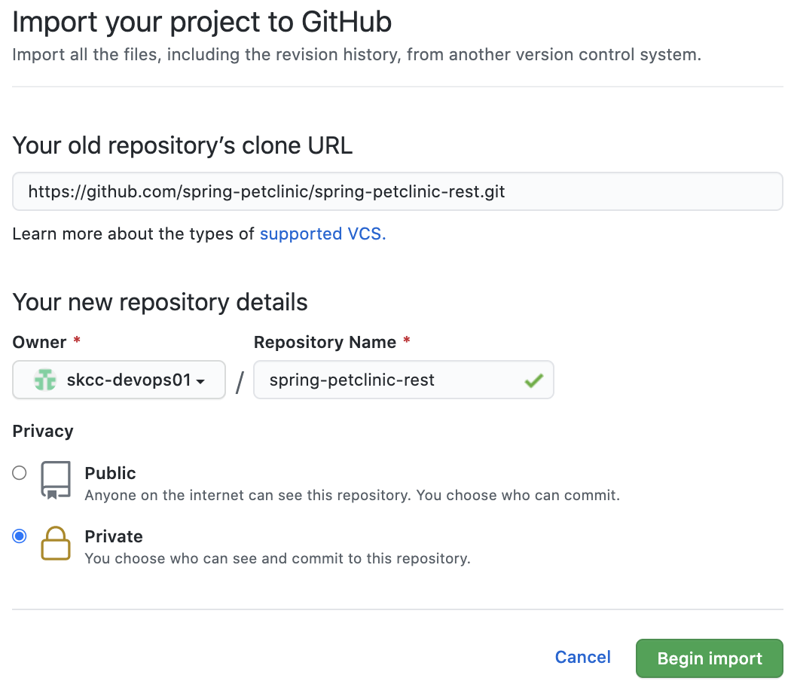
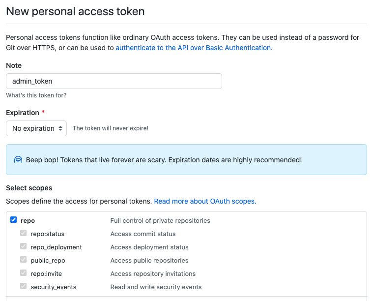
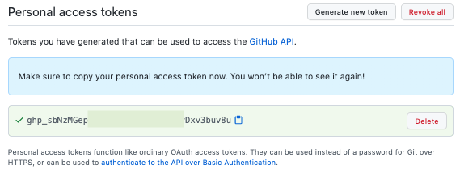

# Git & GitHub 시작하기

## Git에 사용자 이름 및 이메일 설정

Git은 작성자 식별 정보로 사용자 이름과 이메일 주소를 사용하여 커밋 ID에 연결합니다. Git 사용자 이름과 이메일 주소는 GitHub 계정 정보의 사용자 이름 및 이메일 주소와 동일하지 않아도 됩니다.  
`git config` 명령을 사용하여 변경할 수 있으며, Git은 커밋할 때마다 이 정보를 사용합니다.  
한 번 커밋한 후에는 커밋 로그에 있는 이 정보를 변경할 수 없습니다.

`git log` 명령을 사용하여 커밋 히스토리를 확인하면, **Author**에 설정한 정보가 있는 것을 확인할 수 있습니다.

컴퓨터의 모든 Repository에 대한 Git 사용자 이름과 이메일 주소를 설정하려면 아래 명령을 실행합니다.

```bash
git config --global user.name "Gildong Hong"
git config --global user.email "gdhong@example.com"
```

단일 리포지토리에 대해서만 Git 사용자 이름과 이메일 주소를 설정하려면 `--global` 옵션을 제거하고 실행합니다.

```bash
git config user.name "Gildong Hong"
git config user.email "gdhong@example.com"
```

Git 사용자 이름과 이메일 주소를 올바르게 설정했는지 확인합니다.

```bash
$ git config --global user.name
Gildong Hong
$ git config --global user.email
gdhong@example.com
```

또는

```bash
$ git config user.name
Gildong Hong
$ git config user.email
gdhong@example.com
```

아래 명령을 실행하면 Git 구성 정보를 확인할 수 있습니다.

```bash
git config --list
```

## GitHub 계정 생성 및 로그인

아직 GitHub 계정이 없으면 [GitHub](https://github.com/) 사이트에서 **Sign up** 버튼을 클릭한 후 절차에 따라 Free 유형 계정을 생성합니다.  
이메일 인증을 완료하고 로그인 합니다.

## Repository 생성

다음과 같이 GitHub에 **Spring-petclinic-rest** 리포지토리를 생성합니다.

1. 페이지 오른쪽 상단에서 **+** 드롭다운 메뉴을 클릭한 후 **Import repository**를 선택합니다.  
    또는 **Repositories** 탭에서 **New** 버튼을 클릭합니다.
    ||
    | -------------------------------------------------------------------------- |

2. **Import repository** 페이지에서 아래 항목을 입력 또는 선택합니다.
    * **Your old repository clone URL** : `https://github.com/spring-petclinic/spring-petclinic-rest.git`
    * **Repository name** : 리포지토리 이름(`spring-petclinic-rest`)을 입력합니다`
    * **Privacy** : 여기서는 `Private` 선택 (공개 여부에 따라 `Public` 또는 `Private`을 선택합니다.)
    <!--  -->
    
    | |
    | -------------------------------------------------------------------------- |


3. **`Begin import`** 버튼을 클릭합니다.

## [참고] Git에서 GitHub 인증

Git에서 GitHub 리포지토리에 연결하는 경우 HTTPS 또는 SSH를 사용하여 GitHub으로 인증해야 합니다.

### HTTPS를 사용하여 GitHub 연결

HTTPS를 사용하여 GitHub 리포지토리를 Clone하면, Push나 Pull할 때 매번 사용자 이름과 비밀번호를 입력해야 합니다.  
Git Credential 기능을 사용하면 인증정보를 저장해 두고 자동으로 입력되게 할 수 있습니다.  

#### github token을 이용한 인증 
> 패스워드를 통한 인증은 더 이상 이용하지 못함

* Token을 만들기 위해 **우상단(User Profile Icon)** > **Settings** > 좌측 하단 메뉴 (**Developer setting**) > **Personal access tokens** > `Generate new token` 클릭
    * **Note** : 토큰을 지정하는 이름
    * **Expiration** : 토큰 유효 기간 (여기서는 `No Expiration`선택)
    * **Select Scopes** : 필요한 권한에만 체크 (보통은`repo`, `gist`, `admin:org`)

    | |
    | ---------------------------------------------------------- |

    * `Generate token` 클릭하여 생성

    | |
    | ---------------------------------------------------------- |


    * 생성 토큰은 복사하고 안전전 곳에 저장해 둡니다. 
    > 주의할 점은 토큰은 한 번만 보여지고, 만약 잃어버리면 재생성하면 됩니다.
* __앞으로 암호를 입력을 요구하면 토큰을 대신하여 입력하면 됩니다.__


Git Credential 기능은 몇 가지 옵션이 있으며, 자세한 내용은 [Git 도구 - Credential 저장소](https://git-scm.com/book/ko/v2/Git-%EB%8F%84%EA%B5%AC-Credential-%EC%A0%80%EC%9E%A5%EC%86%8C) 문서를 참고하세요.

#### ubuntu 자격 인증 정보 저장
아래는 매번 입력해야 하는 인증을 캐시에 저장하여 일정 시간동안 입력하지 않는 방법입니다.
```bash
git config credential.helper store
```

아직 저장된 credential 정보가 없으니 아래 예시처럼 아이디와 패스워드를 입력합니다.

```bash
$ git push http://example.com/repo.git
Username: <type your username>
Password: <type your token>
```

계정을 입력한 후에는 정보가 서버에 저장되어 입력하지 않아도 됩니다.
이 때 만료시간(초 단위)을 입력하기 위해서 아래의 커맨드를 추가로 입력합니다.

```bash
git config --global credential.helper 'cache --timeout 7200'
```


#### macOS 키체인에 인증 정보 저장

아래 명령을 실행하여 `osxkeychain helper`가 설치되어 있는지 확인합니다.

```bash
git credential-osxkeychain
usage: git credential-osxkeychain <get|store|erase>
```

만약 설치되어 있지 않으면 아래와 같은 메시지가 표시됩니다.

```bash
$ git credential-osxkeychain
 > xcode-select: note: no developer tools were found at '/Applications/Xcode.app',
 > requesting install. Choose an option in the dialog to download the command line developer tools.
```

아래 명령를 실행하여 `credential.helper`에 `osxkeychain`를 사용하겠다고 지정합니다.

```bash
git config --global credential.helper osxkeychain
```

이렇게 하면 macOS 키체인에 인증 정보를 저장하고 GitHub에 연결 시 자동으로 인증할 수 있습니다.

#### Windows 자격 증명 관리자(Credential Manager)에 인증 정보 저장

다음을 수행하여 자격 증명 관리자에 GitHub 인증 정보를 저장합니다.

* Windows 검색에 **자격 증명 관리자** 입력하여 실행합니다.
* **Windows 자격 증명**을 클릭합니다.
* **일반 자격 증명 추가**를 클릭한 후 다음을 입력합니다.
  * 인터넷 또는 네트워크 주소 : `git:https://github.com`
  * 사용자 이름 : GitHub 사용자 이름
  * 암호 : GitHub 비밀번호
* **확인** 버튼을 클릭하여 저장합니다.

아래 명령를 실행하여 `credential.helper`에 `manager-core`를 지정합니다.

```bash
git config --global credential.helper manager-core
```

#### HTTPS를 사용하여 GitHub 리포지토리 Clone

```bash
cd [your_workspace]
git clone https://github.com/[your_username]/spring-boot-hello-world.git
```

### SSH를 사용하여 GitHub 연결

#### SSH key 생성

다음을 수행하여 새로운 SSH Key를 생성합니다.

* macOS에서는 Terminal, Windows 사용자는 Git Bash를 엽니다.
* GitHub 이메일 주소로 대체하여 아래 텍스트를 붙여 넣습니다.

    ```bash
    ssh-keygen -t ed25519 -C "your_email@example.com"
    ```

    > 참고 : Ed25519 알고리즘을 지원하지 않는 레거시 시스템을 사용하는 경우 다음을 사용합니다.
    >
    >  ```bash
    >  ssh-keygen -t rsa -b 4096 -C "your_email@example.com"
    >  ```
    >

* "키를 저장할 파일을 입력하십시오"라는 메시지가 표시되면 Enter 키를 누릅니다. 기본 파일 위치를 사용합니다.
* 프롬프트에서 보안 암호를 입력합니다. 암호를 사용하지 않으려면 입력 없이 Enter 키를 누릅니다.

SSH Key 생성 시 암호를 입력한 경우, [Adding your SSH key to the ssh-agent](https://docs.github.com/en/github/authenticating-to-github/generating-a-new-ssh-key-and-adding-it-to-the-ssh-agent#adding-your-ssh-key-to-the-ssh-agent) 가이드 문서를 참고하여 ssh-agent에 SSH key를 추가합니다.

#### GitHub 계정에 SSH key 등록

다음을 수행하여 GitHub에 SSH key를 등록합니다.

* SSH 공개 키를 클립보드에 복사합니다.

    macOS에서

    ```bash
    pbcopy < ~/.ssh/id_ed25519.pub
    ```

    Windows에서

    ```bash
    clip < ~/.ssh/id_ed25519.pub
    ```

* 우측 상단의 프로필 사진을 클릭한 다음 **Settings**을 클릭 합니다.
* Account settings 사이드 바에서 **SSH and GPG keys**를 클릭 합니다.
* **New SSH key**를 클릭 합니다.
* (선택 사항) **Title** 필드에 키에 대한 설명 레이블을 추가합니다. 예를 들어 개인용 Mac을 사용하는 경우 이 키를 "개인용 MacBook Air"라고 부를 수 있습니다.
* **Key** 필드에 복사한 SSH Key를 붙여 넣습니다.
* **Add SSH key** 버튼을 클릭 합니다.
* 메시지가 표시되면 GitHub 비밀번호를 확인합니다.

#### SSH를 사용하여 GitHub 리포지토리 Clone

```bash
mkdir workspace # 없는 경우 생성
cd workspace
git clone git@github.com:[your_username]/spring-petclinic-rest.git
```

## 참고

[시작하기 - Git 최초 설정](https://git-scm.com/book/ko/v2/%EC%8B%9C%EC%9E%91%ED%95%98%EA%B8%B0-Git-%EC%B5%9C%EC%B4%88-%EC%84%A4%EC%A0%95)  
[Getting started with GitHub](https://docs.github.com/en/github/getting-started-with-github)  
[Git 도구 - Credential 저장소](https://git-scm.com/book/ko/v2/Git-%EB%8F%84%EA%B5%AC-Credential-%EC%A0%80%EC%9E%A5%EC%86%8C)  
[Caching your GitHub credentials in Git](https://docs.github.com/en/github/using-git/caching-your-github-credentials-in-git)  
[Generating a new SSH key and adding it to the ssh-agent](https://docs.github.com/en/github/authenticating-to-github/generating-a-new-ssh-key-and-adding-it-to-the-ssh-agent)  
[Adding a new SSH key to your GitHub account](https://docs.github.com/en/github/authenticating-to-github/adding-a-new-ssh-key-to-your-github-account)  
[Understanding the GitHub flow](https://guides.github.com/introduction/flow/)  
