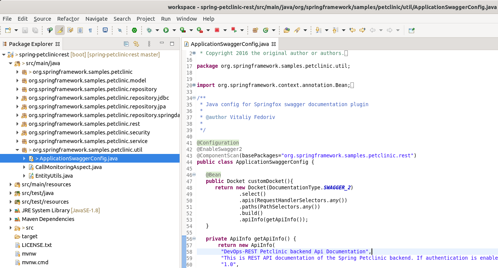

# Spring Boot로 spring-petclinic-rest 애플리케이션 시작하기

## spring-petclinic-rest 프로젝트 Clone

* Import가 완료되면 생성된 Repository로 이동합니다.
* clone url 복사하기 : `code` > `HTTPS` > `https://github.com/skcc-devops01/spring-petclinic-rest.git`

    | |
    | -------------------------------------------------------------------------- |

* 로컬 PC의 Workspace 디렉토리로 이동한 다음, `git clone`을 합니다. (ID/PW가 아닌 username/token방식 추천)

```bash
cd ~/devops/workspace
git clone https://github.com/xxxxx/spring-petclinic-rest.git
```


## STS에서 Spring Boot 프로젝트 구성

다음을 수행하여 Siren Order 프로젝트를 구성합니다.

* **File > Import...** 을 선택합니다.
* **Maven > Existing Maven Projects**을 선택하고 **Next** 버튼을 클릭합니다.
* **Browse...** 버튼을 클릭한 후 앞 단계에서 준비한 `spring-petclinic-rest` 디렉토리를 선택합니다.
* **Finish** 버튼을 클릭 합니다.
* **콘솔에 적절한 버퍼 설정**
STS > Preferences > Run/Debug > Console 에서 Limit console output 체크 후 Console buffer size를 1000000 정도 하거나, 아예 Limit console output를 체크 해제한다.

* **Boot Dashboard**에서 **local**을 확장한 후, `spring-petclinic-rest` 선택한 다음, **(Re)start** 아이콘을 클릭하여 App을 실행합니다.
* 웹 브라우저를 열고 `http://localhost:9966/petclinic/`에 접속합니다.

### `타이틀 변경` 기능 구현

* STS에서 `/spring-petclinic-rest/src/main/java/org/springframework/samples/petclinic/util/ApplicationSwaggerConfig.java` 파일을 엽니다.
* 58번 라인을 아래 내용으로 수정합니다.

  ```java
      "DevOps-REST Petclinic backend Api Documentation",
  ```



* sts > git staging view를 통한 변경소스를 github repository에 push하기
    1. **STS** > **Window** > **Show View** > **other** > **Git** > **Git Staging** veiw open

        
     
    2. Git Staging View - Unstaged Changes(1)를 Staged Changeds (0)으로 옮깁니다. (+ 클릭을 하여도 옮겨짐)
    옮기고 나면 `Push HEAD...` 이 `Commit and Push`로 바뀝니다. 

        ||
        |-|

    3. 아래와 같이 처리 후 클립합니다.
        * **Commit Messag**: 수정된 내용 입력 ("타이틀 변경")
        * `Commit and Push`을 클릭합니다.

    4. User와 Password (token값)을 입력한 후 다음 화면과 같이 처리합니다.

        ||
        |-|

        ||
        |-|

        ||
        |-|

    5. github에 수정 사항을 확인합니다.

    ####
    다음과 같이 터미널에서 Push 가능합니다.

    ```bash
    #[참고] 터미널에서 아래 명령을 수행하여 GitHub에 Push 할 수 있습니다.
    git add .
    git commit -m "타이틀 변경"
    git push
    ```


<!-- ## [Build/Test/Release] CI 파이프라인 구성 -->

### Local에서 Maven compile

로컬 PC에서 `devops/workspace/spring-petclinic-rest` 디렉토리로 이동한 다음, `mvn clean compile` 명령을 실행하여 정상적으로 빌드되는지 확인합니다.

```bash
cd ~/devops/workspace/spring-petclinic-rest
mvn clean compile
```


## Git Push to GitHub

### gitignore 설정

GitHub으로 작성된 코드를 Push하기 전에, Git 관리 대상에서 특정 파일 혹은 디렉토리를 제외하는 `.gitignore` 파일 설정이 필요합니다.  
로컬 환경에만 해당되는 설정이나 컴파일 결과 등 Git 리포지토리에 저장하여 관리할 필요가 없는 파일 및 디렉토리를 `.gitignore` 파일에 추가합니다.  
`.gitignore` 파일에 특정 파일 또는 폴더를 각각 추가하거나 [글로브 패턴(Glob pattern)](https://ko.wikipedia.org/wiki/%EA%B8%80%EB%A1%9C%EB%B8%8C_(%ED%94%84%EB%A1%9C%EA%B7%B8%EB%9E%98%EB%B0%8D))를 사용하여 추가하면 Git이 의도적으로 무시하도록 비추적(untracked) 파일로 지정됩니다.

STS에서 기본적으로 dotfiles 또는 dotfolders(`.`으로 시작되는 설정 파일 또는 폴더)가 보이지 않습니다.  
아래와 같이 수행하면 `.gitignore` 파일을 볼 수 있습니다.

* **Package Explorer > View Menu (⋮) > Filters...** 선택합니다.

<!-- * **Git > Git Repositories**를 선택하고 **Open** 버튼 클릭합니다. -->
* **Java Element Filters** 창에서 `.* resources` 체크를 해제하고 **OK** 버튼 클릭합니다.
* `.gitignore` 파일을 열어 내용을 확인합니다.

> **Spring Initializr**를 사용하여 소스를 생성 시 `.gitignore` 파일도 같이 생성됩니다.
> [gitignore.io](https://www.toptal.com/developers/gitignore)을 이용하여 `.gitignore` 파일을 만들 수도 있습니다.

### Git Commit & Push

아래와 같이 수행하여 작성된 코드를 커밋하고 GitHub에 Push 합니다.

1. Terminal 또는 Git Bash을 열고 `git status` 명령을 실행하여 Git 현재 상태를 확인합니다.

    
    ```bash
    $ cd ~/devops/workspace/spring-petclinic-rest/
    $ git status
    On branch main
    Your branch is up to date with 'origin/main'.

    Untracked files:
    (use "git add <file>..." to include in what will be committed)
            .gitignore
            .mvn/
            mvnw
            mvnw.cmd
            pom.xml
            src/

    nothing added to commit but untracked files present (use "git add" to track)
    ```

    Git 리포지토리의 상태는 `Untracted`, `Unmodified`, `Modified`, `Staged`가 있는데, 현재 `Untracted` 상태임을 알 수 있습니다.

2. `git add` 명령을 실행합니다.

    ```bash
    git add .
    ```

3. 다시 `git status` 명령을 실행하여 Git 상태를 확인합니다.

    ```bash
    $ git status
    On branch main
    Your branch is up to date with 'origin/main'.

    Changes to be committed:
    (use "git restore --staged <file>..." to unstage)
            new file:   .gitignore
    ```

4. `git commit` 명령을 실행하여 로컬 리포지토리에 기록합니다. `-m` 옵션을 사용하여 커밋 메시지를 인라인으로 추가합니다.

    ```bash
    $ git commit -m "App 구현"
    [main bccfed8] App 구현
    1 files changed, 1 insertions(+)
    create mode 100644 .gitignore
    ```

5. 다시 `git status` 명령을 실행하여 Git 상태를 확인합니다.
6. `git push` 명령을 실행하여 원격 저장소 GitHub으로 Push 합니다.


    * 아이디, 패스워드 캐싱 ( 미실행 자 수행 )

        ```bash
        git config credential.helper store
        ```
        * 위 커맨드를 입력한 이후 push 할 때 username과 password(token)를 묻는다.
        * 계정을 입력한 이후에는 username, password 인증없이 사용가능

    <br>  

    ```bash
    $ git push
    Enumerating objects: 2, done.
    Counting objects: 100% (27/27), done.
    Delta compression using up to 2 threads
    Compressing objects: 100% (1/1), done.
    Writing objects: 100% (1/1, 52.57 KiB | 345.00 KiB/s, done.
    Total 1 (delta 0), reused 0 (delta 0), pack-reused 0
    To github.com:skcc-devops01/spring-petclinic-rest.git
    417868b..bccfed8  main -> main
    ```

7. GitHub의 `spring-petclinic-rest` Repository에 소스 코드가 업로드된 것을 확인할 수 있습니다.


## 참고

[Spring Boot](https://spring.io/projects/spring-boot)  
[Getting Started Spring Boot](https://docs.spring.io/spring-boot/docs/current/reference/html/getting-started.html#getting-started-introducing-spring-boot)  
[Spring Quickstart Guide](https://spring.io/quickstart)  
[gitignore](https://git-scm.com/docs/gitignore)  
[Git의 기초 - 수정하고 저장소에 저장하기](https://git-scm.com/book/ko/v2/Git%EC%9D%98-%EA%B8%B0%EC%B4%88-%EC%88%98%EC%A0%95%ED%95%98%EA%B3%A0-%EC%A0%80%EC%9E%A5%EC%86%8C%EC%97%90-%EC%A0%80%EC%9E%A5%ED%95%98%EA%B8%B0)  
