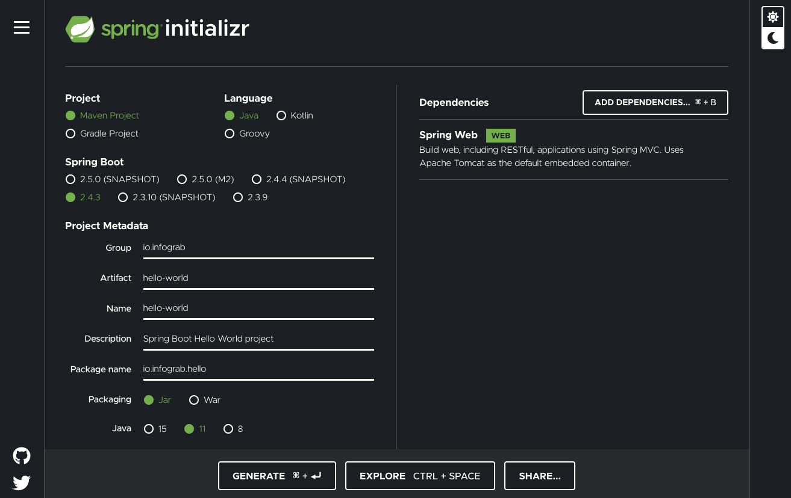

# [참고] Spring Boot 소개

[Spring Boot](https://spring.io/projects/spring-boot)를 사용하면 "바로 실행(just run)"할 수 있는 독립형(stand-alone) 프로덕션 등급의 Spring 기반 애플리케이션을 쉽게 만들 수 있습니다. 대부분의 Spring Boot 애플리케이션에는 최소한의 Spring 구성이 필요합니다.

Spring Boot를 사용하면 `java -jar` 또는 보다 전통적인 war 배포를 사용하여 시작할 수 있는 Java 애플리케이션을 만들 수 있습니다. 또한 "spring scripts"를 실행하는 명령 줄 도구도 제공합니다.

### 특징

* 독립 실행 가능한 Spring 애플리케이션 생성
* 임베디드 웹 서버 Tomcat, Jetty 또는 Undertow를 직접 포함 (WAR 파일을 배포할 필요 없음)
* 빌드 구성을 단순화하기 위해 독자적인 'Starter' Dependencies(의존성 라이브러리)를 제공
* 가능할 때 언제든 Spring 및 서드 파티(3rd party) 라이브러리를 자동 구성
* 메트릭(Metrics), 헬스 체크(Health Check) 및 외부 구성과 같은 프로덕션 준비(Production-ready) 기능 제공 (Spring Boot Actuator, K8S에서 Pod의 Liveness Probe와 Readiness Probe)
* XML 구성을 위한 코드 생성 및 요구사항이 전혀 없음

### 시스템 요구사항

현재 Spring Boot 2.4.3에는 Java 8 이상이 필요하며 Java 15(포함)까지 호환됩니다. [Spring Framework 5.3.4](https://docs.spring.io/spring/docs/5.3.4/reference/html/) 이상도 필요합니다.

다음 빌드 도구에 대해 명시적 빌드 지원이 제공됩니다.

| 빌드 도구  | 버전                                           |
|--------|----------------------------------------------|
| Maven  | 3.3 이상                                       |
| Gradle | 6 (6.3 이상). 5.6.x도 지원되지만 더 이상 사용되지 않는 형식입니다. |

## Spring Initializr로 빠르게 시작하기

Initializr는 애플리케이션에 필요한 모든 종속성을 가져 오는 빠른 방법을 제공하고 많은 설정을 수행합니다.



다음을 수행하여 Spring Boot 프로젝트를 생성합니다.

* [Spring Initializr](https://start.spring.io/) 웹사이트에 접속합니다.
* **Project**에 `Maven Project`를 선택합니다.
* **Language**에 `Java`를 선택합니다.
* **Spring Boot**의 현재 버전을 선택합니다.
* **Project Metadata** 정보에 다음 항목을 입력하거나 선택합니다.
  * Group : 일반적으로 회사 도메인을 역으로 입력
  * Artifact : 버전 정보를 생략한 빌드 결과물 이름, jar 또는 war 파일명 (Group 내에서 아티팩트가 둥 이상이면 안됨)
  * Name : Artifact를 입력하면 자동으로 채워지며, 원하는 다른 이름으로 변경할 수 있습니다.
  * Description : Spring Boot 프로젝트 설명을 입력합니다.
  * Package name : Group과 Artifact 조합으로 자동 채워지나 변경 가능합니다.
  * Packaging : `Jar`를 선택합니다.
  * Java : Java 버전 `11`을 선택합니다.
* **ADD DEPENDENCES...** 클릭하여 필요한 의존성 라이브러리를 추가할 수 있습니다. **Spring Web**을 선택하여 추가합니다.
* **EXPLORE** 버튼을 클릭하여 구성 정보를 확인할 수 있습니다.
* **GENERATE** 버튼을 클릭하면 생성된 소스 및 설정 파일로 구성된 Zip 파일이 다운로드 됩니다.
* 다운로드 받은 `hello-world.zip` 파일을 압축을 푼 후 Workspace > spring-boot-hello-world 폴더로 옮깁니다.

## Hello World 애플리케이션 실행

아래와 같이 진행하여 STS의 Boot Dashboard에서 Spring Boot 애플리케이션을 실행할 수 있습니다.

* **Boot Dashboard**에서 **local**을 확장한 후, `spring-boot-hello-world` 우클릭 하고 **(Re)start**를 선택합니다.
* **Console** 창에서 Spring Boot 애플리케이션이 실행되는 것을 확인할 수 있습니다.

또는 Terminal이나 Git Bash 및 명령 프롬프트(CMD)를 열어 아래와 같이 명령을 실행하여 애플리케이션을 실행할 수 있습니다.

**macOS/Linux/Git Bash :**

```bash
./mvnw spring-boot:run
```

**Windows 명령 프롬프트(CMD) :**

```bash
mvnw spring-boot:run
```

웹 브라우저를 열고 `http://localhost:8080/hello`에 접속하면 "Hello World!"가 화면에 출력되는 것을 확인할 수 있습니다.  
URL 끝에 `?name=Jason` 추가해 보세요.

## Git Push to GitHub

### gitignore 설정

GitHub으로 작성된 코드를 Push하기 전에, Git 관리 대상에서 특정 파일 혹은 디렉토리를 제외하는 `.gitignore` 파일 설정이 필요합니다.  
로컬 환경에만 해당되는 설정이나 컴파일 결과 등 Git 리포지토리에 저장하여 관리할 필요가 없는 파일 및 디렉토리를 `.gitignore` 파일에 추가합니다.  
`.gitignore` 파일에 특정 파일 또는 폴더를 각각 추가하거나 [글로브 패턴(Glob pattern)](https://ko.wikipedia.org/wiki/%EA%B8%80%EB%A1%9C%EB%B8%8C_(%ED%94%84%EB%A1%9C%EA%B7%B8%EB%9E%98%EB%B0%8D))를 사용하여 추가하면 Git이 의도적으로 무시하도록 비추적(untracked) 파일로 지정됩니다.

STS에서 기본적으로 dotfiles 또는 dotfolders(`.`으로 시작되는 설정 파일 또는 폴더)가 보이지 않습니다.  
아래와 같이 수행하면 `.gitignore` 파일을 볼 수 있습니다.

* **Package Explorer > View Menu (⋮) > Filters...** 선택합니다.
* **Git > Git Repositories**를 선택하고 **Open** 버튼 클릭합니다.
* **Java Element Filters** 창에서 `.* resources` 체크를 해제하고 **OK** 버튼 클릭합니다.
* `.gitignore` 파일을 열어 내용을 확인합니다.

> **Spring Initializr**를 사용하여 소스를 생성 시 `.gitignore` 파일도 같이 생성됩니다.
> [gitignore.io](https://www.toptal.com/developers/gitignore)을 이용하여 `.gitignore` 파일을 만들 수도 있습니다.

### Git Commit & Push

아래와 같이 수행하여 작성된 코드를 커밋하고 GitHub에 Push 합니다.

1. Terminal 또는 Git Bash을 열고 `git status` 명령을 실행하여 Git 현재 상태를 확인합니다.

    ```bash
    $ git status
    On branch main
    Your branch is up to date with 'origin/main'.

    Untracked files:
    (use "git add <file>..." to include in what will be committed)
            .gitignore
            .mvn/
            mvnw
            mvnw.cmd
            pom.xml
            src/

    nothing added to commit but untracked files present (use "git add" to track)
    ```

    Git 리포지토리의 상태는 `Untracted`, `Unmodified`, `Modified`, `Staged`가 있는데, 현재 `Untracted` 상태임을 알 수 있습니다.

2. `git add` 명령을 실행합니다.

    ```bash
    git add .
    ```

3. 다시 `git status` 명령을 실행하여 Git 상태를 확인합니다.

    ```bash
    $ git status
    On branch main
    Your branch is up to date with 'origin/main'.

    Changes to be committed:
    (use "git restore --staged <file>..." to unstage)
            new file:   .gitignore
            new file:   .mvn/wrapper/MavenWrapperDownloader.java
            new file:   .mvn/wrapper/maven-wrapper.jar
            new file:   .mvn/wrapper/maven-wrapper.properties
            new file:   mvnw
            new file:   mvnw.cmd
            new file:   pom.xml
            new file:   src/main/java/io/skcc-devops01/hello/HelloWorldApplication.java
            new file:   src/main/resources/application.properties
            new file:   src/test/java/io/skcc-devops01/hello/HelloWorldApplicationTests.java
    ```

4. `git commit` 명령을 실행하여 로컬 리포지토리에 기록합니다. `-m` 옵션을 사용하여 커밋 메시지를 인라인으로 추가합니다.

    ```bash
    $ git commit -m "Hello World App 구현"
    [main bccfed8] Hello World App 구현
    10 files changed, 721 insertions(+)
    create mode 100644 .gitignore
    create mode 100644 .mvn/wrapper/MavenWrapperDownloader.java
    create mode 100644 .mvn/wrapper/maven-wrapper.jar
    create mode 100644 .mvn/wrapper/maven-wrapper.properties
    create mode 100644 mvnw
    create mode 100644 mvnw.cmd
    create mode 100644 pom.xml
    create mode 100644 src/main/java/io/skcc-devops01/hello/HelloWorldApplication.java
    create mode 100644 src/main/resources/application.properties
    create mode 100644 src/test/java/io/skcc-devops01/hello/HelloWorldApplicationTests.java
    ```

5. 다시 `git status` 명령을 실행하여 Git 상태를 확인합니다.
6. `git push` 명령을 실행하여 원격 저장소 GitHub으로 Push 합니다.

    ```bash
    $ git push
    Enumerating objects: 27, done.
    Counting objects: 100% (27/27), done.
    Delta compression using up to 2 threads
    Compressing objects: 100% (17/17), done.
    Writing objects: 100% (26/26), 52.57 KiB | 345.00 KiB/s, done.
    Total 26 (delta 0), reused 0 (delta 0), pack-reused 0
    To github.com:lee297/spring-boot-hello-world.git
    417868b..bccfed8  main -> main
    ```

7. GitHub의 `spring-boot-hello-world` Repository에 소스 코드가 업로드된 것을 확인할 수 있습니다.