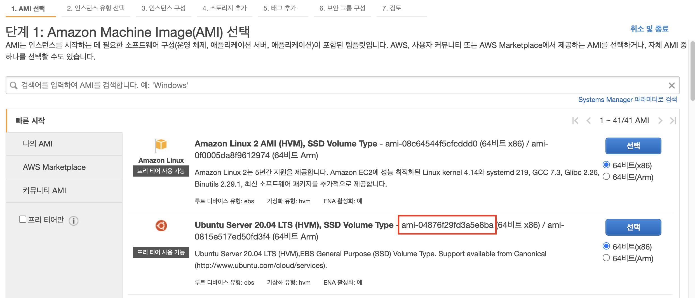
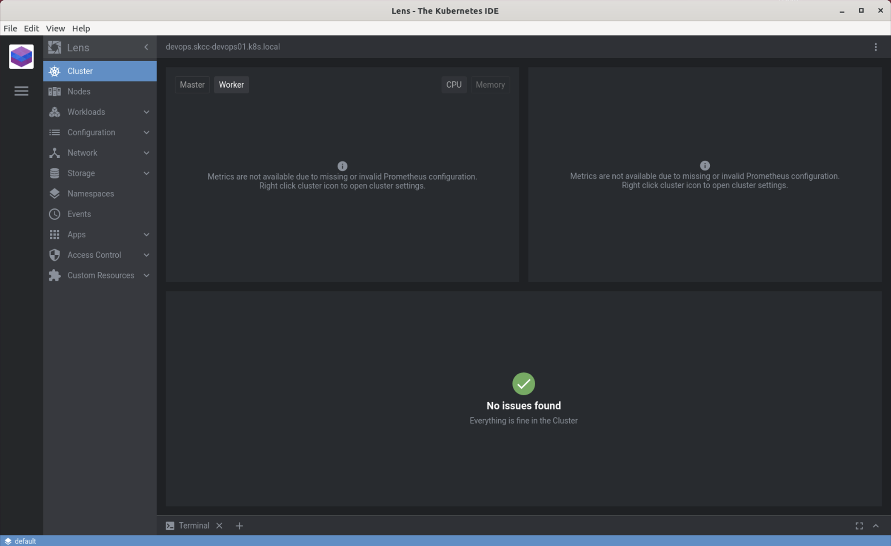
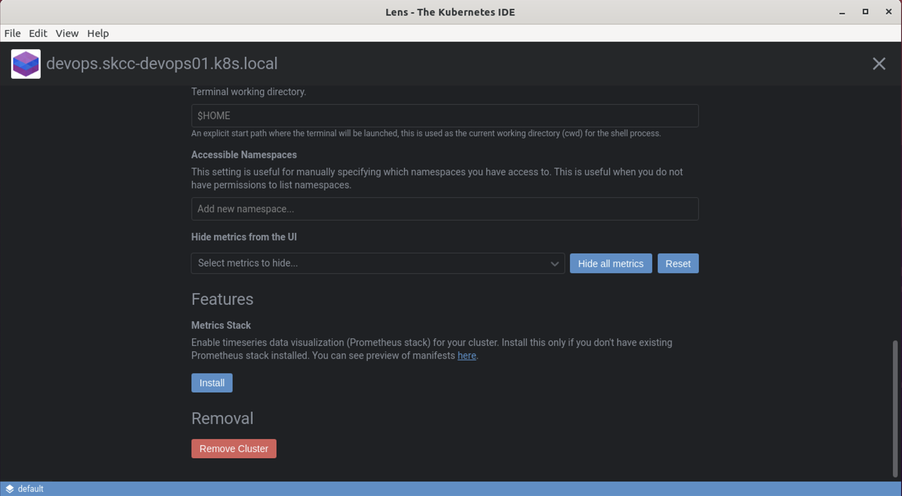
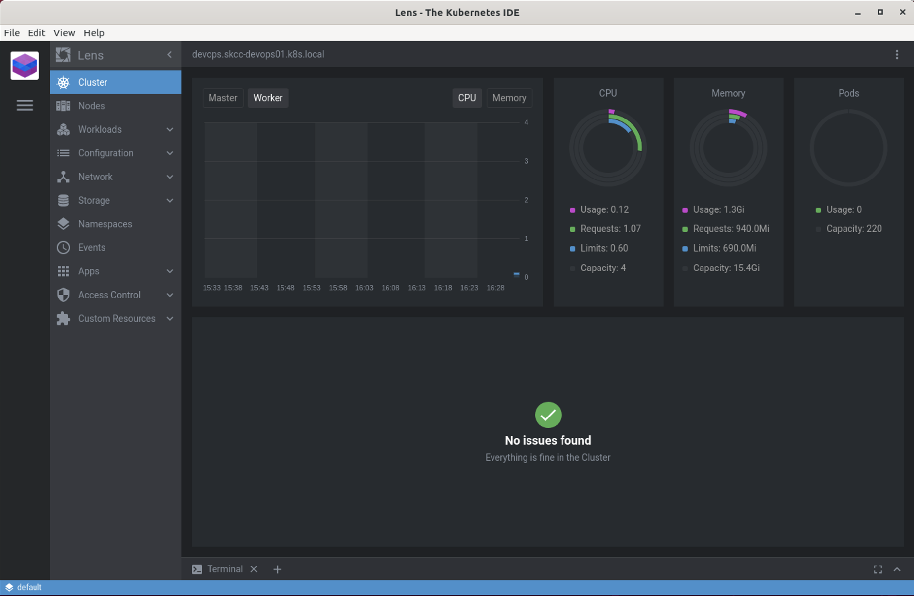

**[목차]**
[TOC]
# Bastion을 이용한 Kubernetes Cluster 생성

## 전체 Workshop 환경 요약 (Bastion 포함)
함


### KOPS 로컬 환경변수 추가

.bash_profile, .bashrc 또는 .zshrc에 환경변수를 추가합니다.

```bash
$ vi ~/.bashrc

#export KOPS_CLUSTER_NAME=devops.skcc-devops01.k8s.local
#export KOPS_STATE_STORE=s3://devops-skcc-devops01-state-store
export KOPS_CLUSTER_NAME=<your_cluster_name>.k8s.local
export KOPS_STATE_STORE=s3://prefix-example-com-state-store
export AWS_PROFILE=kops
```

```bash
source ~/.bashrc
```

### SSH Key Pair 생성

```bash
$ cd ~/.ssh
$ ssh-keygen -t rsa -b 2048
ubuntu@workspace:~/.ssh$ ssh-keygen -t rsa -b 2048
Generating public/private rsa key pair.
Enter file in which to save the key (/home/ubuntu/.ssh/id_rsa): id_rsa_k8s
Enter passphrase (empty for no passphrase):
Enter same passphrase again:
Your identification has been saved in id_rsa_k8s
Your public key has been saved in id_rsa_k8s.pub
The key fingerprint is:
SHA256:MEZ4DnviPKz9iuVlCFW+Y6wtUZ5ABZd/1YqZBaUKAbo ubuntu@workspace
The key's randomart image is:
+---[RSA 2048]----+
|    +=*.  .o..   |
|   oo=o.   .o .  |
|  . o=B.  .* .   |
|   oo*o*..= .    |
|  E+.oB S.       |
|   .=* .         |
|   o=.+          |
|  .+.+           |
|  . oo.          |
+----[SHA256]-----+
$ ls -al
total 28
drwx------  2 ubuntu ubuntu 4096 Sep  9 11:06 ./
drwxr-xr-x 32 ubuntu ubuntu 4096 Sep  9 11:04 ../
-rw-------  1 ubuntu ubuntu  790 Aug 25 15:06 authorized_keys
-rw-------  1 ubuntu ubuntu 1823 Sep  9 11:06 id_rsa_k8s
-rw-r--r--  1 ubuntu ubuntu  398 Sep  9 11:06 id_rsa_k8s.pub
-r--------  1 ubuntu ubuntu 1700 Sep  7 11:01 key-tools.pem
-rw-r--r--  1 ubuntu ubuntu  222 Sep  7 11:04 known_hosts
```

### Ubuntu 20.04 LTS (Focal Fossa) AMI 검색

```bash
aws ec2 describe-images --region ap-northeast-2 --output table \
    --owners 099720109477 \
    --filters "Name=name,Values=ubuntu/images/hvm-ssd/ubuntu-focal-20.04-amd64-*" "Name=state,Values=available" \
    --query "reverse(sort_by(Images, &CreationDate)[*].[CreationDate,Name,ImageId])"
```

실습에 사용할 이미지는 `ami-04876f29fd3a5e8ba` 선택합니다. 

| |
| -------------------------------------------------------------------------- |

### Cluster 구성 만들기

아래 명령을 실행하여 사용할 수 있는 가용 영역을 확인합니다.

```bash
aws ec2 describe-availability-zones --region ap-northeast-2
```

아래 명령은 `create cluster` 명령으로, 클러스터 구성을 생성하지만 바로 클러스터를 만들지는 않습니다. 클러스터를 만들기 전에 SSH 키 쌍을 생성했는지 확인합니다.

```bash
kops create cluster \
    --cloud aws \
    --name ${KOPS_CLUSTER_NAME} \
    --state ${KOPS_STATE_STORE} \
    --zones ap-northeast-2a,ap-northeast-2c \
    --topology private \
    --networking calico \
    --image <AMI_ID> \
    --bastion \
    --master-count 1 \
    --master-size t3.medium \
    --master-zones ap-northeast-2a \
    --node-count 2 \
    --node-size t3.large
```

`kops`로 생성한 모든 인스턴스는 ASG(Auto Scaling Group) 내에서 구축됩니다. 즉, 장애가 발생할 경우 AWS에서 각 인스턴스를 자동으로 모니터링하고 재 구축합니다.

### SSH 액세스

SSH는 기본적으로 어디에서나 Master와 Node에 허용됩니다.

SSH (및 HTTPS)에 액세스 할 수 있는 CIDR을 변경하려면 클러스터 사양에서 AdminAccess를 설정합니다.

기본 이미지를 사용하는 경우 SSH username은 `admin`이고, SSH private key는 `kops get secrets --type sshpublickey admin`의 public key에 해당하는 private key가 됩니다. 새 클러스터를 만들 때 SSH 공개 키는 `--ssh-public-key` 옵션으로 지정할 수 있으며, 기본값은 `~/.ssh/id_rsa.pub` 입니다.

> 참고 : Flatcar에서 SSH 사용자 이름은 `core` 입니다.

새 SSH 공개 키를 만들고 상태 저장소에 키를 저장합니다.

```bash
kops create secret \
    --name ${KOPS_CLUSTER_NAME} \
    sshpublickey admin -i ~/.ssh/id_rsa_k8s.pub
```

기존 클러스터에서 SSH 공개 키를 변경하려면 :

```bash
kops delete secret --name ${KOPS_CLUSTER_NAME} sshpublickey admin
kops create secret --name ${KOPS_CLUSTER_NAME} sshpublickey admin -i ~/.ssh/newkey.pub
kops update cluster --yes # 자동 확장(auto-scaling) 그룹을 재구성하려면
kops rolling-update cluster --name ${KOPS_CLUSTER_NAME} --yes # 모든 머신를 즉시 롤링하여 새 키를 갖도록하려면 (선택 사항)
```

### Cluster 구성 편집

이제 클러스터 구성이 있으므로 명세을 편집하여 클러스터를 정의하는 모든 측면을 볼 수 있습니다.

```bash
kops edit cluster --name ${KOPS_CLUSTER_NAME}
```

### Cluster 구축

이제 실제로 클러스터를 구축하는 마지막 단계를 수행합니다. 시간이 좀 걸립니다. 완료되면 부팅된 인스턴스가 Kubernetes 구성 요소 다운로드를 완료하고 "준비" 상태에 도달하는 동안 더 오래 기다려야 합니다.

아래 명령을 실행하여 클러스터를 실제로 구축합니다.

```bash
kops update cluster --name ${KOPS_CLUSTER_NAME} --yes
```

kops는 클러스터가 예상대로 작동하는지 확인하기 위해 실행할 수 있는 편리한 유효성 검사 도구와 함께 제공됩니다.  
아래 명령을 실행하여 쿠버네티스 클러스터 생성이 완료되었는지 체크합니다.

```bash
kops validate cluster --wait 10m
```

### Cluster 사용

클러스터 생성이 완료되면 kubectl 명령을 사용해서 쿠버네티스 클러스터 정보를 확인합니다.

다음 명령으로 Node 목록을 확인할 수 있습니다.  
Master node의 이름을 기록해 둡니다.

```bash
kubectl get nodes
```

다음 명령으로 Pod 전체 목록을 확인할 수 있습니다.

```bash
kubectl get pod --all-namespaces
```

다음 명령으로 모든 시스템 구성 요소를 볼 수 있습니다.

```bash
kubectl -n kube-system get po
```

### Bastion 접속

Bastion은 프라이빗 네트워크(Private Network) 인스턴스를 포함하는 네트워크에 대한 외부 진입점을 제공합니다. 이 호스트는 강화(Fortification) 또는 감사(Audit)의 단일 지점을 제공 할 수 있으며 인터넷에서 인바운드 SSH 통신을 활성화하거나 비활성화하기 위해 시작 및 중지 할 수 있습니다. 일부는 Bastion을 "점프 서버"라고 부릅니다.

ssh-agent를 사용하면 비밀번호(passphrase) 입력 없이 SSH로 원격 접속할 수 있습니다.  
SSH Key 생성 시 비밀번호를 입력하지 않았다면 이 단계를 건너뜁니다.

우선 ssh key를 ssh-agent에 등록합니다.

```bash
$ eval `ssh-agent -s`
Agent pid 3963

$ ssh-add ~/.ssh/id_rsa_k8s
Identity added: /home/ec2-user/.ssh/id_rsa_k8s (/home/ec2-user/.ssh/id_rsa_k8s)
```

Gossip 모드를 사용할 때 Bastion에 대한 CNAME을 구성 할 수 있는 DNS 영역이 없습니다. Bastion은 로드 밸런서 앞에 있기 때문에 대신 로드 밸런서의 엔드 포인트를 사용하여 Bastion에 도달 할 수 있습니다.

AWS에서이 DNS 이름을 찾는 쉬운 방법은 kops 도구 상자를 사용하는 것입니다.

```bash
$ kops toolbox dump -ojson | grep 'bastion.*elb.amazonaws.com'
        "CanonicalHostedZoneName": "bastion-devops-skcc-devops01-k-cl0jf0-9951683915.ap-northeast-2.elb.amazonaws.com",
        "DNSName": "bastion-devops-skcc-devops01-k-cl0jf0-9951683915.ap-northeast-2.elb.amazonaws.com",
```

Bastion에 접속합니다.

```bash
ssh -A ubuntu@bastion-devops-skcc-devops01-k-cl0jf0-9951683915.ap-northeast-2.elb.amazonaws.com
```

앞 단계에서 기록해 두었던 Master Node의 이름으로 Bastion을 통해 Master Node에 접속합니다.

```bash
$ ssh ip-172-20-49-106.ap-northeast-2.compute.internal
The authenticity of host 'ip-172-20-49-106.ap-northeast-2.compute.internal (172.20.49.106)' can't be established.
ECDSA key fingerprint is SHA256:dKKcfKbqbtFm/7XsWe1poRz0XPBrdovoI+Lc12cs3kA.
Are you sure you want to continue connecting (yes/no/[fingerprint])? yes
```

Master Node에서 Docker 상태를 확인해 본다.

```bash
sudo docker ps -a
```

### Cluster 중지

instances group 목록을 조회합니다.

```bash
$ kops get ig
NAME			ROLE	MACHINETYPE	MIN	MAX	ZONES
bastions		Bastion	t3.micro	1	1	ap-northeast-2a,ap-northeast-2c
master-ap-northeast-2a	Master	t3.medium	1	1	ap-northeast-2a
nodes			Node	t3.large	2	2	ap-northeast-2a,ap-northeast-2c
```

각 instances group의 maxSize와 minSize를 0으로 수정합니다.

```bash
kops edit ig bastions
kops edit ig master-ap-northeast-2a
kops edit ig nodes
```

아래 명령을 실행하여 Cluster를 업데이트 합니다.

```bash
kops update cluster --yes
```

다시 instances group 목록을 조회하면 maxSize와 minSize가 0으로 변경된 것을 확인할 수 있습니다.

```bash
$ kops get ig
NAME			ROLE	MACHINETYPE	MIN	MAX	ZONES
bastions		Bastion	t3.micro	0	0	ap-northeast-2a,ap-northeast-2c
master-ap-northeast-2a	Master	t3.medium	0	0	ap-northeast-2a
nodes			Node	t3.large	0	0	ap-northeast-2a,ap-northeast-2c
```

### Cluster 시작

각 instances group의 maxSize와 minSize를 설정합니다.

```bash
kops edit ig bastions # maxSize: 1, minSize: 1
kops edit ig master-ap-northeast-2a # maxSize: 1, minSize: 1
kops edit ig nodes # maxSize: 2, minSize: 2
```

아래 명령을 실행하여 Cluster를 업데이트 합니다.

```bash
kops update cluster --yes
```

다음을 실행하여 클러스터가 정상 동작하는지 확인합니다.

```bash
kops validate cluster --wait 10m
kubectl get nodes
kubectl -n kube-system get po
```

### Cluster 롤링 업데이트

K8S Cluster를 업그레이드하고 수정하려면 일반적으로 클라우드 인스턴스를 교체해야 합니다. 서비스 손실 및 기타 중단을 방지하기 위해 kOps는 클라우드 인스턴스를 롤링 업데이트로 점진적으로 대체합니다.

다운타임 없는(Zero-Downtime) 롤링 업데이트를 하려면 아래 명령을 실행합니다.

```bash
kops rolling-update cluster --yes
```

`--cloudonly` 옵션을 추가하면 클러스터의 유효성을 검사하지 않습니다.  
`--force` 옵션을 추가하면 클러스터를 롤링할 필요가 없다는 롤링 업데이트 보고가 있더라도 전체 클러스터를 강제로 롤링합니다.

```bash
kops rolling-update cluster --cloudonly --force --yes
```

### Cluster 삭제

AWS 내에서 Kubernetes 클러스터를 실행하는 것은 당연히 비용이 들기 때문에 실험 실행을 마친 경우 클러스터를 삭제하는 것이 좋습니다.

다음 명령을 실행하여 클러스터가 삭제 될 때 파기될 모든 AWS 리소스를 미리 볼 수 있습니다.

```bash
kops delete cluster --name ${KOPS_CLUSTER_NAME}
```

클러스터를 삭제하려면 --yes 플래그와 함께 delete 명령을 실행합니다. 이 명령은 매우 파괴적이며 클러스터와 그 안에 포함된 모든 것을 삭제합니다!

```bash
kops delete cluster --name ${KOPS_CLUSTER_NAME} --yes
```

## Lens 설정

Workspace EC2 인스턴스에서 아래 명령을 실행하여 kubeconfig 파일 내용을 출력합니다.

```bash
cat ~/.kube/config
```

로컬 PC에 kubeconfig 파일을 생성하고 위에서 출력된 내용을 복사하여 붙여넣고 저장합니다.

```bash
vi kubeconfig-admin.yaml
```

다음과 같이 수행하여 Lens에 Kubernetes Cluster를 추가합니다.

* 좌측 상단에 있는 **[+]** 아이콘을 클릭합니다.
* 폴더 모양의 아이콘을 클릭하여 위에서 저장했던 kubeconfig 파일을 선택합니다.
* 콤보박스에서 Context를 선택합니다.

    

* **Add cluster** 버튼을 클릭하면 Kubernetes Cluster를 Lens UI에서 확인할 수 있습니다.

    

* **[+]** 위에 있는 Cluster의 아이콘을 우클릭한 다음 **Settings**를 선택합니다.
* 아래로 스크롤하여 **Features** 섹션으로 이동하여 **Install** 버튼을 클릭하여 **Metrics Stack**을 설치합니다.

    

* 잠시 후 **Cluster** 메뉴를 클릭하면 **CPU, Memory** 등 Metrics 정보를 확인할 수 있습니다.

    

## Cluster의 모든 Node(Worker)에 `insecure-registries` 설정

Cluster의 Pod가 Private Docker Registry에서 HTTP로 Docker 이미지를 Pull 할 수 있게 하려면, Cluster의 모든 Node의 Docker 데몬 설정에 `insecure-registries`을 추가해야 합니다.

아래 명령을 실행하고 **Role**이 `node`인 Node의 이름을 기록합니다.

```bash
kubectl get nodes
```

아래 명령을 실행하여 Bastion 호스트의 DNS 이름을 찾습니다.

```bash
kops toolbox dump -ojson | grep 'bastion.*elb.amazonaws.com'
```

Bastion에 접속합니다.

```bash
ssh -A ubuntu@bastion-xxxx.xxxx.ap-northeast-2.elb.amazonaws.com
```

앞 단계에서 기록해 두었던 Node의 이름으로 Bastion을 통해 Node에 접속합니다.

```bash
ssh ip-172-xx-xx-xxx.ap-northeast-2.compute.internal
```

`/etc/docker/daemon.json` 파일을 생성한 다음, 아래 내용을 붙여 넣고 저장합니다.

```bash
$ sudo vi /etc/docker/daemon.json

{
     "insecure-registries" : ["<Harbor_IP>:<Harbor_Port>"]
}
```

아래 명령을 실행하여 Docker daemon를 재시작합니다.

```bash
sudo service docker restart
```

`sudo systemctl status docker` 명령을 실행하여 Docker가 **active (running)**인지 확인합니다.  
`sudo docker info` 명령을 실행하여 적용되었는지 확인합니다.

다른 Node도 동일한 방식으로 설정합니다.

### Kubernetes에 Insecure Docker Registry를 설정하는 더 간단한 방법

`kops edit cluster` 명령을 실행하여 클러스터 구성 편집기 들어갑니다.

```bash
kops edit cluster --name ${KOPS_CLUSTER_NAME}
```

아래와 같이 `spec` 하위에 `docker.insecureRegistry`를 추가하고 저장합니다.

```bash
apiVersion: kops.k8s.io/v1alpha2
kind: Cluster
metadata:
  creationTimestamp: "2021-03-04T10:03:17Z"
  generation: 1
  name: xxx.xxx.k8s.local
spec:
  api:
    loadBalancer:
      type: Public

  ...(생략)

  docker:
    insecureRegistry: <Harbor_IP>:<Harbor_Port>

  ...(생략)
```

클러스터 구성 정보를 반영하려면 아래 명령을 실행합니다.

```bash
kops update cluster --name ${KOPS_CLUSTER_NAME} --yes
kops rolling-update cluster --name ${KOPS_CLUSTER_NAME} --yes
```

Bastion을 통해 Node에 접속하여 아래 멸령을 실행하여 확인하면 `insecure-registry`가 설정된 것을 알 수 있습니다.

```bash
sudo docker info
```

실제 설정된 곳은 `/etc/sysconfig/docker` 입니다.

```bash
$ cat /etc/sysconfig/docker
DOCKER_OPTS=--insecure-registry=xx.xx.xx.xx:8000 --ip-masq=false --iptables=false --log-driver=json-file --log-level=warn --log-opt=max-file=5 --log-opt=max-size=10m --storage-driver=overlay2
```

