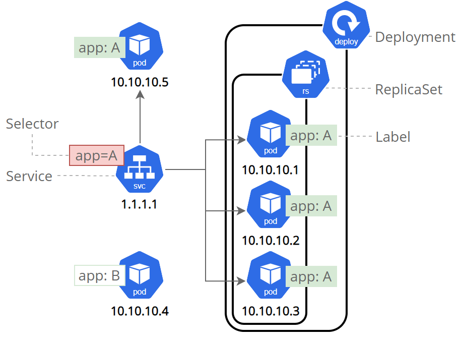
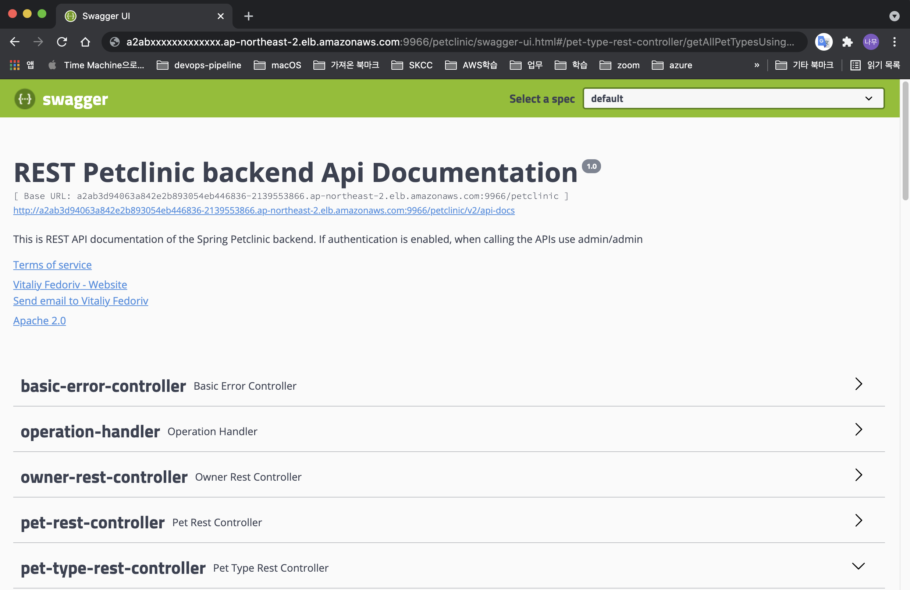

**[목차]**
[TOC]
# Kubernetes 서비스를 사용하여 애플리케이션 노출

Kubernetes 서비스 타입에 대해 알아 보고 레이블과 레이블 셀랙터 오브젝트가 어떻게 서비스와 연관되는지 이해합니다.  
서비스를 이용하여 쿠버네티스 클러스터 외부로 애플리케이션을 노출합니다.

## Kubernetes 서비스 개요

Kubernetes **Pods**은 언젠가는 죽게 됩니다. 실제 파드들은 [생명주기](https://kubernetes.io/ko/docs/concepts/workloads/pods/pod-lifecycle/)를 갖습니다. 워커 노드가 죽으면, 노드 상에서 동작하는 파드들 또한 종료됩니다.

**레플리카셋(ReplicaSet)** 은 애플리케이션이 지속적으로 동작할 수 있도록 새로운 파드들의 생성을 통해 동적으로 클러스터를 미리 지정해 둔 상태로 되돌려 줄 수도 있습니다.  
예를 들어, 3개의 복제본을 갖는 백엔드가 있다고 가정하면, 그 복제본들은 교체 가능한 상태입니다. 그래서 프론트엔드 시스템은 하나의 파드가 소멸되어 재생성이 되더라도, 백엔드 복제본들에 의한 영향을 받아서는 안됩니다. 즉, 동일 노드 상의 파드들이라 할지라도, 쿠버네티스 클러스터 내 각 파드는 유일한 IP 주소를 가지며, 애플리케이션들이 지속적으로 기능할 수 있도록 파드들 속에서 발생하는 변화에 대해 자동으로 조정해 줄 방법이 있어야 합니다.

쿠버네티스에서 **서비스**는 하나의 논리적인 파드 셋과 그 파드들에 접근할 수 있는 정책을 정의하는 추상적 개념입니다.  
서비스가 대상으로 하는 파드 셋은 보통 LabelSelector에 의해 결정됩니다.

비록 각 파드들이 고유의 IP를 갖고 있기는 하지만, 그 IP들은 서비스의 도움없이 클러스터 외부로 노출되어질 수 없습니다. 서비스들은 애플리케이션들에게 트래픽이 실릴 수 있도록 허용해 줍니다. 서비스들은 ServiceSpec에서 `type`을 지정함으로써 다양한 방식들로 노출시킬 수 있습니다.

* **ClusterIP** (기본값) : 클러스터 내에서 내부 IP에 대해 서비스를 노출해 줍니다. 이 방식은 오직 클러스터 내에서만 서비스가 접근될 수 있도록 해줍니다.
* **NodePort** : NAT가 이용되는 클러스터 내에서 각각 선택된 노드들의 동일한 포트에 서비스를 노출시켜 줍니다. `<NodeIP>:<NodePort>`를 이용하여 클러스터 외부로부터 서비스가 접근할 수 있도록 해줍니다. (ClusterIP의 상위 집합)
* **LoadBalancer** : (지원 가능한 경우) 기존 클라우드에서 외부용 로드밸런서를 생성하고 서비스에 고정된 공인 IP를 할당해줍니다. (NodePort의 상위 집합)
* **ExternalName** : 이름으로 CNAME 레코드를 반환함으로써 임의의 이름(스펙에서 `externalName`으로 명시)을 이용하여 서비스를 노출시켜줍니다. 어떤 종류의 프록시도 사용되지 않습니다. (`kube-dns` 버전 1.7 이상에서 지원 가능) 외부 서비스를 쿠버네티스 내부에서 호출하려고 할 때 사용됩니다. (예: RDS와 같은 Database 서버)

## 서비스와 레이블

**서비스**는 파드 셋에 걸쳐서 트래픽을 라우팅 합니다. 애플리케이션에 영향을 주지 않으면서 쿠버네티스에서 파드들이 죽게도 하고, 복제가 되게도 해주는 추상적 개념입니다. 종속적인 파드들 사이에서의 디스커버리와 라우팅은 (하나의 애플리케이션에서 프로트엔드와 백엔드 컴포넌트와 같은) 쿠버네티스 서비스들에 의해 처리됩니다.

서비스는 쿠버네티스의 객체들에 대해 논리 연산을 허용해주는 기본 그룹핑 단위인, [레이블과 셀렉터](https://kubernetes.io/ko/docs/concepts/overview/working-with-objects/labels/)를 이용하여 파드 셋과 매치시킵니다. 레이블은 오브젝트들에 붙여진 키/밸류 쌍으로 다양한 방식으로 이용 가능합니다.

* 개발, 테스트, 그리고 상용환경에 대한 객체들의 지정
* 임베디드된 버전 태그들
* 태그들을 이용하는 객체들에 대한 분류

  | |
  | -------------------------------------------------------------------------- |

## Namespace 생성

Namespace를 생성하고 Context를 변경합니다.

```bash
$ kubectl create ns petclinic-dev
namespace/petclinic-dev created

$ kubectl config set-context --current --namespace=petclinic-dev
Context "devops.skcc-devops01.k8s.local" modified.

$ kubectl config view --minify | grep namespace:
    namespace: petclinic-dev
```

## Docker Registry 시크릿(Secret) 생성

Private Docker Registry에서 이미지를 Pull 하려면, 인증하기 위하여 `docker-registry` 타입의 시크릿이 필요합니다.

Private Docker Registry 자격 증명 시크릿을 생성하는 방법은 두 가지가 있습니다.

### 커맨드 라인에서 자격 증명을 통하여 시크릿 생성하기

아래 명령을 실행하여 `harbor-credentials`이라는 이름의 시크릿을 생성합니다.

```bash
kubectl create secret docker-registry harbor-credentials \
    --docker-server=<Harbor_IP>:<Harbor_Port> \
    --docker-username=<your-name> \
    --docker-password=<your-password> --docker-email=<your-email>
```

### 기존의 Docker 자격 증명을 기반으로 시크릿 생성하기

Tools EC2 인스턴스에서 아래 명령을 수행하여 Docker 자격 증명 정보를 출력합니다.

```bash
$ cat ~/.docker/config.json
{
    "auths": {
        "xx.xx.xx.xx:8000": {
            "auth": "xxxxxxxxxxxxGQraGVsbG8td29ybGQtcm9ibzzzzzzzzzzzz="
        }
    }
}
```

> `~/.docker/config.json` 파일이 없으면 `docker login` 명령을 사용하여 Private Docker Registry에 로그인해야 합니다.
>
>    ```bash
>    docker login <Harbor_IP>:<Harbor_Port>
>    Username: <your-name>
>    Password: <your-password>
>    ```
>

Workspace EC2 인스턴스에서 Docker config json 파일을 생성하고 복사한 내용을 붙여 넣고 저장합니다.

```bash
vi docker-config.json
```

`harbor-credentials`이라는 이름의 시크릿을 생성합니다.

```bash
kubectl create secret generic harbor-credentials \
    --from-file=.dockerconfigjson=./docker-config.json \
    --type=kubernetes.io/dockerconfigjson
```

### 시크릿 `harbor-credentials` 검증

아래 명령을 실행하면 생성한 시크릿 내용을 확인할 수 있습니다.

```bash
kubectl get secret harbor-credentials --output=yaml
```

## 애플리케이션 배포 매니페스트(Manifest) 생성

Deployment를 정의하는 파일을 생성하고 적용합니다.  
아래 예제는 두 개의 `petclinic` Pod를 스핀업(spin up)하는 ReplicaSet를 생성합니다.

* 아래 명령을 실행하여 `petclinic-deployment.yaml` 이라는 파일을 만듭니다.

```bash
cat <<EOF > petclinic-deployment.yaml
apiVersion: apps/v1
kind: Deployment
metadata:
  name: petclinic-deployment
  labels:
    app: petclinic
spec:
  replicas: 2
  selector:
    matchLabels:
      app: petclinic
  template:
    metadata:
      labels:
        app: petclinic
    spec:
      containers:
      - name: petclinic
        image: <Harbor_IP>:<Harbor_Port>/petclinic/spring-petclinic-rest:latest
        ports:
        - containerPort: 9966
      imagePullSecrets:
      - name: harbor-credentials
EOF
```

> Production 환경에서는 롤백(Rollback) 수행을 위해 `latest` 대신 버전 태그를 사용하는 것이 좋습니다. (예: v1.0.1)

* 다음 명령을 실행하여 Deployment를 생성합니다.

```bash
kubectl apply -f petclinic-deployment.yaml
```

* 포드가 실행 중이고 자체 내부 IP 주소가 있는지 확인하려면 다음 명령을 실행합니다.

```bash
$ kubectl get pods -l app=petclinic -o wide | awk {'print $1" " $3 " " $6'} | column -t
NAME                               STATUS   IP
petclinic-deployment-6d8f5984b9-pb55p  Running  100.124.113.198
petclinic-deployment-6d8f5984b9-xnlph  Running  100.102.7.67
```

## ClusterIP 서비스 생성

* `petclinic-clusterip.yaml`이라는 파일을 생성한 다음, 유형을 ClusterIP로 설정합니다.

```bash
cat <<EOF > petclinic-clusterip.yaml
apiVersion: v1
kind: Service
metadata:
  name: petclinic-service
spec:
  type: ClusterIP
  selector:
    app: petclinic
  ports:
    - protocol: TCP
      port: 9966
      targetPort: 9966
EOF
```

* 명령을 사용하여 Kubernetes에 ClusterIP 객체를 생성합니다.

```bash
kubectl create -f petclinic-clusterip.yaml
```

* 아래 명령을 실행하여 애플리케이션에 액세스하기 위한 ClusterIP 번호를 얻습니다.

```bash
$ kubectl get service petclinic-service
NAME            TYPE        CLUSTER-IP       EXTERNAL-IP   PORT(S)   AGE
petclinic-service   ClusterIP   100.70.249.194   <none>        9966/TCP    88s
```

아래 명령을 실행하여 ClusterIP 서비스를 삭제합니다.

```bash
$ kubectl delete service petclinic-service
service "petclinic-service" deleted
```

## NodePort 서비스 생성

* `petclinic-nodeport.yaml`이라는 파일을 생성한 다음, 유형을 NodePort로 설정합니다.

```bash
cat <<EOF > petclinic-nodeport.yaml
apiVersion: v1
kind: Service
metadata:
  name: petclinic-service
spec:
  type: NodePort
  selector:
    app: petclinic
  ports:
    - protocol: TCP
      port: 9966
      targetPort: 9966
EOF
```

* 명령을 사용하여 Kubernetes에 NodePort 객체를 생성합니다.

```bash
kubectl create -f petclinic-nodeport.yaml
```

* `petclinic-service`에 대한 정보를 가져오려면 다음 명령을 실행합니다.

```bash
$ kubectl get service/petclinic-service
NAME                TYPE       CLUSTER-IP       EXTERNAL-IP   PORT(S)          AGE
petclinic-service   NodePort   100.70.246.225   <none>        9966:32474/TCP   55s
```

> 참고 : **ClusterIP**는 자동으로 생성되며 **NodePort**에서 경로를 가져옵니다. **NodePort** 서비스는 사용 가능한 Worker 노드의 30380 포트에서 외부로 공개됩니다.

* 아래 명령을 실행하여 노드의 Public IP 주소를 확인할 수 있습니다. Private Cluster의 노드에는 외부 IP 주소가 없습니다.

```bash
$ kubectl get nodes --output wide
NAME                                               STATUS   ROLES    AGE    VERSION    INTERNAL-IP     EXTERNAL-IP      OS-IMAGE             KERNEL-VERSION   CONTAINER-RUNTIME
ip-172-20-42-128.ap-northeast-2.compute.internal   Ready    master   114m   v1.18.20   172.20.42.128   13.124.123.218   Ubuntu 20.04.2 LTS   5.4.0-1045-aws   docker://19.3.11
ip-172-20-57-252.ap-northeast-2.compute.internal   Ready    node     111m   v1.18.20   172.20.57.252   3.34.182.30      Ubuntu 20.04.2 LTS   5.4.0-1045-aws   docker://19.3.11
ip-172-20-91-222.ap-northeast-2.compute.internal   Ready    node     111m   v1.18.20   172.20.91.222   13.209.88.231    Ubuntu 20.04.2 LTS   5.4.0-1045-aws   docker://19.3.11
```

아래 명령을 실행하여 NodePort 서비스를 삭제합니다.

```bash
$ kubectl delete service petclinic-service
service "petclinic-service" deleted
```

## LoadBalancer 서비스 생성

* `petclinic-loadbalancer.yaml`이라는 파일을 생성한 다음, 유형을 LoadBalancer로 설정합니다.

```bash
cat <<EOF > petclinic-loadbalancer.yaml
apiVersion: v1
kind: Service
metadata:
  name: petclinic-service
spec:
  type: LoadBalancer
  selector:
    app: petclinic
  ports:
    - protocol: TCP
      port: 9966
      targetPort: 9966
EOF
```

* 명령을 사용하여 Kubernetes에 LoadBalancer 객체를 생성합니다.

```bash
kubectl create -f petclinic-loadbalancer.yaml
```

* `petclinic-service`에 대한 정보를 가져오려면 다음 명령을 실행합니다.

```bash
kubectl get service/petclinic-service |  awk {'print $1" " $2 " " $4 " " $5'} | column -t
NAME           TYPE          EXTERNAL-IP                                                                  PORT(S)
petclinic-service  LoadBalancer  *********.ap-northeast-2.elb.amazonaws.com  9966:30913/TCP
```

* 외부에서 로드 밸런서에 액세스할 수 있는지 확인하려면 다음 명령을 실행하거나 웹 브라우저에서 접속합니다.

```bash
$ curl http://*********.ap-northeast-2.elb.amazonaws.com:9966/petclinic/swagger-ui.html
<!-- HTML for static distribution bundle build -->
<!DOCTYPE html>
<html lang="en">
<head>
  <meta charset="UTF-8">
  <title>Swagger UI</title>
  <link rel="stylesheet" type="text/css" href="webjars/springfox-swagger-ui/springfox.css?v=2.9.2" >
  <link rel="stylesheet" type="text/css" href="webjars/springfox-swagger-ui/swagger-ui.css?v=2.9.2" >
  <link rel="icon" type="image/png" href="webjars/springfox-swagger-ui/favicon-32x32.png?v=2.9.2" sizes="32x32" />
  <link rel="icon" type="image/png" href="webjars/springfox-swagger-ui/favicon-16x16.png?v=2.9.2" sizes="16x16" />
  <style>
...

<body>

<svg xmlns="http://www.w3.org/2000/svg" xmlns:xlink="http://www.w3.org/1999/xlink" style="position:absolute;width:0;height:0">

[생략...]

<script src="webjars/springfox-swagger-ui/swagger-ui-bundle.js?v=2.9.2"> </script>
<script src="webjars/springfox-swagger-ui/swagger-ui-standalone-preset.js?v=2.9.2"> </script>
<script src="webjars/springfox-swagger-ui/springfox.js?v=2.9.2"> </script>
</body>

</html>
```

브라우저에서 실행하면 다음과 같이 보입니다.

  | |
  | -------------------------------------------------------------------------- |


아래 명령을 실행하여 LoadBalancer 서비스를 삭제합니다.

```bash
$ kubectl delete service petclinic-service
service "petclinic-service" deleted
```

## Ingress

클러스터 내의 서비스에 대한 외부 접근을 관리하는 API 오브젝트이며, 일반적으로 HTTP를 관리합니다.  
인그레스는 부하 분산, SSL 종료(SSL termination), 명칭 기반의 가상 호스팅을 제공할 수 있습니다.

인그레스는 클러스터 외부에서 클러스터 내부 서비스로 HTTP와 HTTPS 경로를 노출합니다. 트래픽 라우팅은 인그레스 리소스에 정의된 규칙에 의해 컨트롤 됩니다.

[인그레스 컨트롤러](https://kubernetes.io/ko/docs/concepts/services-networking/ingress-controllers)가 있어야 인그레스를 충족할 수 있습니다. 인그레스 리소스만 생성한다면 효과가 없습니다.

[ingress-nginx](https://kubernetes.github.io/ingress-nginx/deploy/)와 같은 인그레스 컨트롤러를 배포해야 합니다. 여러 [인그레스 컨트롤러](https://kubernetes.io/ko/docs/concepts/services-networking/ingress-controllers) 중에서 선택할 수도 있습니다.

### NGINX Ingress controller 설치

AWS에서는 네트워크 로드 밸런서(NLB)를 사용하여 `Type=LoadBalancer` 서비스 뒤에 NGINX Ingress controller를 노출합니다.

아래 명령을 실행하여 NGINX Ingress controller를 설치합니다.

```bash
$ kubectl apply -f https://raw.githubusercontent.com/kubernetes/ingress-nginx/controller-v0.44.0/deploy/static/provider/aws/deploy.yaml
namespace/ingress-nginx created
serviceaccount/ingress-nginx created
configmap/ingress-nginx-controller created
clusterrole.rbac.authorization.k8s.io/ingress-nginx created
clusterrolebinding.rbac.authorization.k8s.io/ingress-nginx created
role.rbac.authorization.k8s.io/ingress-nginx created
rolebinding.rbac.authorization.k8s.io/ingress-nginx created
service/ingress-nginx-controller-admission created
service/ingress-nginx-controller created
deployment.apps/ingress-nginx-controller created
validatingwebhookconfiguration.admissionregistration.k8s.io/ingress-nginx-admission created
serviceaccount/ingress-nginx-admission created
clusterrole.rbac.authorization.k8s.io/ingress-nginx-admission created
clusterrolebinding.rbac.authorization.k8s.io/ingress-nginx-admission created
role.rbac.authorization.k8s.io/ingress-nginx-admission created
rolebinding.rbac.authorization.k8s.io/ingress-nginx-admission created
job.batch/ingress-nginx-admission-create created
job.batch/ingress-nginx-admission-patch created
```

> **EC2 콘솔 > 로드 밸런싱 > 로드밸런서**에서 네트워크 로드 밸런서(NLB)의 상태가 `provisioning`에서 `active`로 변경되는 것을 확인합니다.

### 설치 확인

아래 명령을 실행하여 Ingress controller Pod가 시작되었는지 확인합니다.

```bash
kubectl get pods -n ingress-nginx \
  -l app.kubernetes.io/name=ingress-nginx --watch
```

### 설치된 버전 감지

실행 중인 인그레스 컨트롤러의 버전을 감지하려면, `exec`를 실행하여 Pod로 접속하여 `nginx-ingress-controller --version` 명령을 실행합니다.

```bash
POD_NAMESPACE=ingress-nginx
POD_NAME=$(kubectl get pods -n $POD_NAMESPACE -l app.kubernetes.io/name=ingress-nginx --field-selector=status.phase=Running -o jsonpath='{.items[0].metadata.name}')

kubectl exec -it $POD_NAME -n $POD_NAMESPACE -- /nginx-ingress-controller --version
```

### Ingress로 서비스 노출

다시 ClusterIP 타입의 서비스를 생성합니다.

```bash
kubectl apply -f petclinic-clusterip.yaml
```

위 명령어를 바로 실행하면 아래 에러가 발생하지만 조금 지난 후 다시 실행하면 됨
```
에러
ubuntu@workspace:~$ kubectl apply -f petclinic-clusterip.yaml 
Warning: resource services/petclinic-service is missing the kubectl.kubernetes.io/last-applied-configuration annotation which is required by kubectl apply. kubectl apply should only be used on resources created declaratively by either kubectl create --save-config or kubectl apply. The missing annotation will be patched automatically.
The Service "petclinic-service" is invalid: spec.ports[0].nodePort: Forbidden: may not be used when `type` is 'ClusterIP'
```
    
```
정상 동작
ubuntu@workspace:~$ kubectl apply -f petclinic-clusterip.yaml 
service/petclinic-service created
```

아래 명령을 실행하여 인그레스를 생성합니다.

```bash
cat <<EOF > petclinic-ingress.yaml
apiVersion: networking.k8s.io/v1beta1
kind: Ingress
metadata:
  name: petclinic-ingress
  annotations:
    kubernetes.io/ingress.class: nginx
spec:
  rules:
  - http:
      paths:
      - path: /
        backend:
          serviceName: petclinic-service
          servicePort: 9966
EOF
```

아래 명령을 실행하여 인그레스의 Address와 Port를 확인합니다. (주소를 얻는데 시간이 몇 초 ~ 몇 분 걸릴 수 있습니다.)

```bash
kubectl create -f petclinic-ingress.yaml
kubectl get ingress
```

주소와 포트가 확인되면 웹 브라우저로 접속되는지 확인합니다. (ingress Port: 80이므로 port 없이 처리가능)

```bash
curl http://axxxxx85d844a76905bcfcd73e43b2-f79a950ae81364e7.elb.ap-northeast-2.amazonaws.com/petclinic/swagger-ui.html
```

ClusterIP 타입의 서비스를 Ingress를 통해 클러스터 외부로 노출할 수 있습니다.

아래 명령을 실행하여 `petclinic-dev` Namespace를 삭제합니다.
(주의! 다음 수업을 이어갈 경우, 지우지 말 것!)

```bash
$ kubectl delete namespace petclinic-dev
namespace "petclinic-dev" deleted
```

## 참고

[앱 노출을 위해 서비스 이용하기](https://kubernetes.io/ko/docs/tutorials/kubernetes-basics/expose/expose-intro/)  
[EKS 클러스터에서 실행 중인 Kubernetes 서비스를 공개하는 방법](https://aws.amazon.com/ko/premiumsupport/knowledge-center/eks-kubernetes-services-cluster/)  
[서비스를 사용하여 애플리케이션 노출](https://cloud.google.com/kubernetes-engine/docs/how-to/exposing-apps)  
[프라이빗 레지스트리에서 이미지 받아오기](https://kubernetes.io/ko/docs/tasks/configure-pod-container/pull-image-private-registry/)  
[인그레스(Ingress)](https://kubernetes.io/ko/docs/concepts/services-networking/ingress/)  
[NGINX Ingress Controller - Installation Guide](https://kubernetes.github.io/ingress-nginx/deploy/)  
[NGINX Ingress Controller - User guide](https://kubernetes.github.io/ingress-nginx/user-guide/nginx-configuration/)  
