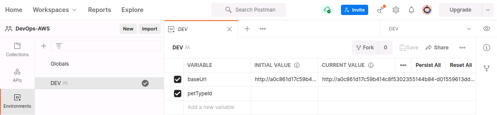
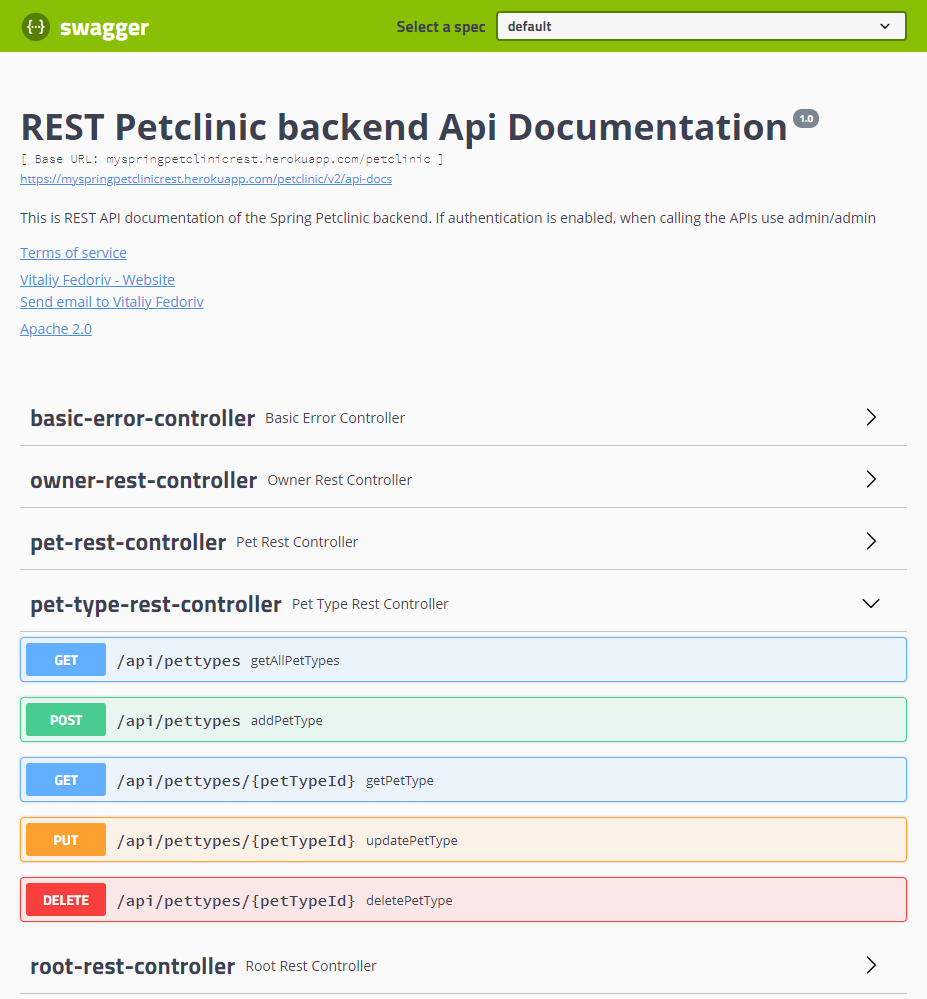
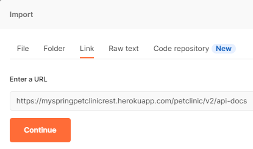
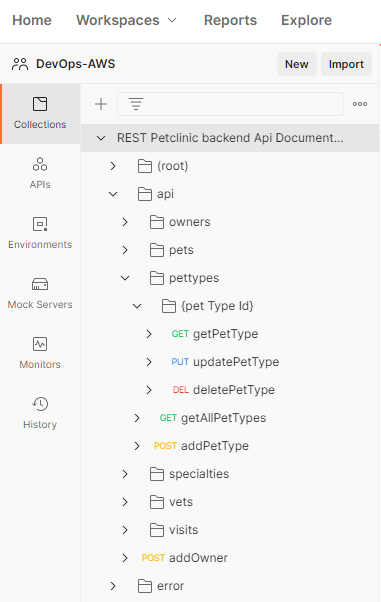
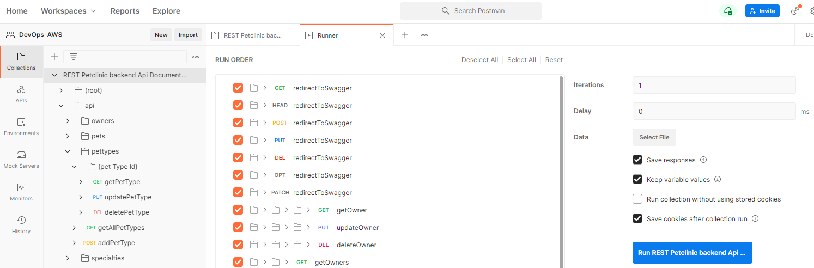
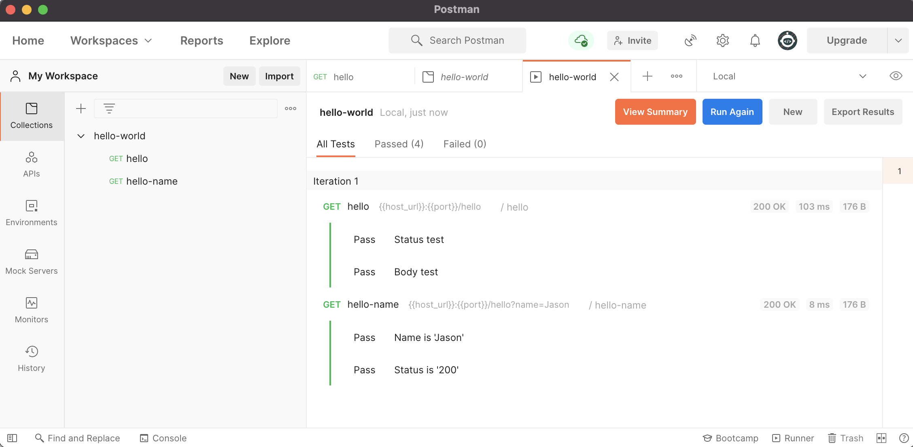
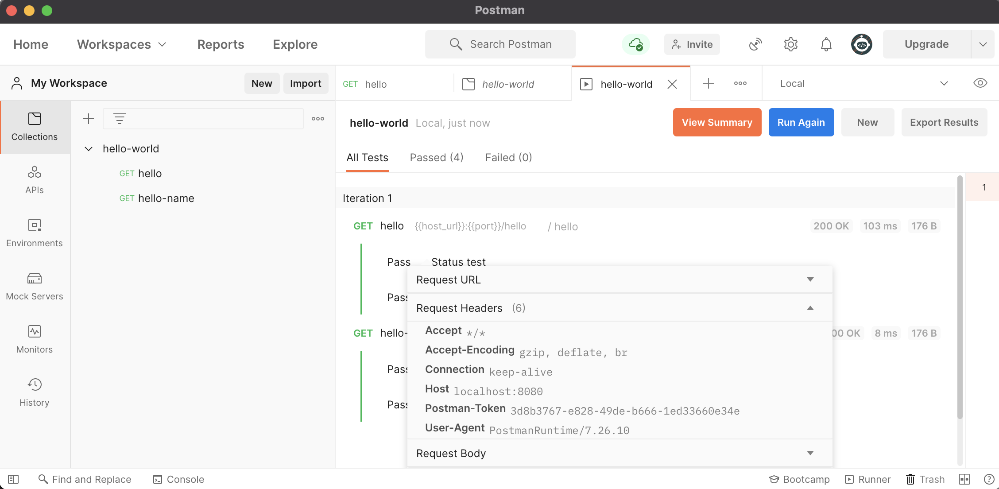
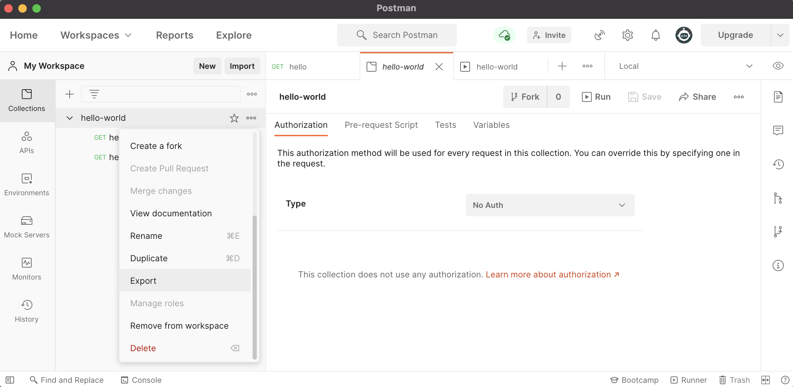

# Postman 구성 및 Test Scripts 실행

## Environments 설정

### Environment 생성

* 사이드 바에서 **Environment**를 클릭한 다음 **Create New Environment**를 클릭합니다.
* `New Environment`을 `DEV`로 수정합니다.

### Environment variables 추가

다음 항목을 입력하여 환경 변수를 추가합니다.

* **VARIABLE** : `baseUrl`
* **INITIAL VALUE** : `http://~.amazonaws.com/petclinic` (Postman 서버를 통해 계정에 동기화되며 Environment에 액세스 할 수 있는 협업자와 공유됩니다.)
* **CURRENT VALUE** : `http://~.amazonaws.com/petclinic` (로컬 Postman 앱에서만 사용되는 값)

`petTypeId` 변수도 추가합니다.

**Save** 버튼을 클릭하여 저장합니다.
    
| |
| -------------------------------------------------------------------------- |

## Collections 설정

Postman 요청(requests)을 컬렉션으로 그룹화하여 작업 공간을 체계화하고, 팀원과 협력하고, API 문서 / 테스트 슈트(Test Suites)를 생성하고, 요청 실행을 자동화 할 수 있습니다.

### Swagger Import

* **Import**를 클릭 후 나온 팝업창의 **Link** 탭을 클릭 후 API 테스트 대상 URL을 입력합니다. (이후 옵션은 Default 설정 그대로 유지)
 
| |
| -------------------------------------------------------------------------- |

| |
| -------------------------------------------------------------------------- |

| |
| -------------------------------------------------------------------------- |


## Collection 실행

다음을 수행하여 Collection을 실행합니다. (여기서는 에러가 발생하는데, 우선 실행해 보는 것에 의의가 있음. 에러 발생 원인은 테스트 스크립트에 petTypeId 관련 Variable 처리가 없음)

* `REST Petclinlc ~` Collection을 선택하고 Variables 탭을 클릭하여 INITIAL VALUE, CURRENT VALUE를 적절히 수정한 후 Save 버튼을 클릭합니다.
* **Run** 버튼을 클릭합니다.
* **Run REST Petclinic ~** 버튼을 클릭합니다.

    | |
    | -------------------------------------------------------------------------- |

    | |
    | -------------------------------------------------------------------------- |


* 요청 이름을 클릭하면 추가 정보를 확인할 수 있습니다.

    | |
    | -------------------------------------------------------------------------- |

* **Export Results** 버튼을 클릭하면 결과를 파일로 다운로드 받을 수 있습니다.

## Collection Export

`REST Petclinic ~` Collection을 선택하고 **View more actions(⋯)** 아이콘을 클릭한 다음 **Export**를 클릭하여 json 파일을 저장합니다.


| |
| -------------------------------------------------------------------------- |

## Newman으로 Command Line으로 Collection 실행

### Newman 설치

아래 명령을 실행하여 Neman을 전역으로(globally) 설치합니다.

```bash
npm install -g newman
```

참고) Newman 추가 플러그인(보고서)
```bash
npm install -g newman-reporter-html
npm install -g newman-reporter-htmlextra
```

### Newman으로 Collection 실행

`newman run` 명령으로 Export하여 저장한 Collection json 파일을 실행합니다.
(여기서는 샘플로 제공된 파일을 사용)  
Environment을 Export 받아 `-e` 옵션으로 실행하거나 `--env-var`으로 환경 변수를 직접 지정하여 실행할 수 있습니다.

```bash
newman run api_test.json -e DEV.postman_environment.json
```

또는

```bash
$ newman run api_test.json --env-var 'baseUrl=$APP_URL/petclinic'
```

```
newman

REST Petclinic backend Api Customized2

❏ api / pettypes
↳ getAllPetTypes
  GET http://a0c861d17c59b414c8f5302355144b84-d01559613ddf2c4c.elb.ap-northeast-2.amazonaws.com/petclinic/api/pettypes [200 OK, 827B, 154ms]
  ✓  Body에 cat이 포함되어 있는지 테스트
  ┌
  │ 'request : [{"id":1,"name":"cat"},{"id":2,"name":"dog"
  │ },{"id":3,"name":"test_015"},{"id":4,"name":"test_017"
  │ },{"id":5,"name":"bird"},{"id":6,"name":"hamster"},{"i
  │ d":7,"name":"test_005"},{"id":8,"name":"test_007"},{"i
  │ d":9,"name":"test_009"},{"id":10,"name":"test_011"},{"
  │ id":11,"name":"test_013"},{"id":12,"name":"test_015"}]
  │ '
  └

↳ addPetType
  POST http://a0c861d17c59b414c8f5302355144b84-d01559613ddf2c4c.elb.ap-northeast-2.amazonaws.com/petclinic/api/pettypes?petTypeId [201 Created, 570B, 26ms]
  ┌
  │ 'addPetType 결과 id : 10'
  │ 'addPetType 결과 name : elephant'
  │ '환경변수 설정된 petTypeId : 10'
  └

┌─────────────────────────┬───────────────────┬───────────────────┐
│                         │          executed │            failed │
├─────────────────────────┼───────────────────┼───────────────────┤
│              iterations │                 1 │                 0 │
├─────────────────────────┼───────────────────┼───────────────────┤
│                requests │                 2 │                 0 │
├─────────────────────────┼───────────────────┼───────────────────┤
│            test-scripts │                 4 │                 0 │
├─────────────────────────┼───────────────────┼───────────────────┤
│      prerequest-scripts │                 3 │                 0 │
├─────────────────────────┼───────────────────┼───────────────────┤
│              assertions │                 1 │                 0 │
├─────────────────────────┴───────────────────┴───────────────────┤
│ total run duration: 435ms                                       │
├─────────────────────────────────────────────────────────────────┤
│ total data received: 340B (approx)                              │
├─────────────────────────────────────────────────────────────────┤
│ average response time: 90ms [min: 26ms, max: 154ms, s.d.: 64ms] │
└─────────────────────────────────────────────────────────────────┘  
```

참고) 보고서
```bash
$ newman run api_test.json \
             --reporters cli,junit,html \
             --env-var 'baseUrl=http://~.amazonaws.com/petclinic' --env-var 'petTypeId="7"' \
             --reporter-junit-export 'target/newman_petclinic_junit.xml'
```

## 참고

[Managing environments](https://learning.postman.com/docs/sending-requests/managing-environments/)  
[Grouping requests in collections](https://learning.postman.com/docs/sending-requests/intro-to-collections/)  
[Building requests](https://learning.postman.com/docs/sending-requests/requests/)  
[Writing tests](https://learning.postman.com/docs/writing-scripts/test-scripts/)  
[Test script examples](https://learning.postman.com/docs/writing-scripts/script-references/test-examples/)  
[Using the Collection Runner](https://learning.postman.com/docs/running-collections/intro-to-collection-runs/)  
[Running collections on the command line with Newman](https://learning.postman.com/docs/running-collections/using-newman-cli/command-line-integration-with-newman/)  
[Newman npm package](https://www.npmjs.com/package/newman)  
