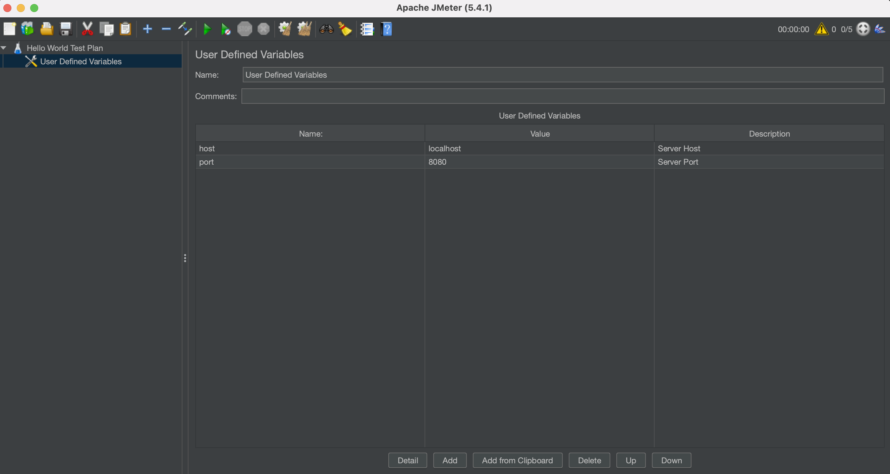
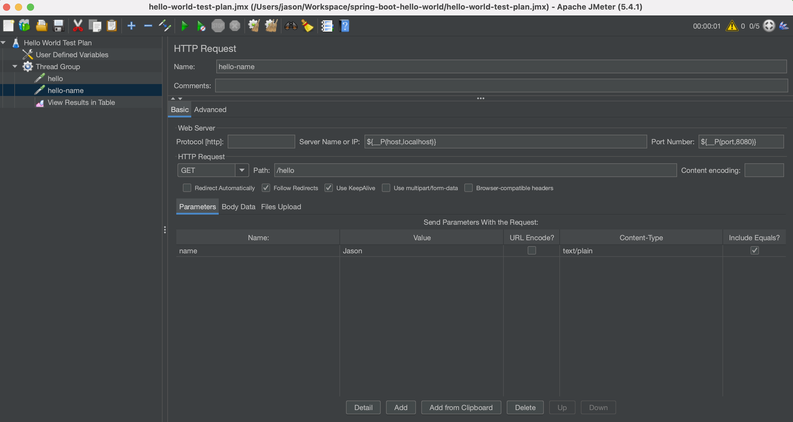
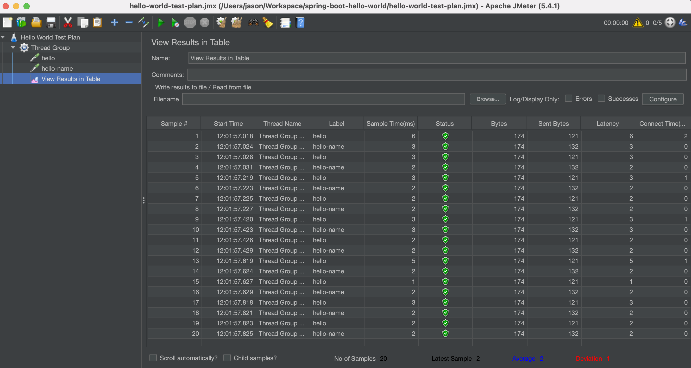
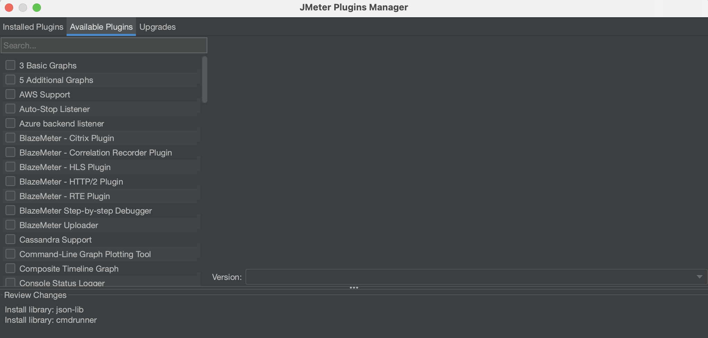

# Apache JMeter 구성 및 Test Plan 작성

## GUI를 사용하여 JMeter Test Plan 작성

* **File > New**을 선택합니다.
* **Name** 필드에 `Hello World Test Plan`을 입력합니다.
* 사이드 바에서 `Hello World Test Plan`를 선택하고 우클릭한 다음, **Add > Config Element > User Defined Variables**를 선택합니다.
* **User Defined Variables**에서 화면 하단의 **Add** 버튼을 클릭한 다음, 아래 사용자 정의 변수를 추가합니다.
  * **Name** : `host`, **Value** : `localhost`
  * **Name** : `port`, **Value** : `8080`

    

* 사이드 바에서 `Hello World Test Plan`를 선택하고 우클릭한 다음, **Add > Thread(users) > Thread Group**를 선택합니다.
* **Thread Group**에서 **Number of threads (users)** 필드에 `5`을 입력하고 **Loop Count** 필드에 `2`를 입력합니다.
* 사이드 바에서 `Thread Group`를 선택하고 우클릭한 다음, **Add > Sampler > Http Request**을 선택합니다.
* **Http Request**에서 다음 항목을 입력합니다.
  * **Name** : `hello` (원하는 이름)
  * **Server Name or IP** : `${__P(host,localhost)}`
  * **Port Number** : `${__P(port,8080)}`
  * **Path** : `/hello`
* 다시 사이드 바에서 `Thread Group`를 선택하고 우클릭한 다음, **Add > Sampler > Http Request**을 선택합니다.
* **Http Request**에서 다음 항목을 입력합니다.
  * **Name** : `hello-name` (원하는 이름)
  * **Server Name or IP** : `${__P(host,localhost)}`
  * **Port Number** : `${__P(port,8080)}`
  * **Path** : `/hello`
  * **Parameters** : 화면 하단의 **Add** 버튼을 클릭한 다음, **Name**에 `name`, **Value**에 `Jason`(원하는 이름)을 입력합니다.
* 필요하다면 앞의 두 단계를 반복해서 **Http Request**를 추가합니다.

    

* 시각적 보고서를 추가하려면 `Thread Group`를 선택하고 우클릭한 다음, **Add > Listener > View Results in Table**를 선택하여 테이블 옵션에서 결과보기를 선택합니다.
* **Disk** 아이콘을 클릭하고 `.jmx` 확장자로 이름을 지정하고 저장합니다. (ex: hello-world-test-plan.jmx)
* 녹색 **Start 아이콘**을 클릭하여 테스트를 실행하고 결과를 확인합니다.

    

## CLI를 사용하여 JMeter Test Plan 실행

아래 명령을 실행하면 JMeter Command 사용법을 확인할 수 있습니다.

```bash
$ jmeter -h


To run Apache JMeter in NON_GUI mode:
Open a command prompt (or Unix shell) and type:

jmeter.bat(Windows)/jmeter.sh(Linux) -n -t test-file [-p property-file] [-l results-file] [-j log-file]
```

Test Plan 파일((ex: hello-world-test-plan.jmx))을 저장한 경로로 이동한 후, 아래 명령을 실행합니다.

```bash
$ jmeter -n -t hello-world-test-plan.jmx -l hello-world-report.jtl
WARNING: package sun.awt.X11 not in java.desktop
Creating summariser <summary>
Created the tree successfully using hello-world-test-plan.jmx
Starting standalone test @ Mon Mar 08 16:38:04 KST 2021 (1615189084823)
Waiting for possible Shutdown/StopTestNow/HeapDump/ThreadDump message on port 4445
summary +      1 in 00:00:00 =    4.3/s Avg:    79 Min:    79 Max:    79 Err:     0 (0.00%) Active: 2 Started: 2 Finished: 0
summary +     19 in 00:00:01 =   30.9/s Avg:     3 Min:     1 Max:     6 Err:     0 (0.00%) Active: 0 Started: 5 Finished: 5
summary =     20 in 00:00:01 =   23.6/s Avg:     7 Min:     1 Max:    79 Err:     0 (0.00%)
Tidying up ...    @ Mon Mar 08 16:38:05 KST 2021 (1615189085758)
... end of run
```

Jenkins Pipeline에서 테스트 후 보고서를 확인하려면 결과 파일이 xml 형식이어야 합니다.  
`-p property-file` 옵션을 사용하여 Properties 파일을 지정하거나 `-J[prop_name]=[value]`으로 변수를 지정할 수 있습니다.

아래와 같이 실행합니다.

```bash
$ jmeter -n -t hello-world-test-plan.jmx -l hello-world-xml-report.jtl -Jjmeter.save.saveservice.output_format=xml -Jhost=127.0.0.1 -Jport=8080
WARNING: package sun.awt.X11 not in java.desktop
Creating summariser <summary>
Created the tree successfully using hello-world-test-plan.jmx
Starting standalone test @ Mon Mar 08 16:50:18 KST 2021 (1615189818762)
Waiting for possible Shutdown/StopTestNow/HeapDump/ThreadDump message on port 4445
summary =     20 in 00:00:01 =   23.9/s Avg:     4 Min:     1 Max:    34 Err:     0 (0.00%)
Tidying up ...    @ Mon Mar 08 16:50:19 KST 2021 (1615189819659)
... end of run
```

결과 파일을 열어 보면 아래와 유사합니다.

```xml
<?xml version="1.0" encoding="UTF-8"?>
<testResults version="1.2">
<httpSample t="34" it="0" lt="32" ct="21" ts="1615189818961" s="true" lb="hello" rc="200" rm="" tn="Thread Group 1-1" dt="text" by="174" sby="121" ng="1" na="1">
  <java.net.URL>http://127.0.0.1:8080/hello</java.net.URL>
</httpSample>
<httpSample t="5" it="0" lt="5" ct="0" ts="1615189818999" s="true" lb="hello-name" rc="200" rm="" tn="Thread Group 1-1" dt="text" by="174" sby="132" ng="1" na="1">
  <java.net.URL>http://127.0.0.1:8080/hello?name=Jason</java.net.URL>
</httpSample>
<httpSample t="2" it="0" lt="2" ct="0" ts="1615189819005" s="true" lb="hello" rc="200" rm="" tn="Thread Group 1-1" dt="text" by="174" sby="121" ng="1" na="1">
  <java.net.URL>http://127.0.0.1:8080/hello</java.net.URL>
</httpSample>
<httpSample t="2" it="0" lt="2" ct="0" ts="1615189819007" s="true" lb="hello-name" rc="200" rm="" tn="Thread Group 1-1" dt="text" by="174" sby="132" ng="1" na="1">
  <java.net.URL>http://127.0.0.1:8080/hello?name=Jason</java.net.URL>
</httpSample>

(생략)

</testResults>
```

## Plugins 설치

* [jmeter-plugins.org](https://jmeter-plugins.org/install/Install/)에서 **plugins-manager.jar** 파일을 다운로드 받습니다.
* 다운로드 받은 파일을 아래와 같이 복사합니다.

```bash
cp ~/Downloads/jmeter-plugins-manager-1.6.jar /usr/local/Cellar/jmeter/5.4.1/libexec/lib/ext
```

JMeter를 재실행하고 **Options > Plugins Manager**를 선택한 다음, **Available Plugins** 탭에서 필요한 플러그인을 설치할 수 있습니다.  
(예: 3Basic Graphs, Custom Thread Gropus)



## 참고

[Getting Started](https://jmeter.apache.org/usermanual/get-started.html)  
[User Defined Variables](https://jmeter.apache.org/usermanual/component_reference.html#User_Defined_Variables)  
[CLI Mode (Command Line mode was called NON GUI mode)](https://jmeter.apache.org/usermanual/get-started.html#non_gui)  
[Overriding Properties Via The Command Line](https://jmeter.apache.org/usermanual/get-started.html#override)  
[Introduction to listeners](https://jmeter.apache.org/usermanual/listeners.html)  
[Using JMeter with Jenkins](https://www.jenkins.io/doc/book/using/using-jmeter-with-jenkins/)  
