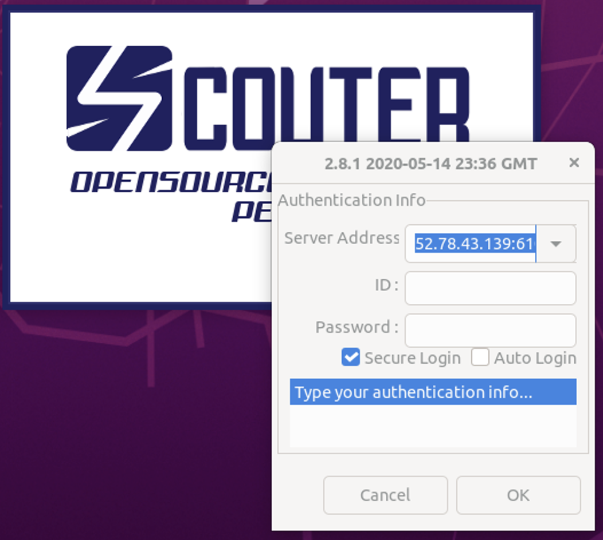

# Scouter 설치 및 구성

**스카우터**([Scouter](https://github.com/scouter-project/scouter))는 new relic 및 appdynamics와 같은 오픈 소스 APM입니다. (APM은 애플리케이션 성능 모니터링 또는 애플리케이션 성능 관리를 의미합니다.)

## Scouter 설치

## Docker Compose를 사용하여 Scouter 설치

Tools VM에  Scouter Server를 설치합니다.

### Docker bridge network 생성

`docker network create` 명령을 사용하여 Scouter 컨테이너가 사용할 사용자 정의 브릿지 네트워크를 생성합니다.  
(`--driver bridge`은 기본값이므로 생략할 수 있습니다.)

```bash
docker network create --driver bridge scouter-net
```

아래 명령을 실행하여 Docker 네트워크를 나열합니다.

```bash
$ docker network ls
NETWORK ID     NAME            DRIVER    SCOPE
aa2cbda3fe50   bridge          bridge    local
813900bb8d36   harbor_harbor   bridge    local
0c2c17842d4a   host            host      local
538e19f1829d   jenkins-net     bridge    local
8b19e2d4abd4   none            null      local
efe2454db16b   scouter-net     bridge    local
c8aaca1222d8   sonarqube-net   bridge    local
```

scouter-net 네트워크를 검사하면, IP 주소와 이 네트워크에 연결된 컨테이너가 없다는 것을 알 수 있습니다.

```bash
docker network inspect scouter-net
```

### 디렉토리 생성

Scouter 작업 디렉토리 (Working directory)를 생성합니다.

```bash
cd /data
sudo mkdir scouter
cd scouter
```

`scouter` 디렉토리의 소유권을 $USER로 변경하고 권한을 변경합니다.

```bash
sudo chown -R $USER:$USER /data/scouter/
sudo chmod -R 755 /data/scouter/
```

### docker-compose.yml 파일 준비

docker hub의 [scouter](https://hub.docker.com/r/scouterapm/scouter-server) 사이트에서 제공하는 docker-compose에 2.10.2 버전 이미지를 사용합니다.

docker-compose.yml 파일을 생성합니다.

```bash
vim docker-compose.yml
```

아래 내용을 추가하고 저장합니다.

```bash
version: '3.2'
services:
  scouter:
    image : scouterapm/scouter-server:2.10.2
    restart : always
    environment:
      - SC_SERVER_ID=SCCOUTER-COLLECTOR
      - NET_HTTP_SERVER_ENABLED=true
      - NET_HTTP_API_SWAGGER_ENABLED=true
      - NET_HTTP_API_ENABLED=true
      - MGR_PURGE_PROFILE_KEEP_DAYS=2
      - MGR_PURGE_XLOG_KEEP_DAYS=5
      - MGR_PURGE_COUNTER_KEEP_DAYS=15
      - JAVA_OPT=-Xms1024m -Xmx1024m
    volumes:
      - ./logs:/home/scouter-server/logs
      - ./sc-data:/home/scouter-server/database
    ports:
      - 6180:6180
      - 6100:6100
      - 6100:6100/udp
networks:
  default:
    external:
      name: scouter-net
```


### Scouter 구동

`docker-compose up` 명령을 실행하여 Scouter를 구동합니다.
(실행 디렉토리 위치는 ~/data/sccouter 입니다.)

```bash
docker-compose up -d
```

scouter-net 네트워크를 검사하면, 네트워크에 한 개의 컨테이너가 연결된 것을 알 수 있습니다.

```bash
docker network inspect scouter-net
```

아래 명령을 실행하면 Scouter 구동 로그를 확인할 수 있습니다.

```bash
docker-compose logs -f
```

아래 명령을 실행하여 container 목록을 확인할 수 있습니다.

```bash
$ docker-compose ps -a
      Name                     Command               State                              Ports
------------------------------------------------------------------------------------------------------------------------
scouter_scouter_1   /home/scouter-server/start ...   Up      0.0.0.0:6100->6100/tcp,:::6100->6100/tcp,
                                                             0.0.0.0:6100->6100/udp,:::6100->6100/udp,
                                                             0.0.0.0:6180->6180/tcp,:::6180->6180/tcp, 6188/tcp
```

## Scouter Client 설치
스카우터 서버에 Agent를 통해 수집된 정보를 불러서 화면으로 표시하는 클라이언트 프로그램입니다.

### Client 실행
본 교재에서는 [Scouter Clent v2.8.1](https://github.com/scouter-project/scouter/releases/tag/v2.8.1)을 OS에 맞는 버전으로 다운로드하여 설치합니다.

* 사용한 버전은 [리눅스 버전](https://github.com/scouter-project/scouter/releases/download/v2.8.1/scouter.client.product-linux.gtk.x86_64.tar.gz)입니다.

원하는 위치에 scouter 디렉토리를 생성하여 압축을 풀어주면 됩니다.

```bash
$ mkdir scouter
$ wget https://github.com/scouter-project/scouter/releases/download/v2.8.1/scouter.client.product-linux.gtk.x86_64.tar.gz
$ tar -zxvf scouter.client.product-linux.gtk.x86_64.tar.gz
```

### Scouter 접속방법

```bash
$ cd scouter.client
$ ./scouter
```

* **Server Address** : [서버주소:6100]
* **ID** : admin
* **Password** : admin
* `OK` 버튼을 누릅니다.

 


### Scouter Agent 설정
Agent를 애플리케이션에 심어서 각종 정보를 스카우터 서버로 보내는 기능을 합니다.

#### scouter.conf 수정 반영

github 가이드 문서 > `Scouter` 디렉토리를 workspace/spring-petclilnic-rest 디렉토리로 복사합니다.

다음과 같이 수정합니다.

```bash
# Scouter Server IP Address (Default : 127.0.0.1)
net_collector_ip=[스카우터 서버 IP]

# Scouter Server Port (Default : 6100)
net_collector_udp_port=6100
net_collector_tcp_port=6100

# Scouter Name(Default : tomcat1)
#obj_name=myFirstTomcat1
obj_name_auto_pid_enabled=true
```

#### pom.xml 수정

pom.xml 파일에 scouter `<target>` 참조부분 스크립트를 추가합니다조
(**가이드문서** > `scripts` 디렉토리 > `pom.xml` 참고)

```xml
                        <configuration>
                            <additionalProperties>
                                <encoding.source>${project.build.sourceEncoding}</encoding.source>
                                <encoding.reporting>${project.reporting.outputEncoding}</encoding.reporting>
                                <java.source>${maven.compiler.source}</java.source>
                                <java.target>${maven.compiler.target}</java.target>
                            </additionalProperties>
                            <target>
                                <copy file="./Scouter/scouter.agent.jar" tofile="./target/scouter.agent.jar"/>
                                <copy file="./Scouter/scouter.conf" tofile="./target/scouter.conf"/>
                            </target>                            
                        </configuration>
```

#### Dockerfile 수정
scouter 관련 jar 파일을 추가하도록 수정합니다.

```bash
FROM adoptopenjdk/openjdk11:alpine-jre
ARG JAR_FILE=target/*.jar
COPY ${JAR_FILE} app.jar
ADD Scouter/scouter.agent.jar scouter.agent.jar
ADD Scouter/scouter.conf scouter.conf
ENV JAVA_OPTS=""
ENTRYPOINT ["java","-Djava.security.egd=file:/dev/./urandom","-Dscouter.config=/scouter.conf","-javaagent:/scouter.agent.jar","-jar","/app.jar"]
```

