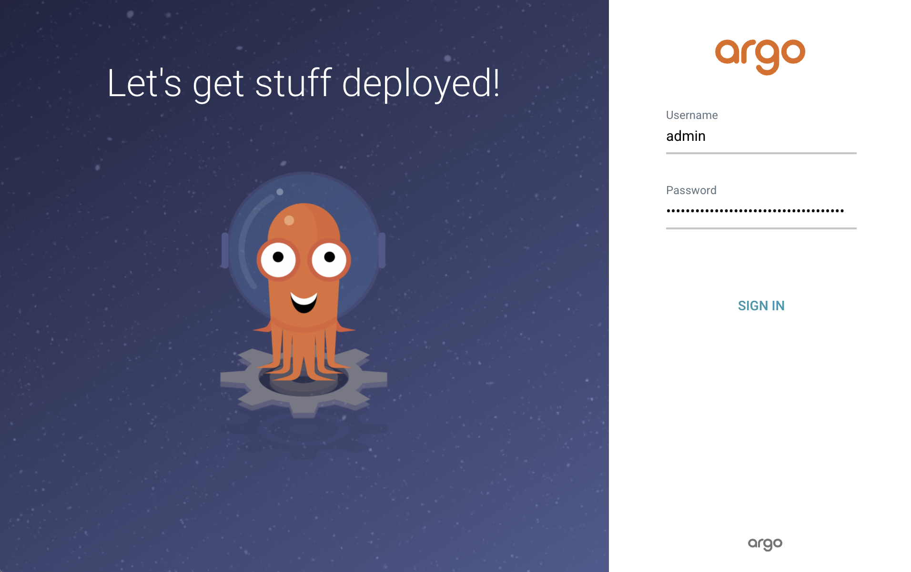
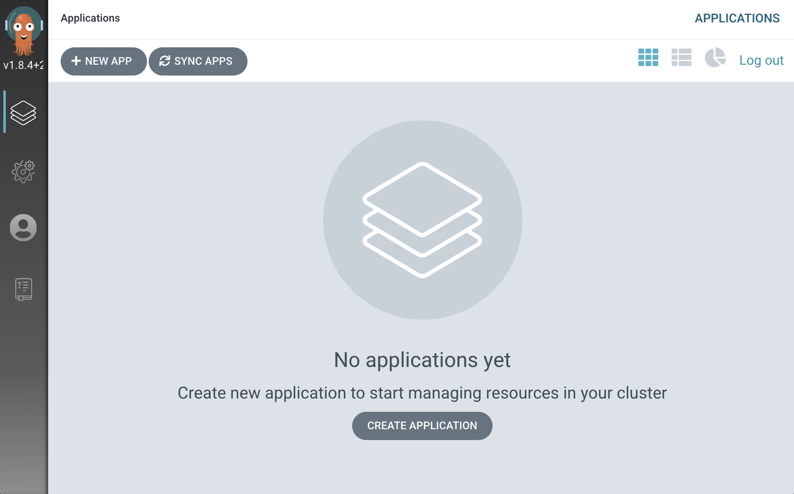

**[목차]**
- [Argo CD 배포(설치) 및 구성](#argo-cd-배포설치-및-구성)
  - [Helm 설치](#helm-설치)
  - [Argo CD 배포(설치)](#argo-cd-배포설치)
    - [Helm를 사용하여 Argo CD 배포](#helm를-사용하여-argo-cd-배포)
    - [Argo CD CLI 설치](#argo-cd-cli-설치)
    - [Argo CD API 서버 노출](#argo-cd-api-서버-노출)
    - [CLI를 사용하여 로그인](#cli를-사용하여-로그인)
    - [Argo CD Web UI 접속](#argo-cd-web-ui-접속)
  - [참고](#참고)
# Argo CD 배포(설치) 및 구성

Argo CD는 Kubernetes용 선언적(Declarative) GitOps 지속적 배포 도구입니다.

## Helm 설치

Helm은 Kubernetes을 위한 Package Manager 입니다.  
Helm Chart를 사용하면 복잡한 Kubernetes 애플리케이션도 편리하게 정의하여 설치하거나 업그레이드할 수 있습니다.

다음을 수행하여 현재 Stable 버전인 v3.5.2 버전을 설치합니다.

```bash
curl -sLo helm-v3.5.2-linux-amd64.tar.gz https://get.helm.sh/helm-v3.5.2-linux-amd64.tar.gz
tar -zxvf helm-v3.5.2-linux-amd64.tar.gz
sudo mv linux-amd64/helm /usr/local/bin/helm
```

버전을 확인합니다.

```bash
$ helm version
version.BuildInfo{Version:"v3.5.2", GitCommit:"167aac70832d3a384f65f9745335e9fb40169dc2", GitTreeState:"dirty", GoVersion:"go1.15.7"}
```

## Argo CD 배포(설치)

### Helm를 사용하여 Argo CD 배포

Argo CD를 [Getting Started - Install Argo CD](https://argo-cd.readthedocs.io/en/stable/getting_started/#1-install-argo-cd) 가이드에 따라 `kubectl`로 설치할 수도 있으나, [Helm](https://helm.sh/) Chart를 사용하여 설치합니다.

Argo CD의 Helm chart repository를 추가합니다.

```bash
$ helm repo add argo https://argoproj.github.io/argo-helm
"argo" has been added to your repositories
```

아래 명령을 실행하면 저장소 목록을 확인할 수 있습니다.

```bash
$ helm repo list
NAME	URL
argo	https://argoproj.github.io/argo-helm
```

Helm chart repository에서 로컬로 사용 가능한 차트 정보를 업데이트 합니다.

```bash
helm repo update
```

Agro CD Helm Chart의 [values.yaml](https://github.com/argoproj/argo-helm/blob/master/charts/argo-cd/values.yaml) 파일을 다운로드 받은 후 수정한 다음, 이래와 같이 `--values` flag로 기본 설정 값을 변경하여 설치할 수 있습니다.

```bash
helm install my-argo-cd argo/argo-cd --values ./my-values.yaml
```

재정의할 값이 많지 않은 경우 `--set parameter=value`를 사용하여 명령줄(CLI) 상에서 변경할 수 있습니다.

**다음을 수행하여 Kubernetes Cluster에 Argo CD를 배포합니다.**

```bash
kubectl create namespace argocd
kubens argocd
helm install devops-argocd argo/argo-cd \
  --set installCRDs=false \
  --set server.extraArgs={--insecure} \
  --version 2.17.2
```

> `devops-argocd`는 Release 이름입니다.

### Argo CD CLI 설치

다음을 수행하여 최신 버전의 Argo CD CLI를 설치합니다.

```bash
VERSION=$(curl --silent "https://api.github.com/repos/argoproj/argo-cd/releases/latest" | grep '"tag_name"' | sed -E 's/.*"([^"]+)".*/\1/')

sudo curl -sSL -o /usr/local/bin/argocd https://github.com/argoproj/argo-cd/releases/download/$VERSION/argocd-linux-amd64

sudo chmod +x /usr/local/bin/argocd
```

### Argo CD API 서버 노출

`devops-argocd-server` 서비스 유형을 `LoadBalancer`로 변경합니다.

```bash
$ kubectl patch svc devops-argocd-server -n argocd -p '{"spec": {"type": "LoadBalancer"}}'
service/devops-argocd-server patched
```

이래 명령을 실행하여 `devops-argocd-server` 서비스의 주소를 확인합니다.

```bash
kubectl get svc devops-argocd-server -o jsonpath='{.status.loadBalancer.ingress[0].hostname}'
```

### CLI를 사용하여 로그인

초기 Admin 패스워드는 Argo CD API 서버의 Pod 이름이 되도록 자동 생성됩니다.  
아래 명렬을 실행하여 `admin` 계정의 패스워드를 확인합니다.

```bash
kubectl get pods -n argocd -l app.kubernetes.io/name=argocd-server -o name | cut -d'/' -f 2
```

위에서 확인한 Argo CD 접속 주소와 패스워드를 사용하여 Argo CD에 로그인 합니다.

```bash
$ argocd login <ArgoCD_Server_Address> \
  --username admin \
  --password <Password> \
  --insecure
WARNING: server is not configured with TLS. Proceed (y/n)? y
'admin' logged in successfully
Context 'xxxxxx.ap-northeast-2.elb.amazonaws.com' updated
```

아래 명령을 사용하여 패스워드를 변경합니다.

```bash
$ argocd account update-password
*** Enter current password:
*** Enter new password:
*** Confirm new password:
Password updated
Context 'xxxxxx.ap-northeast-2.elb.amazonaws.com' updated
```

### Argo CD Web UI 접속

웹 브라우저에서 변경한 패스워드로 로그인 합니다.



로그인하면 아래와 같이 **Applications** 페이지로 이동합니다.



## 참고

[Installing Helm](https://helm.sh/docs/intro/install/)  
[Helm FAQ Troubleshooting](https://helm.sh/docs/faq/#troubleshooting)  
[Argo CD - Overview](https://argo-cd.readthedocs.io/en/stable/)  
[Argo CD - Getting Started](https://argo-cd.readthedocs.io/en/stable/getting_started/)  
[Argo CD Chart](https://artifacthub.io/packages/helm/argo/argo-cd)  
[Argo CD Chart - GitHub](https://github.com/argoproj/argo-helm/tree/master/charts/argo-cd)  
[Argo CD CLI - Installation](https://argo-cd.readthedocs.io/en/stable/cli_installation/)  
[NGINX Ingress Controller - Installation Guide#Using Helm](https://kubernetes.github.io/ingress-nginx/deploy/#using-helm)  
