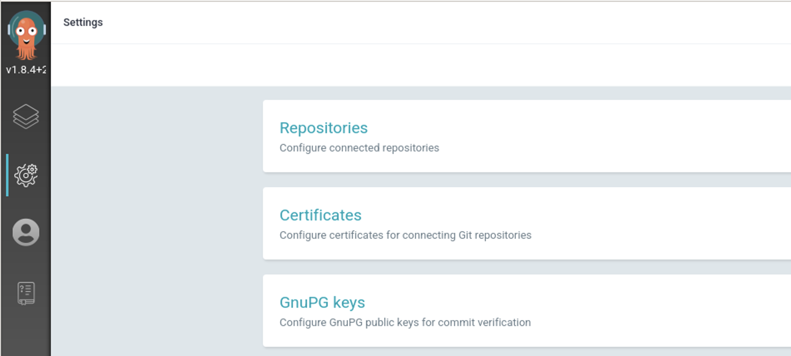
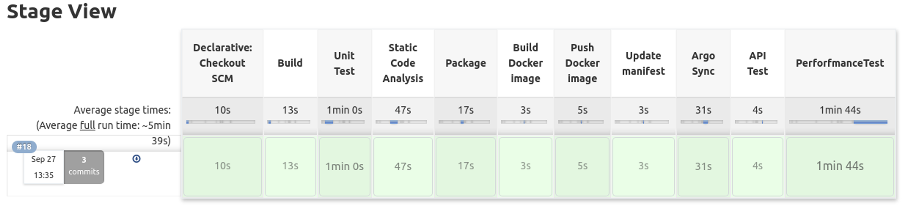

**[목차]**
[TOC]
# Argo CD로 지속적 배포(Continuous Deployment)

## Kubernetes Manifests(YAML)를 사용하여 App 배포

### `petclinic-argocd-manifest` GitHub Repository 생성

다음을 수행하여 GitHub에 `petclinic-argocd-manifest` 리포지토리를 생성합니다.

1. 페이지 오른쪽 상단에서 **+** 드롭다운 메뉴을 클릭한 후 **New repository**를 선택합니다.

2. **Create a new repository** 페이지에서 아래 항목을 입력 또는 선택합니다.
    * **Owner** : 본인 계정을 선택합니다.
    * **Repository name** : 리포지토리 이름을 입력합니다. (예: `petclinic-argocd-manifest`)
    * **Description (optional)** : 리포지토리에 대한 설명을 입력합니다.
    * **Visibility(가시성)** : 공개 여부에 따라 `Public` 또는 `Private`을 선택합니다.
    * **Initialize this repository with** : `Add a README file`을 체크합니다.

3. **Create repository** 버튼을 클릭합니다.

### Manifests(YAML) 파일 준비

다음을 수행하여 Deployment, Service, Ingress의 Manifest 파일을 생성합니다.

* 이전 단계에서 생성한 GitHub Repository에서 **Add file** 버튼을 클릭한 다음, `Create new file`을 선택합니다.
* 파일 이름으로 `petclinic-deployment.yaml`을 입력하고 **Edit new file**에 아래 내용을 붙여 넣습니다. (이미지 태그는 Harbor에서 확인)

```yaml
apiVersion: apps/v1
kind: Deployment
metadata:
  name: petclinic-deployment
  labels:
    app: petclinic
spec:
  replicas: 2
  selector:
    matchLabels:
      app: petclinic
  template:
    metadata:
      labels:
        app: petclinic
    spec:
      containers:
      - name: petclinic
        image: <Harbor_IP>:<Harbor_Port>/petclinic/spring-petclinic-rest:<Image_Tag>
        ports:
        - containerPort: 9966
      imagePullSecrets:
      - name: harbor-credentials
```

* **Commit new file** 버튼을 클릭하여 커밋합니다. (커밋 메시지를 수정할 수 있습니다.)
* 마찬가지 방법으로 `petclinic-service.yaml` 파일을 생성한 다음, 아래 내용을 붙여 넣고 커밋합니다.

```yaml
apiVersion: v1
kind: Service
metadata:
  name: petclinic-service
  labels:
    app: petclinic
spec:
  type: ClusterIP
  selector:
    app: petclinic
  ports:
    - protocol: TCP
      port: 9966
      targetPort: 9966
```

* `petclinic-ingress.yaml` 파일도 작성하고 커밋합니다.

```yaml
apiVersion: networking.k8s.io/v1beta1
kind: Ingress
metadata:
  name: petclinic-ingress
  annotations:
    kubernetes.io/ingress.class: nginx
spec:
  rules:
  - http:
      paths:
      - path: /
        backend:
          serviceName: petclinic-service
          servicePort: 9966
```

* GitHub Repository의 녹색 버튼을 클릭하여 Clone HTTPS URL을 복사합니다.

### Argo CD Web UI를 통해 애플리케이션 생성

* **Settings** 페이지에서 **Repositories**을 클릭합니다.

    | |
    | -------------------------------------------------------------------------- |

* **CONNECT REPO USING HTTPS** 버튼을 클릭한 다음, 아래 항목을 입력하고 **CONNECT** 버튼을 클릭합니다.
  * **Type** : `git` 선택
  * **Repository URL** : 이전 단계에서 복사한 Git Clone HTTPS URL 입력
  * **Username** : GitHub 계정 입력 (Private인 경우)
  * **Password** : GitHub 패스워드(Token) 입력 (Private인 경우)
* **Applications** 페이지에서 **NEW APP** 버튼을 클릭한 다음, 아래 항목을 입력합니다.
  * **Application Name** : `petclinic` (원하는 이름)
  * **Project** : `default` 선택
  * **SYNC POLICY** : `Manual` 선택
  * **SYNC OPTIONS** : `USE A SCHEMA TO VALIDATE RESOURCE MANIFESTS` 체크
  * **Repository URL** : 조금 전에 등록한 Repository URL 선택
  * **Revision** : `HEAD` 입력하고 `Branches` 선택
  * **Path** : `.`(dot) 입력 (Manifest 파일이 있는 디렉토리 경로)
  * **Cluster URL** : `https://kubernetes.default.svc` 선택
  * **Namespace** : `petclinic-dev`
* 상단의 **CREATE** 버튼을 클릭합니다.

  

  

### CLI를 통해 애플리케이션 생성

아래와 같이 `argocd app create` 명령을 실행하여 애플리케이션을 생성할 수도 있습니다.

```bash
argocd app create petclinic-cli \
  --repo <GitHub_Repository_URL> \
  --path . \
  --dest-server https://kubernetes.default.svc \
  --dest-namespace petclinic-dev
```

아래 명령을 실행하여 `petclinic-cli` 애플리케이션을 삭제합니다.

```bash
argocd app delete petclinic-cli
```

### `petclinic` 애플리케이션 Sync (Deploy)

이전 단계에서 생성했던 리소스를 삭제합니다.

```bash
$ kubectl delete deployments/petclinic-deployment -n petclinic-dev
deployment.apps "petclinic-deployment" deleted

$ kubectl delete services/petclinic-service -n petclinic-dev
service "petclinic-service" deleted

$ kubectl delete ingresses/petclinic-ingress -n petclinic-dev
ingress.extensions "petclinic-ingress" deleted
```

`petclinic` 애플리케이션의 상태를 확인합니다.

```bash
$ argocd app get petclinic
Name:               petclinic
Project:            default
Server:             https://kubernetes.default.svc
Namespace:          petclinic-dev
URL:                https://argocd.example.com/applications/petclinic
Repo:               https://github.com/xxxx/petclinic-argocd-manifest.git
Target:             HEAD
Path:               .
SyncWindow:         Sync Allowed
Sync Policy:        <none>
Sync Status:        OutOfSync from HEAD (b0f7dc7)
Health Status:      Missing

GROUP              KIND        NAMESPACE      NAME                  STATUS     HEALTH   HOOK  MESSAGE
                   Service     petclinic-dev  petclinic-service     OutOfSync  Missing        service/petclinic-service unchanged
apps               Deployment  petclinic-dev  petclinic-deployment  OutOfSync  Missing        deployment.apps/petclinic-deployment configured
networking.k8s.io  Ingress     petclinic-dev  petclinic-ingress     OutOfSync  Missing        ingress.networking.k8s.io/petclinic-ingress configured
```

애플리케이션이 아직 배포되지 않았고 Kubernetes 리소스가 생성되지 않았으므로, 애플리케이션 상태는 초기에 `OutOfSync` 상태입니다.  
애플리케이션을 동기화(배포)하려면 다음을 실행합니다.

```bash
argocd app sync petclinic
```

Argo CD Web UI에서 `Synced` 상태로 변경된 것을 확인할 수 있습니다.


웹 브라우저에서 `petclinic` 애플리케이션의 URL로 접속하여 정상 동작하는지 확인합니다.

아래 명령을 실행하여 `petclinic` 애플리케이션을 삭제합니다.

```bash
argocd app delete petclinic
```

## Helm Chart를 사용하여 App 배포

### Helm Chart 생성

* Workspace EC2 인스턴스에서 원하는 Working Directory로 이동 후, 아래 명령을 실행하여 Helm Chart 기본 구조를 생성합니다.

    ```bash
    cd ~/
    helm create petclinic-argocd-helm
    cd petclinic-argocd-helm
    ```

* 아래와 같이 `petclinic-argocd-helm` Chart 기본 구조가 생성된 것을 확인할 수 있습니다.

    ```bash
    $ sudo apt install tree

    $ tree ~/petclinic-argocd-helm/
    ./petclinic-argocd-helm/
    ├── Chart.yaml
    ├── charts
    ├── templates
    │   ├── NOTES.txt
    │   ├── _helpers.tpl
    │   ├── deployment.yaml
    │   ├── hpa.yaml
    │   ├── ingress.yaml
    │   ├── service.yaml
    │   ├── serviceaccount.yaml
    │   └── tests
    │       └── test-connection.yaml
    └── values.yaml
    ```

    | 디렉토리/파일                | 설명                                                   |
    |------------------------|------------------------------------------------------|
    | .helmignore            | 헬름 차트에 포함시키고 싶지 않은 파일들을 지정                           |
    | Chart.yaml             | 차트에 대한 정보를 포함하는 YAML 파일                              |
    | charts                 | 이 차트가 의존하는 차트를 포함하는 디렉토리                             |
    | templates              | 값과 결합하여 유효한 Kubernetes manifest 파일을 생성하기 위한 템플릿 디렉토리 |
    | templates/NOTES.txt    | 차트의 "도움말". `helm install`을 실행할 때 사용자에게 표시            |
    | templates/_helpers.tpl | 차트 전체에서 다시 사용할 수 있는 템플릿 헬퍼를 지정하는 공간                  |
    | values.yaml            | 이 차트의 기본 구성 값                                        |

* `Chart.yaml` 파일을 열고 다음 항목을 수정합니다.
  * description : `A Helm chart for Petclinic App` (차트 설명)
  * appVersion : `"0.1.0"` (애플리케이션의 릴리즈 버전) <- (주의! apiVersion 아님)

* `deployment.yaml` 파일에서 `containers.ports.containerPort`의 값을 9966으로 변경하고, `containers.livenessProbe`와 `containers.readinessProbe`을 제거합니다.

* `ingress.yaml` 파일에서 `spec.rules.host`를 제거하여 아래와 같이 수정합니다.

```yaml
  rules:
    {{- range .Values.ingress.hosts }}
    - http:
        paths:
          {{- range .paths }}
          - path: {{ .path }}
            backend:
              serviceName: {{ $fullName }}
              servicePort: {{ $svcPort }}
          {{- end }}
    {{- end }}
  {{- end }}
```

* `values.yaml` 파일을 열고 다음 항목을 수정합니다. (전체적인 모습은 아래 그림을 참고하되 자신의 정보에 맞게 수정할 것)
  * replicaCount : 2
  * image.repository : <Harbor_IP>:<Harbor_Port>/petclinic/spring-petclinic-rest
  * image.tag : 배포할 이미지 태그 (Harbor에서 확인)
  * imagePullSecrets : `- name: harbor-credentials` 추가 (이전에서 생성했던 Docker Registry Secret 사용)
  * serviceAccount.create : false (이미 생성한 `petclinic-sa` 사용)
  * serviceAccount.name : "petclinic-sa"
  * service.port : 9966
  * ingress : **아래 샘플 내용 참고**  
    * ingress.enabled : true
    * ingress.hosts : 하단 영역 주의해서 수정
  <br>
  
   ```yaml 
   # Default values for petclinic-argocd-helm.
   # This is a YAML-formatted file.
   # Declare variables to be passed into your templates.
   
   replicaCount: 2
   
   image:
     repository: xx.xx.xx.xxx:8000/petclinic/spring-petclinic-rest
     pullPolicy: IfNotPresent
     # Overrides the image tag whose default is the chart appVersion.
     tag: "8ae2xxxx_xx"
   
   imagePullSecrets:
     - name: harbor-credentials
   nameOverride: ""
   fullnameOverride: ""
   
   serviceAccount:
     # Specifies whether a service account should be created
     create: false
     # Annotations to add to the service account
     annotations: {}
     # The name of the service account to use.
     # If not set and create is true, a name is generated using the fullname template
     name: "petclinic-sa"
   
   podAnnotations: {}
   
   podSecurityContext: {}
     # fsGroup: 2000
   
   securityContext: {}
     # capabilities:
     #   drop:
     #   - ALL
     # readOnlyRootFilesystem: true
     # runAsNonRoot: true
     # runAsUser: 1000
   
   service:
     type: ClusterIP
     port: 9966
   
   ingress:
     enabled: true
     annotations: {}
       # kubernetes.io/ingress.class: nginx
       # kubernetes.io/tls-acme: "true"
     hosts:
       - host: chart-example.local
         paths: 
         - path: /
           backend:
             serviceName: petclinic-service
             servicePort: 9966
     tls: []
     #  - secretName: chart-example-tls
     #    hosts:
     #      - chart-example.local
   
   resources: {}
     # We usually recommend not to specify default resources and to leave this as a conscious
     # choice for the user. This also increases chances charts run on environments with little
     # resources, such as Minikube. If you do want to specify resources, uncomment the following
     # lines, adjust them as necessary, and remove the curly braces after 'resources:'.
     # limits:
     #   cpu: 100m
     #   memory: 128Mi
     # requests:
     #   cpu: 100m
     #   memory: 128Mi
   
   autoscaling:
     enabled: false
     minReplicas: 1
     maxReplicas: 100
     targetCPUUtilizationPercentage: 80
     # targetMemoryUtilizationPercentage: 80
   
   nodeSelector: {}
   
   tolerations: []
   
   affinity: {}
   ```

### Helm Chart 디버깅

`helm lint` 명령을 실행하여 Syntax 오류가 있는지 확인합니다.

```bash
$ helm lint ./petclinic-argocd-helm/
==> Linting ./petclinic-argocd-helm/
[INFO] Chart.yaml: icon is recommended
[WARNING] templates/ingress.yaml: networking.k8s.io/v1beta1 Ingress is deprecated in v1.19+, unavailable in v1.22+; use networking.k8s.io/v1 Ingress

1 chart(s) linted, 0 chart(s) failed
```

`helm template` 명령을 실행하여 `values.yaml`, `templates/_helpers.tpl`의 값을 참조하여 template 파일들이 Kubernetes manifest 파일을 정상적으로 생성할 수 있는지 미리 확인합니다.

```bash
helm template ./petclinic-argocd-helm/
```

`--debug`와 `--dry-run` 옵션을 사용하면 차트를 설치하지 않고 생성될 릴리스의 매니페스트를 확인할 수 있습니다.

```bash
helm install petclinic ./petclinic-argocd-helm/ \
  --namespace petclinic-dev \
  --set image.tag="<Image_Tag>" \
  --debug --dry-run
```

> `--debug` : verbose(장황한) 출력을 활성화하여 결과를 상세하게 보여 줍니다.
> `--dry-run` : 실제 설치 명령을 실행하지 않고 모의(테스트) 설치만 하여 결과를 미리 보여 줍니다.

### Helm Chart 설치 (App 배포)

`helm install` 명령을 실행하여 App을 배포합니다.

```bash
helm install petclinic ./petclinic-argocd-helm/ \
  --namespace petclinic-dev \
  --set image.tag="<Image_Tag>"
```

`helm list` 명령을 실행하면 릴리즈 목록을 확인할 수 있습니다.

```bash
$ helm list
NAME       	NAMESPACE      	REVISION	UPDATED                                	STATUS  	CHART                  	APP VERSION
petclinic	petclinic-dev	1       	2021-03-10 07:28:16.981769812 +0000 UTC	deployed	petclinic-argocd-helm-0.1.0	0.1.0
```

웹 브라우저에서 `petclinic` 애플리케이션의 URL로 접속하여 정상 동작하는지 확인합니다.

아래 명령을 실행하여 `petclinic` 애플리케이션을 삭제합니다.

```bash
$ helm uninstall petclinic --namespace petclinic-dev
release "petclinic" uninstalled
```

### `petclinic-argocd-helm` GitHub Repository 생성

petclinic-argocd-manifest
다음을 수행하여 GitHub에 `petclinic-argocd-helm` 리포지토리를 생성합니다.

1. 페이지 오른쪽 상단에서 **+** 드롭다운 메뉴을 클릭한 후 **New repository**를 선택합니다.
2. **Create a new repository** 페이지에서 아래 항목을 입력 또는 선택합니다.
    * **Owner** : 본인 계정을 선택합니다.
    * **Repository name** : 리포지토리 이름을 입력합니다. (예: `petclinic-argocd-helm`)
    * **Description (optional)** : 리포지토리에 대한 설명을 입력합니다.
    * **Visibility(가시성)** : 공개 여부에 따라 `Public` 또는 `Private`을 선택합니다.
    * **Initialize this repository with** : **<span style="color:rgb(190, 90, 180)">아무것도 체크하지 않습니다</span>**

3. **Create repository** 버튼을 클릭합니다.

### GitHub Repository에 Helm 차트 Push

Workspace EC2 인스턴스에서 `git version` 명령을 실행하여 설치되어 있는지 확인하고, 되어 있지 않으면 Git를 설치합니다.(앞서 설치되어 있으면 Skip함)

```bash
git version
sudo apt update -y
sudo apt install git -y
git version
```

`git init` 명령을 실행하여 Git 로컬 Repository를 생성합니다.

```bash
cd ~/petclinic-argocd-helm
git init
git config --list
```

리포지토리에 대한 Git 사용자 이름과 이메일 주소를 설정합니다.

```bash
git config user.name "Gildong Hong"
git config user.email "gdhong@example.com"
```

GitHub 인증 정보를 저장합니다.

```bash
git config credential.helper 'cache --timeout=7200'
```

Git 사용자 이름과 이메일 주소를 올바르게 설정했는지 확인합니다.

```bash
git config --list
```

아래 명령을 수행하여 GitHub에 Push 합니다.

```bash
git add .
git commit -m "Add Initial Helm Chart"
git branch -M main
git remote add origin https://github.com/xxxxx/petclinic-argocd-helm.git
git push -u origin main
```

웹 브라우저에서 GitHub Repository를 새로고침 합니다.

**Add a README** 버튼을 클릭한 다음, **Commit new file** 버튼을 클릭하여 커밋합니다.

### CLI를 통해 `petclinic-argocd-helm` 애플리케이션 생성

`argocd repo add` 명령을 실행하여 Repository를 추가합니다.

```bash
argocd repo add <GitHub_Repository_URL> \
  --username <GitHub_username> \
  --password <GitHub_password> \
  --insecure-skip-server-verification
```

`argocd repo list` 명령을 실행하여 Repository 목록을 확인합니다.

```bash
$ argocd repo list
TYPE  NAME  REPO                                                   INSECURE  OCI    LFS    CREDS  STATUS      MESSAGE
git         https://github.com/xxxx/petclinic-argocd-manifest.git  false     false  false  true   Successful
git         https://github.com/xxxx/petclinic-argocd-helm.git      true      false  false  true   Successful
```

**Settings** 페이지에서 **Repositories**을 클릭하면 Git Repository가 추가된 것을 확인할 수 있습니다.

`argocd app create` 명령을 실행하여 `petclinic-argocd-helm` 애플리케이션을 생성합니다.  
(이미지 태그는 최신 버전보다 한 단계 이전 버전을 사용합니다.)

```bash
argocd app create petclinic-argocd-helm \
  --repo <GitHub_Repository_URL> \
  --path . \
  --revision HEAD \
  --dest-server https://kubernetes.default.svc \
  --dest-namespace petclinic-dev \
  --helm-set image.tag="<Image_Tag>"
```

> 주의 : `--helm-set image.tag` 옵션을 사용하면 
> **<span style="color:rgb(190, 90, 180)">Auto Sync 시 이미지 변경이 되지 않습니다.</span>**

`petclinic-argocd-helm` 애플리케이션의 상태를 확인합니다.

```bash
$ argocd app get petclinic-argocd-helm
Name:               petclinic-argocd-helm
Project:            default
Server:             https://kubernetes.default.svc
Namespace:          petclinic-dev
URL:                https://argocd.example.com/applications/petclinic-argocd-helm
Repo:               https://github.com/skcc-devops01/petclinic-argocd-helm.git
Target:             HEAD
Path:               .
SyncWindow:         Sync Allowed
Sync Policy:        <none>
Sync Status:        OutOfSync from HEAD (49c6ebf)
Health Status:      Missing

GROUP              KIND        NAMESPACE      NAME                   STATUS     HEALTH   HOOK  MESSAGE
                   Service     petclinic-dev  petclinic-argocd-helm  OutOfSync  Missing
apps               Deployment  petclinic-dev  petclinic-argocd-helm  OutOfSync  Missing
networking.k8s.io  Ingress     petclinic-dev  petclinic-argocd-helm  OutOfSync  Missing
```

**Applications** 페이지에서 `petclinic-argocd-helm` 애플리케이션이 추가된 것을 확인할 수 있습니다.

`argocd app sync` 명령을 실행하여 애플리케이션을 동기화(배포)합니다.

```bash
argocd app sync petclinic-argocd-helm
```

웹 브라우저에서 `petclinic-argocd-helm` 애플리케이션의 URL로 접속하여 정상 동작하는지 확인합니다.

`argocd app set` 명령을 사용하여 이미지 태그를 변경합니다. (최신 버전 태그 사용)

```bash
argocd app set petclinic-argocd-helm -p image.tag="<Image_Tag>"
```

다시 `argocd app sync` 명령을 실행합니다.

```bash
argocd app sync petclinic-argocd-helm
```

아래 명령을 실행하면 배포된 애플리케이션 Pod의 이미지를 확인할 수 있습니다.

```bash
$ kubectl get pods -n petclinic-dev -o=custom-columns='DATA:spec.containers[*].image'
DATA
xx.xx.xx.xx:8000/petclinic/spring-petclinic-rest:xxxxx_yyy
xx.xx.xx.xx:8000/petclinic/spring-petclinic-rest:xxxxx_yyy
```


### 애플리케이션 자동 배포 설정

**자동 배포**를 하기 위해 앞서 생성한 애플리케이션의 옵션(--helm-set image.tag)을 **제거**해 주어야 합니다.
`petclinic-argocd-helm` 애플리케이션을 삭제 후 재생성합니다.
```bash
argocd app delete petclinic-argocd-helm
```

```bash
argocd app create petclinic-argocd-helm \
  --repo https://github.com/xxxx/petclinic-argocd-helm.git \
  --path . \
  --revision HEAD \
  --dest-server https://kubernetes.default.svc \
  --dest-namespace petclinic-dev
````

GitHub Repository에 있는 values.yaml 파일의 `image.tag` 값을 변경하고 `git push` 하면 Argo CD가 자동으로 배포하도록 설정합니다.

* **Argo CD**의 **Applications** 페이지에서 `petclinic-argocd-helm` 애플리케이션을 클릭하여 상세 페이지로 이동합니다.
* 좌측상단에 있는 **APP DETAILS** 버튼을 클릭합니다.
* 아래로 스크롤 하여 **Sync Policy** 섹션으로 이동합니다.
* **ENABLE AUTO SYNC** 버튼을 클릭합니다.
* **Enable Auto-Sync?** 모달창에서 **OK** 버튼을 클릭합니다.
* **Self Heal**의 **ENABLE** 버튼을 클릭합니다.
* **Enable Self Heal?** 모달창에서 **OK** 버튼을 클릭하여 자동 배포를 설정합니다.

> Prune Resources: 변경 사항에 따라 리소스를 업데이터할 때, 기존의 리소스를 삭제하고 새로운 리소스를 생성합니다. Job 리소스처럼 매번 새로운 작업을 실행해야 하는 경우 이 옵션을 사용합니다.  
> Self Heal: 해당 옵션을 활성화 시키면 ArgoCD가 지속적으로 git repository의 설정값과 운영 환경의 값의 싱크를 맞출려고 합니다. 기본적으로 5초마다 계속해서 sync를 시도하게 됩니다. (default timeout)

### 애플리케이션 자동 배포 확인

* GitHub Repository에 있는 values.yaml 파일의 `image.tag` 값을 변경하고 `git push` 합니다.
* Argo CD에서 몇초 후 Sync가 되는지 확인합니다.
* 아래 명령을 실행하여 배포된 애플리케이션 Pod의 이미지가 변경되었는지 확인합니다.

```bash
kubectl get pods -n petclinic-dev -o=custom-columns='DATA:spec.containers[*].image'
```

### CD Pipeline을 트리거하도록 CI Pipeline 수정

#### Jenkinsfile에 `Update manifest` stage 추가

다음을 수행하여 `Jenkinsfile-Basic-CD` 파일에 `Update manifest` stage를 추가하고 GitHub에 Push 합니다.

* `Jenkinsfile-Basic-CD` 파일을 열고 `Push Docker image` stage 다음에 `Deploy to Cluster`를 제거하고 아래 내용을 붙여 넣습니다. (**git url, credentialsId 수정해야 함**)

    ```groovy
    
    //    stage( 'Deploy to Cluster' ) {
    //      steps {
    //        script {
    //          kubernetesDeploy(kubeconfigId: 'kubeconfig-sa-token', configs: 'spring-petclinic-rest.yaml')
    //        }
    //        sh 'sleep 20'
    //      }
    //    }

    stage('Update manifest') {
      steps {
        sh """
          git config --global user.name 'Jenkins'
          git config --global user.email 'jenkins@skcc-devops01.net'
          git config --global credential.helper cache
	        git config --global push.default simple
        """
        git url: 'https://github.com/xxxx/petclinic-argocd-helm.git',
    	      credentialsId: '<Your_GitHub_Credentials>',
	          branch: 'main'
        sh """
          sed -i 's/tag:.*/tag: "${IMAGE_TAG}"/g' values.yaml
          git add values.yaml
          git commit -m 'Update Docker image tag: ${IMAGE_TAG}'
          git push origin main
        """
      }
    }
    ```
  > 주의 : github Repository가 **Private**으로 되어 있어야 오류가 발생하지 않음

* 아래 명령을 수행하여 GitHub에 Push 합니다.

    ```bash
    git add .
    git commit -m "Add 'Update manifest' stage to Jenkinsfile"
    git push
    ```

#### Jenkins CI Pipeline Job 실행 (Update manifest)

> `Update manifest` Stage 이후 오류는 무시하고 아래 내용를 수행하여 결과를 확인해 봅니다.

* **Dashboard**에서 Job 선택한 다음, 사이드 바에서 **Build Now**를 클릭하여 Job이 실행합니다.
* **Build History**에서 **#일련번호**을 선택한 다음, **Console Output**을 선택하여 빌드 로그를 확인합니다.

#### Environment configuration용 GitHub Repository 확인

`https://github.com/xxxx/petclinic-argocd-helm(본인 Repository)`에 접속하여 `Update Docker image tag: xxx_yyy`와 같은 커밋 내역이 있는지 확인합니다.

#### 애플리케이션 배포 확인(트리거 대기시간 고려)

Argo CD에서 몇초 후 Sync가 되어 애플리케이션이 배포되는지 확인합니다.


## 전체 CI/CD Pipeline 완성하기
> argoCD 트리거 작동 대기 시간이 필요한데 얼마만큼 필요한지 알기 어렵기 때문에 수작업을 통해 대기시간 계산이 필요합니다.

### 정상작동을 위한 트리거 이후 stage 수정

#### Jenkins에서 ArgoCD 자격 증명 생성

* **Dashboard dropdown menu > Jenkins 관리 > Security > Manage Credentials**을 선택하여 **Credentials** 페이지로 이동합니다.
* **Domain > (global)** 드롭다운 메뉴에서 **Add Credentials**을 클릭합니다.
* 다음 항목을 입력하거나 선택한 후 **OK** 버튼을 클릭합니다.
  * **Kind** : `Username and password` 선택
  * **Scope** : `Global (Jenkins, nodes, items, all child items, etc)` 선택
  * **Username** : ArgoCD Username ( **`admin`** 사용 )
  * **Password** : ArgoCD 패스워드 입력
  * **ID** : 원하는 고유한 ID 입력 (예: `argocd-credential-admin`)
  * **Description** : (선택사항) 유사한 자격 증명(credentials)을 구분하는 데 도움이 되는 설명 입력


#### ArgoCD Sync Stage 추가

##### ArgoCD Container 추가

jenkins-agent-pod.yaml 수정하여 argocd container를 추가합니다.

```yaml
  
  ...
  
  - name: argocd
    image: payfit/argocd-cli:latest
    command:
    - cat
    tty: true
  serviceAccountName: petclinic-sa

  ...

```

##### Jenkinsfile-Basic-CD Stage('Update manifest') 다음에 아래와 같이 ArgoCD Sync 처리를 위한 Stage를 추가합니다.


```groovy
  environment {
    ...
    ArgoURL='a1544b5071c974437a5dd178c5915a67-xxxxxxxxxx.ap-northeast-2.elb.amazonaws.com'
    argocdAppPrefix='petclinic-argocd-helm'
    appWaitTimeout = 600    
  }

     stage('Update manifest') {
        ...
     }

     stage('Argo Sync'){
       steps {
         withCredentials([usernamePassword(credentialsId: 'argocd-credential-admin', usernameVariable: 'ARGOCD_USER', passwordVariable: 'ARGOCD_AUTH_PWD')]) {
          container('argocd') {
                  sh """
                  yes | argocd login --insecure ${ArgoURL} --username ${ARGOCD_USER} --password ${ARGOCD_AUTH_PWD}
                  argocd app sync ${argocdAppPrefix} --force
                  argocd app wait ${argocdAppPrefix} --timeout ${appWaitTimeout}
                  argocd logout ${ArgoURL}
                  sleep 20
                  """
            }
         }
       }
     }

     ...

```

#### Jenkins CI Pipeline Job 실행 (Argo Sync)

> `Update manifest` Stage 이후 오류는 무시하고 아래 내용를 수행하여 결과를 확인해 봅니다.

* **Dashboard**에서 Job 선택한 다음, 사이드 바에서 **Build Now**를 클릭하여 Job이 실행합니다.
* **Build History**에서 **#일련번호**을 선택한 다음, **Console Output**을 선택하여 빌드 로그를 확인합니다.


### CI 부분 추가 (Build, Unit Test, Static Code Analysis)

CI Pipeline에서 사용한 `Jenkinsfile`에서 **Build, Unit Test, Static Code Analysis** Stage를 `Jenkinsfile-Basic-CD` 파일에 아래와 같이 붙여넣는다.
**API Test** stage에서 petclinic-argocd-helm git 환경에서 spring-petclinic-rest git 환경으로 전환하는 스크립트를 추가해야 앞서 오류가 없어집니다. 

```groovy
  stages {
    stage('Build') {
      steps {
        container('maven') {
          sh 'mvn clean compile'
        }
      }
    }

    stage('Unit Test') {
      steps {
        container('maven') {
          sh 'mvn test'
        }
      }
      post {
        always {
          junit 'target/surefire-reports/*.xml'
          step([ $class: 'JacocoPublisher' ])
        }
      }
    }

    stage('Static Code Analysis') {
      steps {
        configFileProvider([configFile(fileId: 'maven-settings', variable: 'MAVEN_SETTINGS')]) {
          container('maven') {
            sh 'mvn sonar:sonar -s $MAVEN_SETTINGS'
          }
        }
      }
    }  

    stage('Package') {
      ...
      
    stage('API Test') {
      steps {
        container('newman') {
        
          //convert xxx-helm.git env to xxx-rest.git environment
          git url: 'https://github.com/xxxx/spring-petclinic-rest.git',
                  credentialsId: 'skcc-devopsXX-github',
                    branch: 'master'
                  
          sh """
            newman run api_test.json \
                  --env-var 'baseUrl=${APP_URL}' \
                  --reporters cli,junit \
                  --reporter-junit-export 'target/newman/petclinic-report.xml'
          """
        }
      }
      post {
        always {
          junit 'target/newman/*.xml'
        }
      }
    }    
       
      
```

#### Pipeline Job 실행 (전체 Pipeline)

* **Dashboard**에서 Job 선택한 다음, 사이드 바에서 **Build Now**를 클릭하여 Job이 실행합니다.
* **Build History**에서 **#일련번호**을 선택한 다음, **Console Output**을 선택하여 빌드 로그를 확인합니다.

||
|-|

## 참고

[Helm - 내 차트 만들기](https://helm.sh/ko/docs/intro/using_helm/#%EB%82%B4-%EC%B0%A8%ED%8A%B8-%EB%A7%8C%EB%93%A4%EA%B8%B0)  
[Helm Charts](https://helm.sh/docs/topics/charts/)  
[Helm 템플릿 디버깅](https://helm.sh/ko/docs/chart_template_guide/debugging/)  
[Helm Install](https://helm.sh/ko/docs/helm/helm_install/)  
[Argo CD - Getting Started](https://argo-cd.readthedocs.io/en/stable/getting_started/)  
[Argocd app create](https://argo-cd.readthedocs.io/en/stable/user-guide/commands/argocd_app_create/)  
[Argocd repo add](https://argo-cd.readthedocs.io/en/stable/user-guide/commands/argocd_repo_add/)  
[Argocd app set](https://argo-cd.readthedocs.io/en/stable/user-guide/commands/argocd_app_set/)  
[Argo CD - Automated Sync Policy](https://argo-cd.readthedocs.io/en/stable/user-guide/auto_sync/)  
