# Kubernetes Logging & Monitoring

## Monitoring Dashboard

Prometheus와 Grafana를 이용하여 Kubernetes Cluster 모니터링 대시보드를 구성합니다.

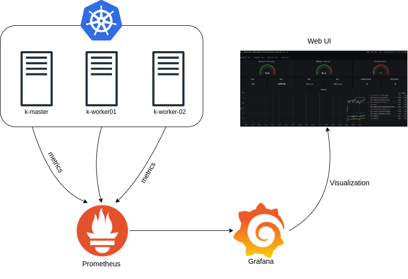

### Namespace 생성

`kube-monitoring` 네임스페이스를 생성합니다.

```bash
kubectl create namespace kube-monitoring
kubens kube-monitoring
```

### Prometheus 배포

Helm chart를 이용하여 Prometheus을 Kubernetes Cluster에 배포합니다.

```bash
helm repo add prometheus-community https://prometheus-community.github.io/helm-charts
helm repo list
helm repo update
helm search repo prometheus-community
helm install prometheus prometheus-community/prometheus
```

### Grafana 배포

Helm chart를 이용하여 Grafana을 Kubernetes Cluster에 배포하고 grafana의 Service type을 `LoadBalancer`로 변경합니다.

```bash
helm repo add grafana https://grafana.github.io/helm-charts
helm repo list
helm repo update
helm search repo grafana
helm install grafana grafana/grafana
kubectl patch svc grafana -p '{"spec": {"type": "LoadBalancer"}}'
```

아래 명령을 실행하여 Admin 계정의 패스워드를 확인합니다.

```bash
kubectl get secret --namespace kube-monitoring grafana -o jsonpath="{.data.admin-password}" | base64 --decode ; echo
```

아래 명령을 실행하여 `prometheus-server`의 Endpoint를 확인합니다.

```bash
kubectl get endpoints
```

### Grafana Dashboard 구성

* 웹 브라우저에서 `grafana` Service의 External IP(`http://xxx-yyyy.ap-northeast-2.elb.amazonaws.com/`)로 접속합니다.
* 이전 단계에서 확인한 패스워드로 로그인합니다.
* **DATA SOURCES**를 클릭합니다.
  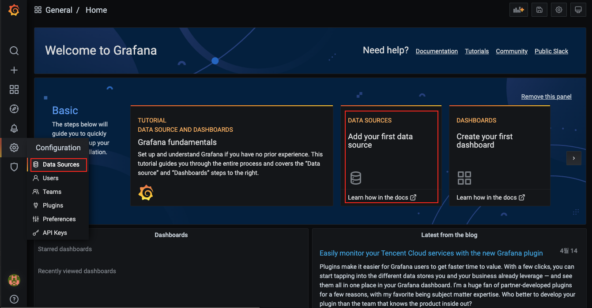
* **Add data source** 페이지에서 `Prometheus`를 선택합니다.
* **HTTP URL**에 `http://<prometheus-server_Endpoint_IP>:9090`을 입력하고 **Save & Test** 버튼을 클릭합니다.
* 좌측 사이드 바에서 **+** 아이콘을 클릭하고 **Import**를 선택합니다.
* **Import** 페이지에서 **Import via grafana.com** 필드에 `https://grafana.com/grafana/dashboards/13770`을 입력하고 **Load** 버튼을 클릭합니다.
* **Data Source** 필드에 `Prometheus`을 선택하고 **Import** 버튼을 클릭합니다.
* 잠시 후 구성이 완료되면 Dashboard를 확인할 수 있습니다.
  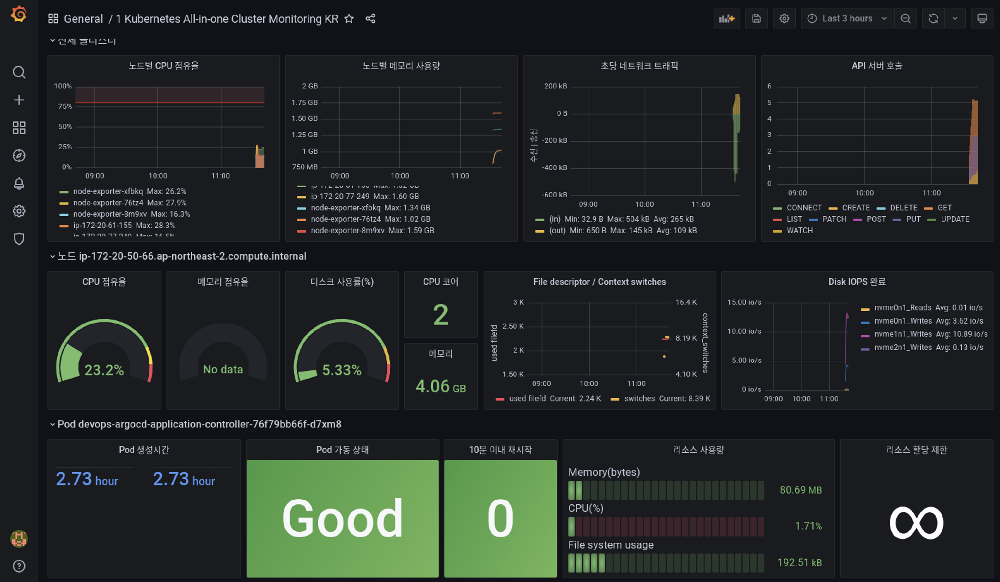

다음 단계 진행을 위해 Prometheus와 Grafana를 삭제합니다.

```bash
helm uninstall prometheus
helm uninstall grafana
kubectl delete namespace kube-monitoring
```

## EFK Stack을 사용하여 Kubernetes Logging 시스템 구축

EFK Stack은 Elasticsearch, Fluentd, Kibana의 첫글자의 합성으로 로그 데이터를 수집하고 분석하여 시각화해 주는 것을 의미합니다.

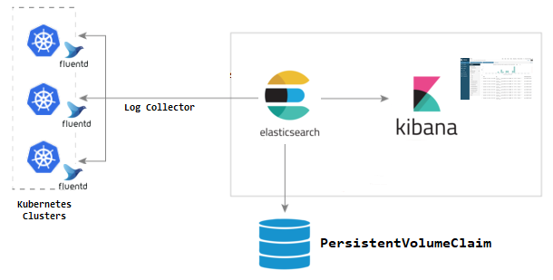

### `kube-logging` Namespace 생성

`kube-logging` 네임스페이스를 생성합니다.

```bash
kubectl create namespace kube-logging
kubens kube-logging
```

### Elasticsearch Architecture

Elasticsearch에는 여러 구성요소가 있습니다.

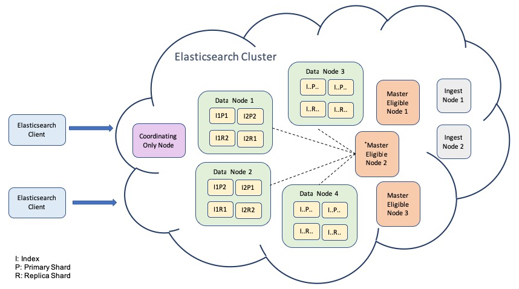

* Elasticsearch Cluster : Elasticsearch에서 가장 큰 시스템 단위를 의미하며, 최소 하나 이상의 노드로 이루어진 노드들의 집합입니다. 서로 다른 클러스터는 데이터의 접근, 교환을 할 수 없는 독립적인 시스템으로 유지되며, 여러 대의 서버가 하나의 클러스터를 구성할 수 있고, 한 서버에 여러 개의 클러스터가 존재할 수도 있습니다.
* Master-eligible node : master 역할이 있는 노드로 클러스터를 제어하는 마스터 노드로 선출될 수 있습니다.
* Data node : 데이터 노드는 데이터를 보유하고 CRUD, 검색 및 집계와 같은 데이터 관련 작업을 수행합니다.
* Ingest node :  인제스트 노드는 인덱싱 전에 문서를 변환하고 보강하기 위해 문서에 수집 파이프 라인을 적용할 수 있습니다.
* Remote-eligible node : `remote_cluster_client` Role이 있는 노드로 원격 클라이언트 역할을 할 수 있습니다.
* Machine learning node : `xpack.ml.enabled` 및 `ml` Role이 있는 노드입니다. 기계 학습 기능을 사용하려면 클러스터에 기계 학습 노드가 하나 이상 있어야합니다.
* Transform node : `transform` Role이 있는 노드입니다. 변환을 사용하려면 클러스터에 하나 이상의 변환 노드가 있어야 합니다.
* Coordinating only node : 마스터 업무를 처리하고, 데이터를 보관하고, 문서를 사전 처리할 수 있는 능력을 빼앗긴 경우 요청을 라우팅하고 search reduce 단계를 처리하며 대량 인덱싱을 배포할 수 있는 조정 노드로 남게됩니다. 기본적으로 Coordinating only node는 스마트 로드 밸런서로 작동합니다.

Production 환경에서는 위와 같은 구성으로 Elasticsearch를 배포하여야 겠으나, 여기서는 모든 Role을 수행하는 3개의 Master 노드로 구성된 Elasticsearch Cluster를 배포합니다. (Helm chart의 [values.yaml](https://github.com/elastic/helm-charts/blob/master/elasticsearch/values.yaml#L11) 참조)

### Elasticsearch 배포

Helm chart를 이용하여 Elasticsearch를 Kubernetes Cluster에 배포합니다.

* antiAffinity : 기본적으로 여러 Elasticsearch Node가 동일한 Kubernetes Node에서 실행되는 것을 방지하도록 되어 있는데, `soft`로 설정하면 Kubernetes Node가 충분하지 않은 경우 동일한 노드에서도 실행 가능 (기본값 `hard`)
* esJavaOpts : Elasticsearch용 Java 옵션. JVM Heap 사이즈 설정
* resources : StatefulSet의 리소스(CPU/Memory) 요청량(request) 및 상한(limit) 설정
* volumeClaimTemplate : 스토리지 사이즈 설정 (기본값 30Gi)

```bash
helm repo add elastic https://helm.elastic.co
helm repo list
helm repo update
helm search repo elastic

helm install elasticsearch elastic/elasticsearch \
  --set antiAffinity=soft \
  --set esJavaOpts="-Xmx1g -Xms1g" \
  --set resources.requests.cpu="100m" \
  --set resources.requests.memory="500Mi" \
  --set resources.limits.cpu="1000m" \
  --set resources.limits.memory="1500Mi" \
  --set volumeClaimTemplate.resources.requests.storage="5Gi"
```

### Kibana 배포

Helm chart를 이용하여 Kibana를 Kubernetes Cluster에 배포합니다.

```bash
helm install kibana elastic/kibana
kubectl patch svc kibana-kibana -p '{"spec": {"type": "LoadBalancer"}}'
```

### Fluentd 배포

Helm chart를 이용하여 Fluentd를 Kubernetes Cluster에 배포합니다.

```bash
helm repo add bitnami https://charts.bitnami.com/bitnami
helm repo list
helm repo update
helm search repo fluentd
```

`fluentd_values.yaml` 파일을 생성하여 아래 내용을 붙여 넣고 저장합니다.

```bash
vi fluentd_values.yaml
```

```yaml
forwarder:
  configMapFiles:
    fluentd-inputs.conf: |
      # HTTP input for the liveness and readiness probes
      <source>
        @type http
        port 9880
      </source>
      # Get the logs from the containers running in the node
      <source>
        @type tail
        path /var/log/containers/*.log
        # exclude Fluentd logs
        exclude_path /var/log/containers/*fluentd*.log
        pos_file /opt/bitnami/fluentd/logs/buffers/fluentd-docker.pos
        tag kubernetes.*
        read_from_head true
        <parse>
          @type json
          time_format %Y-%m-%dT%H:%M:%S.%NZ
        </parse>
      </source>
      # enrich with kubernetes metadata
      <filter kubernetes.**>
        @type kubernetes_metadata
      </filter>
aggregator:
  configMapFiles:
    fluentd-output.conf: |
      # Throw the healthcheck to the standard output
      <match fluentd.healthcheck>
        @type stdout
      </match>
      # Send the logs to the standard output
      <match **>
        @type elasticsearch
        include_tag_key true
        host "#{ENV['ELASTICSEARCH_HOST']}"
        port "#{ENV['ELASTICSEARCH_PORT']}"
        logstash_format true
        suppress_type_name true

        <buffer>
          @type file
          path /opt/bitnami/fluentd/logs/buffers/logs.buffer
          flush_thread_count 2
          flush_interval 5s
        </buffer>
      </match>
  extraEnv:
    - name: ELASTICSEARCH_HOST
      value: elasticsearch-master
    - name: ELASTICSEARCH_PORT
      value: "9200"
```

위에서 생성한 `fluentd_values.yaml`을 사용하여 Fluentd를 배포합니다.

```bash
helm install fluentd bitnami/fluentd -f fluentd_values.yaml
```

### Kibana에서 로그 조회

* 웹 브라우저에서 `http://<Kibana_External_IP>:5601`에 접속합니다.
  * **Welcom to Elastic** 화면에서 **Explore on my own** 클릭합니다.

  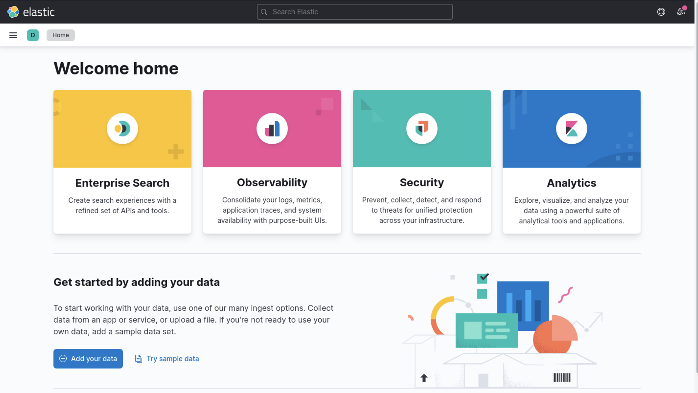

* 사이드 바에서 **Management > Stack Management** 선택합니다.
  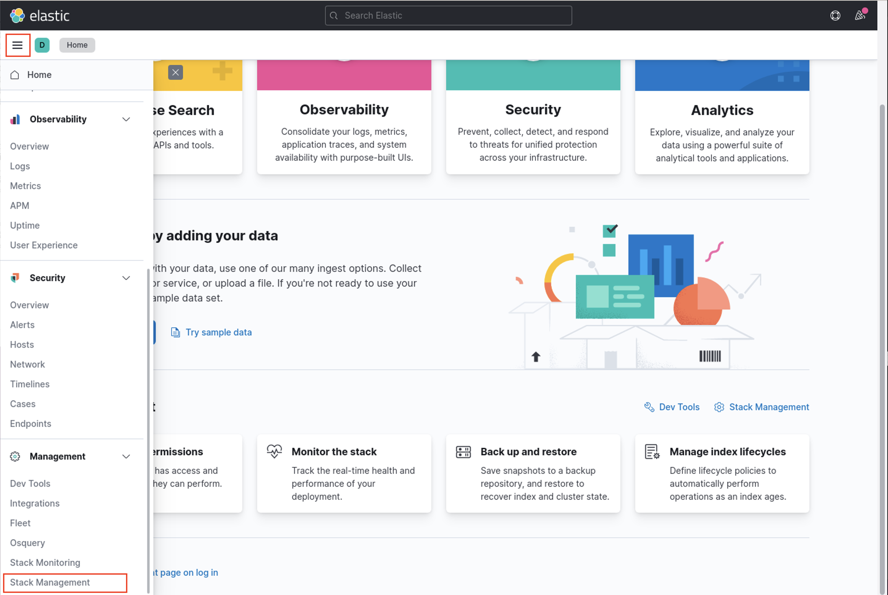
* **Stack Management** 페이지의 사이드 바에서 **Kibana > Index Patterns** 선택합니다.
* **Create index pattern** 버튼을 클릭합니다.
* **Create index pattern** 페이지에서 **Name** 필드에 `logstash-*`을 입력합니다.
* **Timestamp field**에서 `@timestamp`를 선택하고 **Create index pattern** 버튼을 클릭합니다.
* Menu 아이콘(햄버거 버튼)을 클릭한 다음, 사이드 바에서 **Analytics > Discover**를 클릭합니다.
  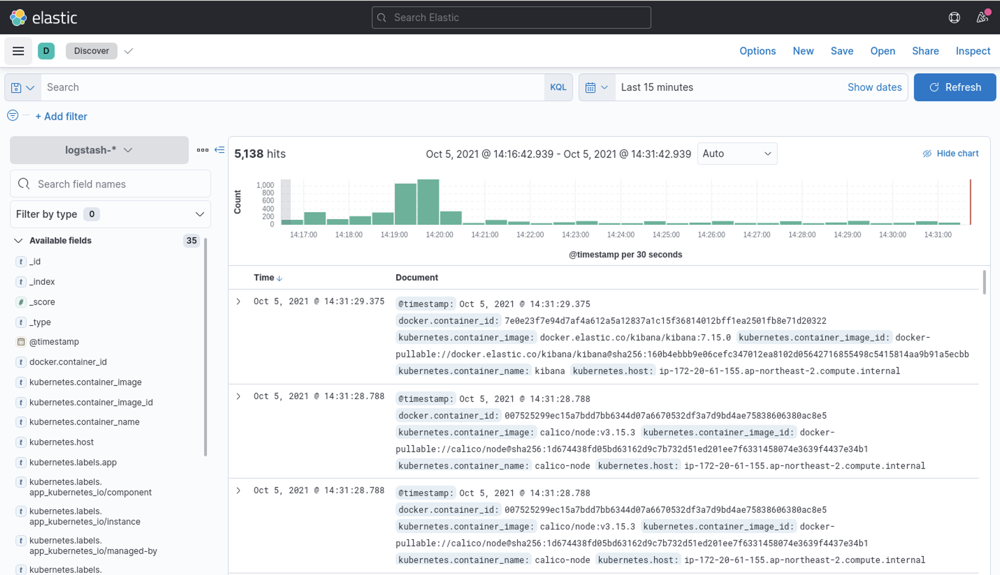

#### `petclinic` 애플리케이션 로그 조회

* **+ Add filter**를 클릭합니다.
* **EDIT FILTER** 모달창에서 **Field**에서 `kubernetes.labels.app_kubernetes_io/instance`, **Operator**에 `is`을 선택하고, **Value**에 `petclinic`을 입력합니다.
  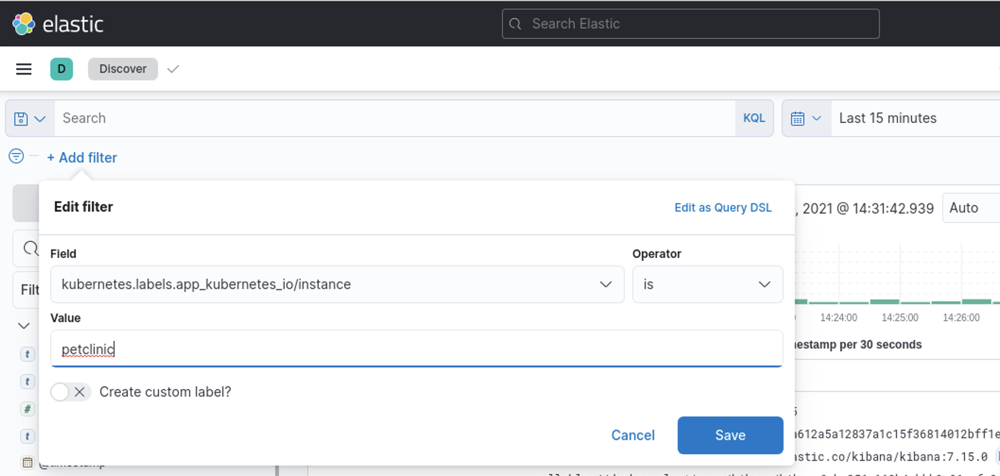
* **Save** 버튼을 클릭하면 `petclinic` 애플리케이션의 로그가 조회됩니다.
  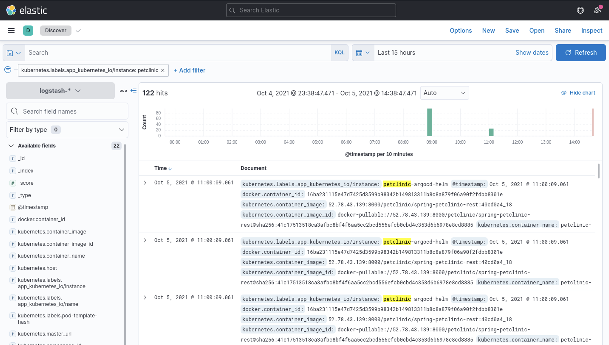
* 좌측의 **Filter by type**에서 `log`에 마우스 포인트를 올려 **+** 아이콘을 클릭하면 목록에 `Document`가 `log`로 변경됩니다.
  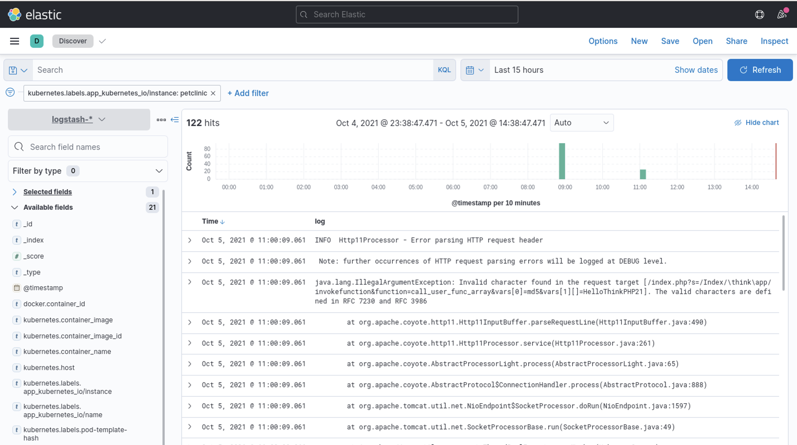

## 참고

[Elasticsearch architecture](https://subscription.packtpub.com/book/data/9781789957754/1/ch01lvl1sec04/elasticsearch-architectural-overview)  
[Elasticsearch Node](https://www.elastic.co/guide/en/elasticsearch/reference/current/modules-node.html)  
